```r
packagesList <- c("data.table", "tidyr", "parallel", "igraph", "ggplot2", "Hmisc", "corrplot", "dplyr", "pheatmap", "plotfunctions", "reticulate", "tidyselect")
newPackages <- packagesList[!(packagesList %in% installed.packages()[,"Package"])]
if(length(newPackages) > 0) {
  install.packages(newPackages)
}

packagesListBC <- c("GSEABase",  "GOstats", "GenomicRanges")
newPackagesBC <- packagesListBC[!(packagesListBC %in% installed.packages()[,"Package"])]
if(length(newPackagesBC) > 0) {
  BiocManager::install(newPackagesBC)
}
```


```r
library("data.table")
library("tidyr")
library("parallel")
library("igraph")
library("Hmisc")
library("corrplot")
library("dplyr")
library("GSEABase")
library("GOstats")
library("pheatmap")
# library("reticulate")
library("plotfunctions")
library("tidyselect")
library("GenomicRanges")
```


```r
if (!file.exists("data/SI_Data_01_expressionValues.txt") | !file.exists("data/SI_Data_03_genotypes.txt") | !file.exists("data/SI_Data_04_eQTL.csv")) {
  files_in_zip <- unzip(zipfile = "data/zipped_data.zip", list = T)
  for (datafile in files_in_zip$Name){
    if (!file.exists(paste0("data/", "datafile"))){
      unzip(zipfile = "data/zipped_data.zip", exdir = "data/")
    }
  }
}
```


Data from **Albert FW, Bloom JS, Siegel J, Day L, Kruglyak L. 2018. Genetics of trans-regulatory variation in gene expression. eLife 7: 1–39.**  [Source data](https://elifesciences.org/articles/35471/figures#supp1) or [source data](https://figshare.com/s/83bddc1ddf3f97108ad4)  
Files to download:  
* SI_Data_01_expressionValues.txt (in the repo)
* SI_Data_03_genotypes.txt (too big for the repo)
* SI_Data_04_eQTL.csv

I started with :  
* **phenotype matrix** - contains the gene expression data (expression levels in units of log2(TPM) for all genes and segregants)  
* **genotype matrix** - contains the genotype information (genotypes at 42,052 markers for all segregants. BY (i.e. reference) alleles are denoted by ‘−1’. RM alleles are denoted by ‘1’.)  
* **eqtl_results** - Genes with a local eQTL and significant Allele-specific expression (ASE), and discordant direction of effect. (1) Positive values indicate higher expression in RM compared to BY. (2) Shown is the less sig- nificant p-value from the two ASE datasets. (3) The table shows only genes where both ASE datasets agreed in the direction of effect. Shown is the average effect.  

# for the actual analysis jump to "Inferring causality with new parameters"

Original parameters used

```r
var.exp.lim <- 0.1

nSNPs <- length(colnames(genotype)) - 1
nGenes <- length(colnames(phenotype)) - 1
# nSNPs <- 42052
# nGenes <- 5720

snp.pval <- 0.05 / (as.numeric(nGenes) * as.numeric(nSNPs))
snp.pval.nsign <- as.numeric(1e-5)

corr.pval <-  0.05 / (nGenes * nGenes)
```


# Get effects table
Probably best to run in uppmax  

What's happening here:  
- create a table with all the possible combinations of geneA-eqtlA with geneB-eqtlB  
- ANOVA to test the effect of an eQTL on a gene  
- combines the anova results with the table with the geneA-eqtlA and geneB-eqtlB combinations  
- get correlation between genes  
- adds the correlation between genes to the previous table  
Output is a table with all combinations of gene-eqtl pairs (all geneA must have a cis-eqtl but not all of geneB have to have an eqtl (in cis or not)), if their eqtl is in cis or not, the variance explained by each gene-eqtl pair, the anova p-value and r2 of the effect of an eqtl on a gene and the correlation value and p-value between genes.

```r
library(data.table)
if (!file.exists("results/effects_table.Rdata")){
  
  eqtl_results.sub <- eqtl_results[,.(gene, pmarker, cis, var.exp)]
  
  genesB <- colnames(phenotype[,2:ncol(phenotype)])
  effectsA_B.sepA_B <- create_ini_table(eqtl_results.sub, genesB, var.exp.lim)
  
  ### Find effect of eqtls from geneA in expression of geneB ####
  eqtls.A <- unique(effectsA_B.sepA_B$eqtl.A)
  genes.B <- unique(effectsA_B.sepA_B$geneB)
  res.tot.eqtlA_geneB <- data.table(expand.grid(gene=genes.B, eqtl=eqtls.A))#, anv.res=NA))
  res.eqtlA_geneB <- res.tot.eqtlA_geneB
  
  # run anova in parallel -- effect of eqtlA on geneB
  message("running anova for the effect of eqtlA on geneB")
  cl = makeCluster(detectCores() - 1, type="FORK")
  res.eqtlA_geneB$anv.res <- parApply(cl=cl,res.eqtlA_geneB,1,effect_eqtl_gene, phenotype, genotype)
  stopCluster(cl)

  
  ### Find effect of eqtls from geneB in expression of geneA
  message("running anova for the effect of eqtlB on geneA")
  eqtls.B <- na.omit(unique(effectsA_B.sepA_B$eqtl.B))
  genes.A <- unique(effectsA_B.sepA_B$geneA)
  res.tot.eqtlB_geneA <- data.table(expand.grid(gene=genes.A, eqtl=eqtls.B))#, anv.res=NA))
  res.eqtlB_geneA <- res.tot.eqtlB_geneA
  
  # run the anova function in parallel -- effect of eqtlB on geneA
  cl = makeCluster(detectCores() - 1, type="FORK")
  res.eqtlB_geneA$anv.res <- parApply(cl=cl,res.eqtlB_geneA,1,effect_eqtl_gene, phenotype, genotype)
  stopCluster(cl)
  
  ## merge anova results with the information table to create an effects table
  
  # results from effect of eqtlA on geneB
  effects_table.eqtlA_geneB <- merge_after_anova(res.eqtlA_geneB, "B", "A", effectsA_B.sepA_B)
  
  # results from effect of eqtlB on geneA
  effects_table.anova <- merge_after_anova(res.eqtlB_geneA, gene.AB="A", eqtl.AB="B", effects_table.eqtlA_geneB )
  setcolorder(effects_table.anova, c("geneA", "geneB", "eqtl.A", "eqtl.B", "cis.A", "cis.B"))
  
  ### correlation ####
  message("getting correlation between genes")
  cor_traits <- rcorr(as.matrix(phenotype[,2:ncol(phenotype)])) # to remove the sample names
  
  cor_traits.cor <- cor_traits$r
  cor_traits.p <- cor_traits$P
  
  my_cor_matr_flat <- flat_cor_mat(cor_traits.cor,cor_traits.p)
  my_cor_matr_flat <- data.table(my_cor_matr_flat)
  
  cor_matr <- my_cor_matr_flat[!duplicated(t(apply(my_cor_matr_flat, 1, sort))), ]
  
  # merge the correlation values with the table that has the anova results
  setnames(cor_matr, old=c("row","column", "pval"), new=c("geneA","geneB", "cor.pval"))
  
  message("combining anova results with correlation")
  effects_table.cor <- merge(effects_table.anova, cor_matr, by=c("geneA","geneB"), all.x=T)
  
  message("saving effects table with correlation between genes")
  save(effects_table, file="results/effects_table.Rdata")
  
}
```

## Test different parameters and create summary table with results from testing the different parameters
Test different parameter values combinations to see if I there is a certain combination that gives optimal results in the causality inference.    
Takes a while, probably better to use uppmax    

Assumptions:  
* geneA is in cis with eqtlA  
* geneB is in cis with eqtlB  
* var.explained for geneA must be > var.exp.lim  
* correlation pval is < corr.pval    
Inferred if gene A is affecting geneB or if geneB is affecting geneA.  
* geneA != geneB  

There are two categories and several end results:    
Categories:  
* A affects B: A->B  
* B affects A: B->A  

End results:  
* **A->B = T and B->A = F** or **A->B = F and B->A = T** --> this is the case we are mostly interested in. It means we can say that a gene affects the other, but it's not affected by it.  
* **A->B = T and B->A = NA** or **A->B = NA and B->A = T** --> we can say that a gene affects the other, but we can't say if the second gene affects the first  
* **A->B = NA and B->A = NA** --> we can't say anything about causality  
* **A->B = F and B->A = T** or **A->B = F and B->A = T** --> neither gene affects the other  
* **A->B = T and B->A = T** or **A->B = T and B->A = T**  

How it works:    
* **A->B = T** if anova p-value for the effect of eqtlA on geneB is < snp.pval  
* **A->B = F** if the anova p-value of the effect of eqtlA on geneB is > snp.pval.nsign and geneA and geneB have different eqtls  
* **B->A = T** if anova p-value for the effect of eqtlB on geneA is < snp.pval  
* **B->A = F** if the anova p-value of the effect of eqtlB on geneA is > snp.pval.nsign and geneA and geneB have different eqtls  


What's happening here:  
- set different values for an effect or a correlation to be significant or non-significant  
- find causality (A->B and B->A) using the diferent parameters 
  - the object "res" is a list of tables where each table corresponds to the causality inference done with different parameters (specified in each table)  
  
geneA <- causal genes  
geneB <- affected genes  

- create table with a summary of the results:  
  - number of different geneA and geneB found    
  - number of different eqtlA and eqtlB found  
  - number of unique gene pairs  
  - number of different gene-eqtl pairs for geneA-eqtlA and geneB-eqtlB  
  - the parameter cutoffs  

```r
if (!file.exists("results/resparams.Rdata")){
  
  message("loading effects_table")
  load("results/effects_table.Rdata")
  
  sign_p <- c(1e-17, 1e-16, 1e-15, 1e-14, 1e-13, 1e-12, 1e-11, 1e-10, 1e-9, 1e-8, 1e-7, 1e-6, 1e-5, 1e-4, 1e-3, 1e-2)
  non_sign_p <- c(1e-7, 1e-6, 1e-5, 1e-4, 1e-3, 1e-2)
  cor_p <- c(1e-9, 1e-8, 1e-7, 1e-6, 1e-5, 1e-4, 1e-3, 1e-2)
  params0 <- data.table(expand.grid(sign_p=sign_p, non_sign_p=non_sign_p, cor_p=cor_p))
  
  message("testing parameters")
  
  cl = makeCluster(detectCores() - 1, type="FORK")
  res <- parApply(cl=cl,params0,1, testparams, effects_table, var.exp.lim)
  stopCluster(cl)

  save(res, file="results/resparams.Rdata")
  
}

if (!file.exists("results/res_table_params.Rdata")){
  message("loading resparams")
  load(file = "results/resparams.Rdata")
  
  # create summary table with results from testing the different parameters
  message("creating summary table")
  cl = makeCluster(detectCores()-1, type="FORK")
  res_table.temp <- parLapply(cl=cl, res, create_res_table)
  stopCluster(cl)
  
  res_table <- rbindlist(res_table.temp)
  res_table <- res_table[order(sign.p, -nonsign.p, cor.p)]
  
  save(res_table, file="results/res_table_params.Rdata")
  
} else if (file.exists("results/res_table_params.Rdata")){
  message("loading res_table with the results of testing the several parameters")
  load("results/res_table_params.Rdata")
}
```

```
## loading res_table with the results of testing the several parameters
```


### Plot number of times geneA -> geneB with the different parameters tested 
Only the cases where A->B=T and B->A=F

```r
par(mfrow=c(2,4))

cor.pvals <- unique(res_table$cor.p)
linetype <- c(1:length(unique(res_table$nonsign.p)))

for (p in cor.pvals){
  xrange <- range(-log(res_table$sign.p)) # set x-axis range
  yrange <- range(res_table$unique.genepairs) # set y-axis range
  plot(xrange, yrange, type = "n", main=paste("corr pval = ", p), xlab = "-log(sign.p)",
       ylab = " #unique gene pairs") # empty plot
  colors <- rainbow(length(unique(res_table$nonsign.p)))
  for (i in 1:length(unique(res_table$nonsign.p))){
    x <- -log(res_table[nonsign.p==nonsign.p[i] & cor.p==p]$sign.p)
    y <- res_table[nonsign.p==nonsign.p[i] & cor.p==p]$unique.genepairs
    lines(x,y,  type="l", lwd=1.5,lty=linetype[i], col=colors[i])
  }
  #legend(x=20, yrange[2], unique(res_table$nonsign.p), col=colors, lty=linetype, cex=0.8)
}
```

<div class="figure">
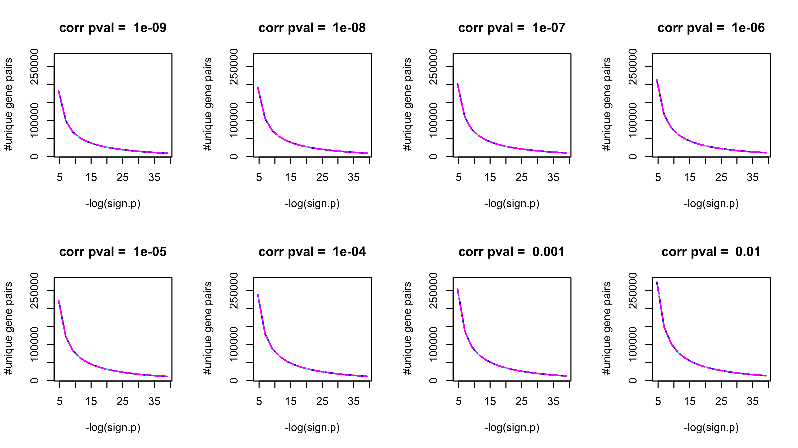
<p class="caption">Number of unique gene pairs found when using different cutoffs. Each pannel corresponds to a different correlation p-value cutff. X-axis is the -log(pvalue) (for the effect to be significant) and differenc colors represent different values for the non-significant p-value (for the effect to be considered non-significant)</p>
</div>


```r
par(mfrow=c(1,1))

xrange <- range(-log(res_table$sign.p)) # set x-axis range
yrange <- range(res_table$unique.genepairs) # set y-axis range
plot(xrange, yrange, type = "n", xlab = "-log(p)", ylab = "#unique gene pairs",  
     main="#gene pairs where A->B") # empty plot
colors <- rainbow(length(unique(res_table$nonsign.p)))
linetype <- c(1:length(unique(res_table$nonsign.p)))
for (i in 1:length(unique(res_table$nonsign.p))){
  x <- -log(res_table$sign.p[res_table$nonsign.p==unique(res_table$nonsign.p)[i]])
  y <- res_table$unique.genepairs[res_table$nonsign.p==unique(res_table$nonsign.p)[i]]
  lines(x,y,  type="l", lwd=1.5,lty=linetype[i], col=colors[i])
}
legend(x=20, yrange[2], unique(res_table$nonsign.p), col=colors, lty=linetype, cex=0.8)
```

<div class="figure">
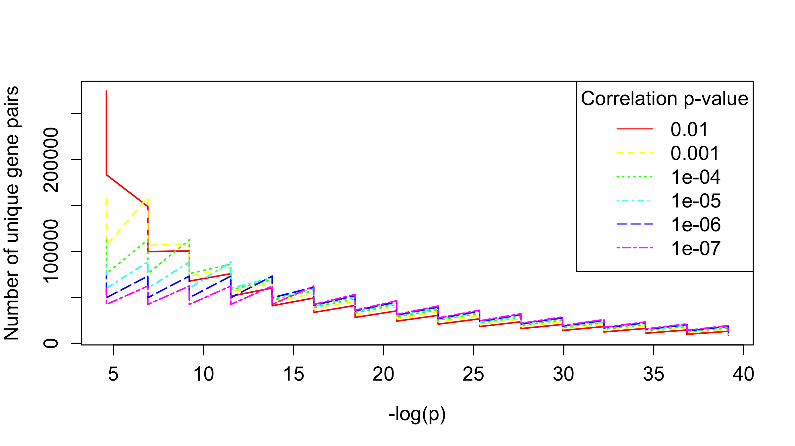
<p class="caption">Number of unique gene pairs found when using different cutoffs. X-axis is the -log(pvalue) (for the effect to be significant) and differenc colors represent different values for the non-significant p-value (for the effect to be considered non-significant)</p>
</div>


# Inferring causality with new parameters

```r
var.exp.lim <- 0.1

# nSNPs <- length(colnames(genotype))-1
# nGenes <- length(colnames(phenotype))-1

nSNPs <- 42052
nGenes <- 5720

snp.pval <- as.numeric(1e-5)
snp.pval.nsign <- 0.01

corr.pval <- 0.05/choose(nGenes,2)
```

Assumptions (same as before):  
* geneA is in cis with eqtlA  
* geneB is in cis with eqtlB  
* var.explained for geneA must be > var.exp.lim  
* correlation pval is < corr.pval    
Inferred if gene A is affecting geneB or if geneB is affecting geneA.  
* geneA != geneB  

There are two categories and several end results:    
Categories:  
* A affects B: A->B  
* B affects A: B->A  

End results:  
* **A->B = T and B->A = F** or **A->B = F and B->A = T** --> this is the case we are mostly interested in. It means we can say that a gene affects the other, but it's not affected by it.  
* **A->B = T and B->A = NA** or **A->B = NA and B->A = T** --> we can say that a gene affects the other, but we can't say if the second gene affects the first  
* **A->B = NA and B->A = NA** --> we can't say anything about causality  
* **A->B = F and B->A = T** or **A->B = F and B->A = T** --> neither gene affects the other  
* **A->B = T and B->A = T** or **A->B = T and B->A = T**  

How it works:    
* **A->B = T** if anova p-value for the effect of eqtlA on geneB is < snp.pval  
* **A->B = F** if the anova p-value of the effect of eqtlA on geneB is > snp.pval.nsign and geneA and geneB have different eqtls  
* **B->A = T** if anova p-value for the effect of eqtlB on geneA is < snp.pval  
* **B->A = F** if the anova p-value of the effect of eqtlB on geneA is > snp.pval.nsign and geneA and geneB have different eqtls  


## Get the effect of each gene on the other and the cases where A->B = T and B->A = F

```r
# find all effects
if (!file.exists("results/findeffects_all_newparams.gz")){
  message("loading effects_table")
  load("results/effects_table.Rdata")
  
  message("finding causality")

  find.effects <- effects_table[cor.pval < corr.pval & cis.A ==T & cis.B==T & geneA!=geneB]
  find.effects <- find.effects_fun(find.effects, snp.pval, snp.pval.nsign)
  
  message("saving to file")
  fwrite(find.effects, "results/findeffects_all_newparams.gz")
}

# subset to get effects where A affects B and B does not affect A
if (!file.exists("results/findeffects_TF_newparams.gz")){
  message("loading find.effects")
  find.effects <- fread("results/findeffects_all_newparams.gz")
  
  message("getting cases where A->B = T and B->A = F")
  find.effects_TF.1 <- find.effects[find.effects$`A->B`==T & find.effects$`B->A`==F,
                                    .(geneA, geneB, eqtl.A, eqtl.B, `A->B`, `B->A`)]
  find.effects_TF.2 <- rbind(find.effects_TF.1, 
                             find.effects[find.effects$`A->B`==F & find.effects$`B->A`==T & 
                                            var.exp.B > var.exp.lim, 
                                          .(geneA=geneB, geneB=geneA, eqtl.A=eqtl.B, 
                                            eqtl.B=eqtl.A, `A->B`=`B->A`, `B->A`=`A->B`)])
  find.effects_TF <- unique(find.effects_TF.2)
  
  message("saving to file")
  fwrite(find.effects_TF, "results/findeffects_TF_newparams.gz")

} else if (file.exists("results/findeffects_TF_newparams.gz")){
  message("loading find.effects_TF")
  find.effects_TF <- fread("results/findeffects_TF_newparams.gz")
}
```

```
## loading find.effects_TF
```

### Plot number of times a gene pair appears

```r
find.effects_TF.numpairs <- find.effects_TF[, .N, by=.(geneA, geneB)]

numpairs.table <- data.table(N = unique(find.effects_TF.numpairs$N), numpairs =NA)
for (i in 1:nrow(numpairs.table)){
  numpairs.table$numpairs[i] <- nrow(find.effects_TF.numpairs[N==numpairs.table$N[i]])
}

# plot the number of times a gene pair appears
bp <- barplot(numpairs.table[order(-numpairs)]$numpairs, 
              numpairs.table[order(-numpairs)]$N, names.arg=unique(find.effects_TF.numpairs[order(N)]$N), 
              width = 0.5, space=0.2, legend.text = F, ylim = c(0,max(numpairs.table$numpairs)+2500),
              main = "Number of times gene pairs appear \n (A->B = T and B->A = F)", xlab = "# times a gene pair appears", 
              ylab = "# of gene pairs")
text(bp,numpairs.table[order(-numpairs)]$numpairs, 
     labels=numpairs.table[order(-numpairs)]$numpairs, cex=1, pos=3)
```


### Plot the number of times a gene-eqtl pair appears


### Frequency of gene-eqtl pairs

```r
find.effects_TF.geneeqtl.A <- find.effects_TF[, .N, by=.(geneA, eqtl.A)]
find.effects_TF.geneeqtl.A.plot <- find.effects_TF.geneeqtl.A %>% unite(gene_eqtlA, geneA, eqtl.A, sep = "__")
numpairs.table2 <- data.table(N = unique(find.effects_TF.geneeqtl.A.plot$N), numpairs =NA)
for (i in 1:nrow(numpairs.table2)){
  numpairs.table2$numpairs[i] <- nrow(find.effects_TF.geneeqtl.A[N==numpairs.table2$N[i]])
}
numpairs.table2 <- numpairs.table2[order(N)]

hist(find.effects_TF.geneeqtl.A.plot$N, main = "Frequency of gene-eqtl pairs", xlab = "# times gene-eqtl pairs appear",labels = T, ylim = c(0,780))
```


```r
# the majority of gene-eqtl pairs appear between 0-100 times
```
### Plot the network
Takes a very long time and you can't really see anything so it's not very worth it.  
There are no subclusters, it's just one bit network


```r
plot_TF <- graph_from_edgelist(as.matrix(find.effects_TF[,.(geneA, geneB)]),directed=TRUE)
# components(plot_TF)

memb <- components(plot_TF)$membership
nodes <- data.table(id = names(memb),
                    group_id = memb)
nodes <- nodes[order(nodes$id), ]

if(length(unique(nodes$group_id))> 1){
  message(paste0("There are ", length(unique(nodes$group_id)), " subclusters!"))
} else {
  message("There are no subclusters")
}
```

```
## There are no subclusters
```

```r
#plot(plot_TF, layout=layout_with_gem,edge.arrow.size=.5, vertex.label=NA)
```

From the 2884 genes with an eqtl in cis, only 741 (25.69%) of the genes have a causal effect.


\newpage

# GO analysis
In order to find the GO terms associated with my genes I used YeastMine (Balakrishnan et al., 2012) (https://yeastmine.yeastgenome.org/yeastmine/begin.do). Since I was not being able to do it in R, using the YeastMine API, I used python to run my queries. To be able to run the queries with python, first I needed to create an account and request an API key. Since you can generate python code from the website, I used it as a guide and added/ removed parameters to get what I needed. 

To get an API key, go to https://yeastmine.yeastgenome.org/yeastmine/begin.do and create an account. Go to account details and create a new key. 
Save the key in a file called yeastmineAPI.txt  

"genelist" is a list of the genes involved in the causality - Uploaded into yeastmine and saved in my area   

1. create gene list

```r
if (!file.exists("data/genelist.txt")){
  genelist <- data.table(unique(c(find.effects_TF$geneA, find.effects_TF$geneB)))
  fwrite(genelist, "data/genelist.txt", col.names = F)
}

genelist <- fread("data/genelist.txt", header = F)
genes_in_find.effects <- data.table(unique(c(find.effects_TF$geneA, find.effects_TF$geneB)))
if (nrow(genelist) != nrow(genes_in_find.effects)){
  update_genelist <- T
  stop("YOU'LL NEED TO REUPLOAD THE GENELIST INTO YEASTMINE AND RERUN THE PYTHON CODE BELOW")
} else {
  update_genelist <- F
}
```
2. upload list into yeastmine giving it the name genelist
3. Continue once you have uploaded the genelist into yeastmine

Get table with geneID, gene symbol, gene name, GO identifier, GO term name, GO namespace and evidence code

```python
# Sometimes breaks Rstudio, might be better to run it in a script/python console
import os.path
from os import path
os.chdir("/Users/Carolina/Documents/GitHub/DegreeProject/summarizing/")
if not path.isfile("results/genelistwithGOterm.txt"):
  # The following lines will be needed in every python script:
  from intermine.webservice import Service
  yeastmineAPItoken_file = open('data/yeastmineAPI.txt', 'r')
  yeastmineAPItoken = yeastmineAPItoken_file.readline().rstrip()
  service = Service("https://yeastmine.yeastgenome.org/yeastmine/service", token = yeastmineAPItoken)
  
  # Get a new query on the class (table) you will be querying:
  query = service.new_query("Gene")
  
  # The view specifies the output columns
  query.add_view(
      "secondaryIdentifier", "symbol", "name",
      "ontologyAnnotations.ontologyTerm.identifier",
      "ontologyAnnotations.ontologyTerm.name",
      "ontologyAnnotations.ontologyTerm.namespace",
      "ontologyAnnotations.evidence.code.code"
  )
  
  # You can edit the constraint values below
  query.add_constraint("Gene", "IN", "genelist", code = "A")
  
  terms = "gene", "symbol", "gene.name", "GO.identifier", "GO.term", "GO.namespace", "evidence"
  
  terms_query = ["secondaryIdentifier", "symbol", "name", "ontologyAnnotations.ontologyTerm.identifier", "ontologyAnnotations.ontologyTerm.name", "ontologyAnnotations.ontologyTerm.namespace", "ontologyAnnotations.evidence.code.code"]
  print("saving file")
  with open("results/genelistwithGOterm.txt", "w") as file:
    # write headers
    for term in terms[:-1]:
      file.write(term)
      file.write("\t")
    else:
      file.write(terms[-1])
    file.write("\n")
    #write content
    for row in query.rows():
      for t in terms_query[:-1]:
        if row[t] != None:
          file.write(str(row[t]))
          file.write("\t")
        else:
          file.write("NA")
          file.write("\t")
      if row[terms_query[-1]] != None:
        file.write(row[terms_query[-1]])
      else:
        file.write("NA")
      file.write("\n")
else:
  print("file exists")
```

```
## file exists
```

Load file generated with python - contains gene, gene symbol, gene name, GO code, GO term, GO namespace and evidence code

```r
genes_GO.table <- fread("results/genelistwithGOterm.txt")
genes_GO.table <- unique(genes_GO.table)
```

Subset to have only the things we'll need for the next analysis - GO terms related to biological processes and remove unecessary columns

```r
genes_GO.bio <- unique(genes_GO.table[GO.namespace=="biological_process"])
genes_GO.bio.noevidence <- data.table(genes_GO.bio)
genes_GO.bio.noevidence[,evidence :=NULL]
genes_GO.bio.noevidence[,GO.namespace :=NULL]
genes_GO.bio.noevidence <- unique(genes_GO.bio.noevidence)
```

Run to get different measures

```r
#count number of times each ontology term appears (number of diferent genes that have this GO term)
GOterms.count <- genes_GO.bio.noevidence[, .(description=unique(GO.term), count = .N), by = GO.identifier][order(-count)]

# find genes that have "transcription factor" in the GO term
GO_trans_factor <- unique(genes_GO.bio.noevidence[grepl("transcription factor",GO.term, fixed = F)])

# gene symbol + GO term + gene name
GO_transc_reg <- unique(genes_GO.bio.noevidence[(grepl(" transcription ",GO.term, fixed = F) & grepl(" regulation ",GO.term, fixed = F)) | grepl("transcription factor",GO.term, fixed = F)])
```


### number of times each geneA and geneB point to another gene

```r
numlinks_from_gene.A <- find.effects_TF[, .(geneB, count.A=.N), by=geneA]
numlinks_from_gene.B <- find.effects_TF[, .(count.B=.N), by=geneB]
numlinks_from_gene <- merge(numlinks_from_gene.A, numlinks_from_gene.B, by="geneB", all=T)
# save(numlinks_from_gene, file = "results/numlinks_from_gene.Rdata")
setcolorder(numlinks_from_gene, c("geneA", "geneB", "count.A", "count.B"))
head(numlinks_from_gene[order(-count.A, count.B)])
```

<div class="kable-table">

geneA     geneB      count.A   count.B
--------  --------  --------  --------
YLR270W   YDR236C        836         2
YLR270W   YGL193C        836         2
YLR270W   YJL008C        836         2
YLR270W   YJL193W        836         3
YLR270W   YJL143W        836         4
YLR270W   YLR179C        836         4

</div>

### number of times each geneA points to another gene + GO term

```r
links_perGO_pergene <- merge(unique(genes_GO.bio.noevidence), 
                             unique(numlinks_from_gene[,.(geneA, count.A)]),
                             by.x="gene", by.y="geneA", all=T)
head(links_perGO_pergene[order(-count.A), .(gene, GO.identifier, GO.term, count.A)])
```

<div class="kable-table">

gene      GO.identifier   GO.term                                                                        count.A
--------  --------------  ----------------------------------------------------------------------------  --------
YLR270W   GO:0000290      deadenylation-dependent decapping of nuclear-transcribed mRNA                      836
YLR270W   GO:0009267      cellular response to starvation                                                    836
YLR270W   GO:0031086      nuclear-transcribed mRNA catabolic process, deadenylation-independent decay        836
YLR270W   GO:1901919      positive regulation of exoribonuclease activity                                    836
YLR264W   GO:0000028      ribosomal small subunit assembly                                                   806
YLR264W   GO:0002181      cytoplasmic translation                                                            806

</div>


```r
links_perGO <- links_perGO_pergene[,.(gocount=sum(count.A, na.rm = T)), by=c("GO.identifier", "GO.term")]
```

### find the GOs that have transcription factor or transcription regulation in the name

```r
links_perGO_transfactor <- links_perGO[(grepl(" transcription ",GO.term, fixed = F) & 
                                         grepl(" regulation ",GO.term, fixed = F)) | 
                                         grepl("transcription factor",GO.term, fixed = F)]
head(links_perGO_transfactor[order(-gocount)][,.(GO.term, gocount)])
```

<div class="kable-table">

GO.term                                                                            gocount
--------------------------------------------------------------------------------  --------
positive regulation of transcription by RNA polymerase II                              493
negative regulation of transcription by RNA polymerase II                              433
negative regulation of transcription by transcription factor localization              109
positive regulation of transcription elongation from RNA polymerase II promoter        107
positive regulation of transcription initiation from RNA polymerase II promoter         86
positive regulation of transcription by RNA polymerase I                                33

</div>
There are 65 different terms with "transcription" and "regulation" or "transcription factor" in their name


#### causal links GO is regulating transcription or a transcription factor

```r
bp <-
  barplot(
    links_perGO_transfactor[order(-gocount)][gocount>0]$gocount,
    names.arg = links_perGO_transfactor[gocount>0]$GO.identifier,
    ylab = "# links",
    xlab = "" ,
    ylim = c(0, 650),
    main = "Number of links going out", 
    las=2, 
    cex.names = 0.7
  )
text(
  bp,
  links_perGO_transfactor[order(-gocount)][gocount>0]$gocount,
  links_perGO_transfactor[order(-gocount)][gocount>0]$gocount,
  cex = 0.8,
  pos = 3
)
```

<div class="figure">
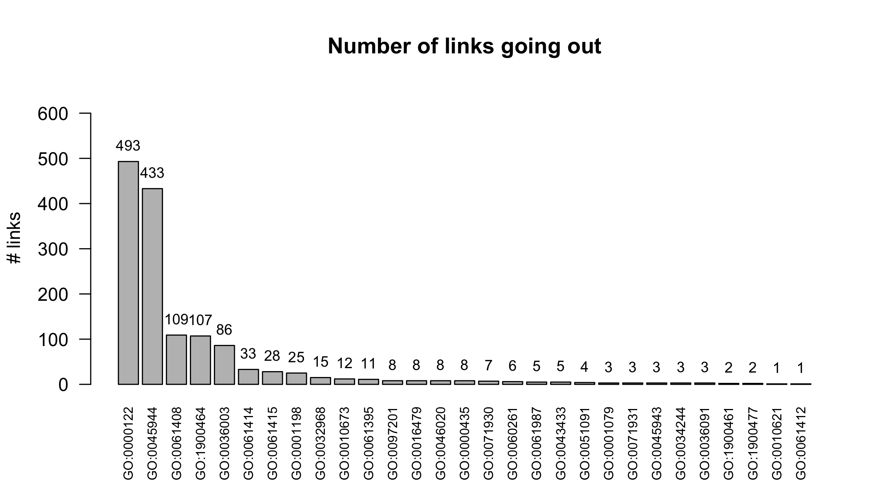
<p class="caption">Number of links going out of causal genes that have terms with 'transcription factor' or 'transcription' and 'regulation'</p>
</div>

```r
hist(links_perGO_transfactor[order(-gocount)]$gocount, 
     main = "# causal links \n GO is regulating transcription or a transcription factor")
```

<div class="figure">
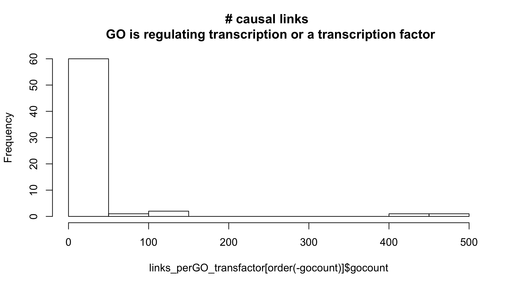
<p class="caption">Number of links going out of causal genes that have terms with 'transcription factor' or 'transcription' and 'regulation'</p>
</div>


### Num of links going out of genes with "transcription" "regulation" or "transcription factor" as its GO term and number of links going out of genes with other descriptions

```r
data.table(links_perGO[(grepl(" transcription ",GO.term, fixed = F) & grepl(" regulation ",GO.term, fixed = F)) | grepl("transcription factor",GO.term, fixed = F) , .(sum_trans=sum(gocount, na.rm = T))], links_perGO[!((grepl(" transcription ",GO.term, fixed = F) & grepl(" regulation ",GO.term, fixed = F)) | grepl("transcription factor",GO.term, fixed = F)) , .(sum_others=sum(gocount, na.rm = T))])
```

<div class="kable-table">

 sum_trans   sum_others
----------  -----------
      1432       149730

</div>

### Num of links having "transcription" and "regulation" or "transcription factor" in the description
(with outliers)

```r
bp_tfactor <-
  boxplot(
    gocount ~ grepl("transcription factor", GO.term, fixed = F),
    data = links_perGO,
    outline = T,
    names = c("Other", "transcription factor"),
    xlab = "",
    ylab = "# links",
    main = "Number of arrows pointing from each GO category",
    ylim = c(-1, 195))

text(1:length(bp_tfactor$n),
     bp_tfactor$stats[5, ] + 5,
     paste("n=", bp_tfactor$n),
     pos = 4)

bp_tfactor_reg <-boxplot(
    gocount ~ ((grepl(" transcription ", GO.term, fixed = F) & 
                 grepl(" regulation ", GO.term, fixed = F)) |
                 grepl("transcription factor", GO.term, fixed = F)),
    data = links_perGO,
    outline = T,
    names = c("Other", "transcription factor or regulator"),
    xlab = "",
    ylab = "# links",
    main = "Number of arrows pointing from each GO category",
    ylim = c(-1, 195))

text(1:length(bp_tfactor_reg$n),
  bp_tfactor_reg$stats[5, ] + 5,
  paste("n=", bp_tfactor_reg$n),
  pos = 4)
```

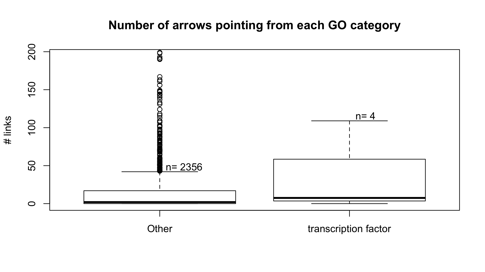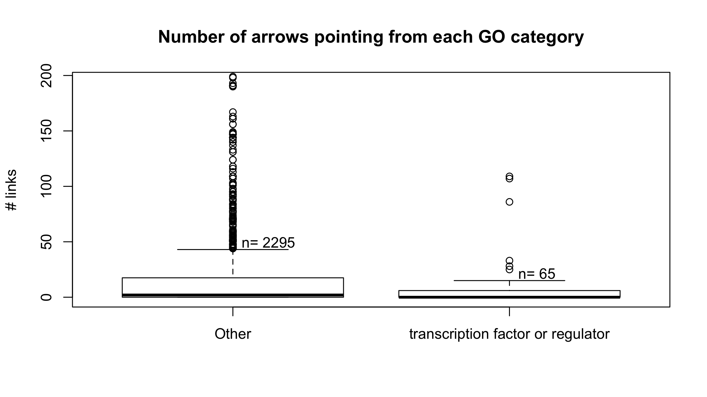
would make sense for there to be an enrichment of transcription regulators/factors in the genes A

### Num of links having "transcription" and "regulation" or "transcription factor" in the description
(without outliers)

```r
links_perGO.nobioprocess <-
  links_perGO[!GO.term == "biological_process"]

bp_tfactor_reg <-boxplot(
    gocount ~ ((grepl(" transcription ", GO.term, fixed = F) &
                  grepl(" regulation ", GO.term, fixed = F)) |
                  grepl("transcription factor", GO.term, fixed = F)),
    data = links_perGO.nobioprocess,
    outline = F,
    names = c("Other", "transcription factor or regulator"),
    xlab = "",
    ylab = "# links",
    main = "Number of arrows pointing from each GO category", 
    ylim = c(0,60)
  )

text(
  1:length(bp_tfactor_reg$n),
  bp_tfactor_reg$stats[5, ] + 5,
  paste("n=", bp_tfactor_reg$n),
  pos = 4
)
```

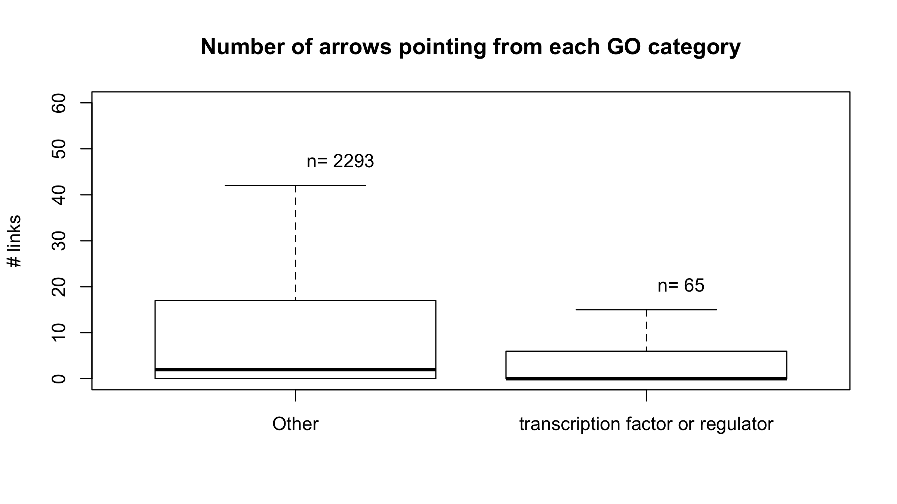

### 10 most represented GO categories

```r
nms <- links_perGO[order(-gocount)]$GO.term[1:10]
mytable <- links_perGO[order(-gocount)]$gocount[1:10]
# labels with count
lbls <- paste( links_perGO[order(-gocount)]$GO.term[1:10], " -- ", mytable, sep="") 
pie(mytable, labels = nms,
    main = "Top 10 most represented GO categories \n (in causal genes)")
```

<div class="figure">
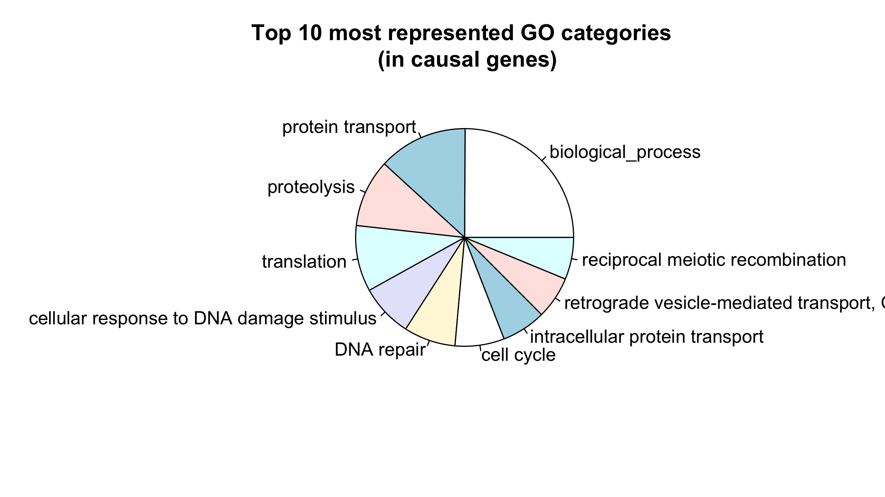
<p class="caption">Most represented GO categories in the causal genes</p>
</div>
According to [EBI](https://www.ebi.ac.uk/QuickGO/term/GO:0050789), the GO term "biological process" is "any process that modulates the frequency, rate or extent of a biological process" it's usually used when the actual function of the gene is not known.  

High values might be because there are many genes associated with a certain term or because the genes that are associated with that term have many "arrows" going out (they affect many other genes)

\newpage


# GO Enrichment

I used GOstats, an R package (bioconductor), to test GO terms for over representation. I used both a classical hypergeometric test and a conditional hypergeometric test, which uses the relationships among GO terms to decorrelate the results  

First I needed to define a few parameters:  
* **universe** - all the genes in the dataset (can be involved in the causality or not) (num genes = 5720)  
* **interesting genes** - causal genes (n=2658) or affected genes (n=2478)  

Falcon & Gentleman (2007) the universe can be reduced by not using the genes that are not being expressed (in this case I would say not involved in the causality).   Taking this into account, it would be interesting to perform the hypergeometric test using only the genes involved in the causality (genes that affect the expression of other genes and genes that are affected) as universe. Falcon & Gentleman (2007) also suggest removing genes that do not map to any GO term  
I'm performing the hypergeometric test twice, once for the causal genes and once for the affected genes to see if there's a different enrichment in both groups. It would be expected that the causal group would be enriched for genes involved in regulation.  

From Falcon & Gentleman (2007)    
"In the hypergeometric model, each term is treated as an independent classification. Each gene is classified according to whether or not it has been selected and whether or not it is annotated at a particular term. A hypergeometric probability is computed to assess whether the number of selected genes associated with the term is larger than expected."  

Performed new hypergeometric test with  
* **universe** - all the genes involved in the causality (num genes = 2861)  
* **interesting genes** - causal genes or affected genes  

I checked if the resulting enrichment table was the same for both universes tested and it was.  
I will continue by using the results from the second test, where the universe was comprised of genes involved in the causality.  

## Get enrichment for the "causal" genes and for the affected genes 
### Hypergeometric test
Causal - genesA   
Affected - genesB  

Test universe as all the genes in the dataset and universe as all the genes involved in the causality

```r
if (!exists("genes_GO.bio")){
  genes_GO.table <- fread("results/genelistwithGOterm.txt")
  genes_GO.table <- unique(genes_GO.table)
  genes_GO.bio   <- unique(genes_GO.table[GO.namespace=="biological_process"])
}

# create geneset
goframeData <- unique(genes_GO.bio[,.(GO.identifier, evidence, gene)])
gs <- getgeneset(goframeData)


genesA <- unlist(unique(find.effects_TF[,geneA]))
genesB <- unlist(unique(find.effects_TF[,geneB]))

# universe is genes involved in causality
universe <- unique(c(genesA, genesB))


# get enrichment for genesA
res.geneA <- getenrichment(gs, universe = universe, interestinggenes = genesA)
res.geneA.dt <- data.table(summary(res.geneA))

# get enrichment for genesB
res.geneB <- getenrichment(gs, universe = universe, interestinggenes = genesB)
res.geneB.dt <- data.table(summary(res.geneB))


# universe is all the genes
universe.all <- names(phenotype[,2:ncol(phenotype)])

res.geneA.uniall <- getenrichment(gs, universe = universe.all, interestinggenes = genesA)
res.geneA.uniall.dt <- data.table(summary(res.geneA.uniall))

# get enrichment for genesB
res.geneB.uniall <- getenrichment(gs, universe = universe.all, interestinggenes = genesB)
res.geneB.uniall.dt <- data.table(summary(res.geneB.uniall))


# check if I got the same results using the universe = all genes and universe = genes involved in causality
if (!isTRUE(all.equal(res.geneA, res.geneA.uniall)) | isTRUE(all.equal(res.geneB, res.geneB.uniall))) {
  message("the hypergeometric test with the different universes didn't give the same results")
} else {
  message("The hypergeometric test for the different universes gave the same results")
}
```

```
## the hypergeometric test with the different universes didn't give the same results
```

#### To get the GO term graph for the geneA or geneB enrichment 
(where universe is all the genes involved in the causality)

```r
#save all the graphs to a pdf
if (!file.exists("results/figures/termgraph_A.pdf") | update_genelist){
  
  termgrA <- termGraphs(res.geneA, use.terms = T, pvalue = 0.05)
  pdf(file = "results/figures/termgraph_A.pdf", onefile = T)
  for (i in 1:length(termgrA)){
    plotGOTermGraph(termgrA[[i]], r = res.geneA, add.counts = T, 
                    node.colors=c(sig="green", not="white"), max.nchar=30)
  }
  dev.off()
  message("saved the pdf with GO term graphs for the causal genes")
  
} else {
  message("pdf with graphs for the causal genes already exists")
}
```

```
## pdf with graphs for the causal genes already exists
```

```r
if (!file.exists("results/figures/termgraph_B.pdf") | update_genelist){
  
  termgrB <- termGraphs(res.geneB, use.terms = T, pvalue = 0.05)
  
  pdf(file = "results/figures/termgraph_B.pdf", onefile = T)
  for (i in 1:length(termgrB)){
    plotGOTermGraph(termgrB[[i]], r = res.geneB, add.counts = T, 
                    node.colors=c(sig="green", not="white"), max.nchar=30)
  }
  dev.off()
  message("saved the pdf with GO term graphs for the affected genes")
  
} else {
  message("pdf with graphs for the affected genes already exists")
}
```

```
## pdf with graphs for the affected genes already exists
```


### Conditional Hypergeometric test


```r
if (!exists("genes_GO.bio")){
  genes_GO.table <- fread("results/genelistwithGOterm.txt")
  genes_GO.table <- unique(genes_GO.table)
  genes_GO.bio   <- unique(genes_GO.table[GO.namespace=="biological_process"])
}

# create geneset
goframeData <- unique(genes_GO.bio[,.(GO.identifier, evidence, gene)])
gs <- getgeneset(goframeData)


genesA <- unlist(unique(find.effects_TF[,geneA]))
genesB <- unlist(unique(find.effects_TF[,geneB]))

# universe is genes involved in causality
universe <- unique(c(genesA, genesB))

# get enrichment
hgCondA <- getenrichment(gs, universe = universe, interestinggenes = genesA, cond = T)
hgCondA.dt <- data.table(summary(hgCondA))

hgCondB <- getenrichment(gs, universe = universe, interestinggenes = genesB, cond = T)
hgCondB.dt <- data.table(summary(hgCondB))

# causal genes
hgCondA
```

```
## Gene to GO BP Conditional test for over-representation 
## 3062 GO BP ids tested (115 have p < 0.05)
## Selected gene set size: 740 
##     Gene universe size: 2433 
##     Annotation package: Based on a GeneSetCollection Object
```

```r
# affected genes
hgCondB
```

```
## Gene to GO BP Conditional test for over-representation 
## 4305 GO BP ids tested (25 have p < 0.05)
## Selected gene set size: 2277 
##     Gene universe size: 2433 
##     Annotation package: Based on a GeneSetCollection Object
```

```r
hgCondA.dt
```

<div class="kable-table">

GOBPID           Pvalue   OddsRatio      ExpCount   Count   Size  Term                                                                              
-----------  ----------  ----------  ------------  ------  -----  ----------------------------------------------------------------------------------
GO:0015074    0.0000033    6.690476     8.2120838      20     27  DNA integration                                                                   
GO:2000112    0.0000294    1.883809    58.2262997      84    196  regulation of cellular macromolecule biosynthetic process                         
GO:0009889    0.0000479    1.825424    61.4006143      87    207  regulation of biosynthetic process                                                
GO:0031328    0.0000545    1.831857    59.9177970      85    197  positive regulation of cellular biosynthetic process                              
GO:0032774    0.0000606    1.653361    91.2453761     121    300  RNA biosynthetic process                                                          
GO:0080090    0.0000759    1.669385    84.6262093     113    283  regulation of primary metabolic process                                           
GO:0006351    0.0000839    1.641275    90.0287711     119    296  transcription, DNA-templated                                                      
GO:0010557    0.0000925    1.810992    58.0928894      82    191  positive regulation of macromolecule biosynthetic process                         
GO:0010628    0.0001103    1.803870    57.4845869      81    189  positive regulation of gene expression                                            
GO:0006278    0.0002131    3.427669    11.2535964      22     37  RNA-dependent DNA biosynthetic process                                            
GO:0018130    0.0002211    1.473873   142.6469379     175    469  heterocycle biosynthetic process                                                  
GO:0006310    0.0002433    2.525737    19.3488372      33     64  DNA recombination                                                                 
GO:0019438    0.0002936    1.465007   140.5178792     172    462  aromatic compound biosynthetic process                                            
GO:0031323    0.0002937    1.617189    78.9813167     104    265  regulation of cellular metabolic process                                          
GO:0050789    0.0003480    1.506967   115.4398321     144    391  regulation of biological process                                                  
GO:1901362    0.0005162    1.426117   152.0756268     183    500  organic cyclic compound biosynthetic process                                      
GO:0051254    0.0006350    1.717006    52.3140156      72    172  positive regulation of RNA metabolic process                                      
GO:0006449    0.0007805         Inf     1.8249075       6      6  regulation of translational termination                                           
GO:0045944    0.0009824    1.751615    44.4060830      62    146  positive regulation of transcription by RNA polymerase II                         
GO:0006508    0.0009953    1.625763    60.8302507      81    200  proteolysis                                                                       
GO:1903508    0.0010438    1.691951    50.4891081      69    166  positive regulation of nucleic acid-templated transcription                       
GO:0051173    0.0010664    1.619066    60.9272954      81    202  positive regulation of nitrogen compound metabolic process                        
GO:0044271    0.0011298    1.354018   199.5232224     231    656  cellular nitrogen compound biosynthetic process                                   
GO:0048522    0.0015723    1.529220    74.9325127      96    249  positive regulation of cellular process                                           
GO:0009890    0.0015979    1.686259    46.8392931      64    154  negative regulation of biosynthetic process                                       
GO:0032197    0.0017845    2.717895    11.8618989      21     39  transposition, RNA-mediated                                                       
GO:0006139    0.0019659    1.314026   238.7587341     270    785  nucleobase-containing compound metabolic process                                  
GO:0090305    0.0020440    1.898887    28.5902178      42     94  nucleic acid phosphodiester bond hydrolysis                                       
GO:2000113    0.0020722    1.690126    43.7977805      60    144  negative regulation of cellular macromolecule biosynthetic process                
GO:0044260    0.0022341    1.322285   229.2397661     259    784  cellular macromolecule metabolic process                                          
GO:1903507    0.0026994    1.742159    36.4981504      51    120  negative regulation of nucleic acid-templated transcription                       
GO:0006974    0.0030499    1.698192    39.2355117      54    129  cellular response to DNA damage stimulus                                          
GO:0007059    0.0030749    1.990156    22.5071928      34     74  chromosome segregation                                                            
GO:0090502    0.0032152    2.331006    14.5992602      24     48  RNA phosphodiester bond hydrolysis, endonucleolytic                               
GO:0031929    0.0035390    4.242570     5.1705713      11     17  TOR signaling                                                                     
GO:1903047    0.0039370    1.705524    36.1939992      50    119  mitotic cell cycle process                                                        
GO:0007165    0.0044264    1.609291    45.0143855      60    148  signal transduction                                                               
GO:0031146    0.0046075    8.074352     2.7373613       7      9  SCF-dependent proteasomal ubiquitin-dependent protein catabolic process           
GO:0071704    0.0051567    1.274064   472.6510481     501   1554  organic substance metabolic process                                               
GO:1903008    0.0058136    2.630337     9.7328401      17     32  organelle disassembly                                                             
GO:0051253    0.0060545    1.642643    37.7147554      51    124  negative regulation of RNA metabolic process                                      
GO:0016070    0.0061015    1.452213    70.5594901      88    243  RNA metabolic process                                                             
GO:0043624    0.0079486    3.009491     6.9954788      13     23  cellular protein complex disassembly                                              
GO:0043007    0.0085095         Inf     1.2166050       4      4  maintenance of rDNA                                                               
GO:0045143    0.0089690    4.156498     4.2581176       9     14  homologous chromosome segregation                                                 
GO:0140013    0.0091864    2.130803    13.9909577      22     46  meiotic nuclear division                                                          
GO:0006950    0.0093778    1.353247   100.0657624     119    329  response to stress                                                                
GO:0016042    0.0098089    2.211640    12.4702014      20     41  lipid catabolic process                                                           
GO:0034250    0.0103783    2.701332     7.9079326      14     26  positive regulation of cellular amide metabolic process                           
GO:0006817    0.0113429    5.379718     3.0415125       7     10  phosphate ion transport                                                           
GO:0006928    0.0113429    5.379718     3.0415125       7     10  movement of cell or subcellular component                                         
GO:0051171    0.0114562    2.046312    14.1465433      22     49  regulation of nitrogen compound metabolic process                                 
GO:0046686    0.0115678   11.510204     1.8249075       5      6  response to cadmium ion                                                           
GO:0000122    0.0120761    1.776702    22.5071928      32     74  negative regulation of transcription by RNA polymerase II                         
GO:0000819    0.0124401    2.044345    14.2951089      22     47  sister chromatid segregation                                                      
GO:0010608    0.0127158    1.749293    23.4196465      33     77  posttranscriptional regulation of gene expression                                 
GO:0051716    0.0131314    1.350248    89.8730853     107    302  cellular response to stimulus                                                     
GO:0000086    0.0137669    3.299413     5.1705713      10     17  G2/M transition of mitotic cell cycle                                             
GO:0031324    0.0150198    1.433615    56.2679819      70    185  negative regulation of cellular metabolic process                                 
GO:0001302    0.0153214    2.774176     6.6913276      12     22  replicative cell aging                                                            
GO:0048519    0.0160641    1.343835    85.7706535     102    282  negative regulation of biological process                                         
GO:1903506    0.0165833    2.031746    12.9411765      20     44  regulation of nucleic acid-templated transcription                                
GO:0007049    0.0184123    1.342701    81.5125360      97    268  cell cycle                                                                        
GO:0010629    0.0194304    1.423026    53.2264694      66    175  negative regulation of gene expression                                            
GO:0006357    0.0203374    2.065833    11.5498008      18     39  regulation of transcription by RNA polymerase II                                  
GO:0051172    0.0222357    1.405315    54.4430744      67    179  negative regulation of nitrogen compound metabolic process                        
GO:0040008    0.0226889    2.885274     5.4747226      10     18  regulation of growth                                                              
GO:0032270    0.0230816    1.742987    19.1615290      27     63  positive regulation of cellular protein metabolic process                         
GO:0006448    0.0230875    4.032401     3.3456638       7     11  regulation of translational elongation                                            
GO:1903432    0.0230875    4.032401     3.3456638       7     11  regulation of TORC1 signaling                                                     
GO:0033043    0.0233562    1.480462    39.2355117      50    129  regulation of organelle organization                                              
GO:0071824    0.0241908    1.712744    20.0739827      28     66  protein-DNA complex subunit organization                                          
GO:0051246    0.0249559    1.420677    48.3600493      60    159  regulation of protein metabolic process                                           
GO:0006511    0.0270639    1.553656    28.8943691      38     95  ubiquitin-dependent protein catabolic process                                     
GO:0007568    0.0278380    2.310867     7.9079326      13     26  aging                                                                             
GO:0006384    0.0280570         Inf     0.9124538       3      3  transcription initiation from RNA polymerase III promoter                         
GO:0051446    0.0280570         Inf     0.9124538       3      3  positive regulation of meiotic cell cycle                                         
GO:0071168    0.0280570         Inf     0.9124538       3      3  protein localization to chromatin                                                 
GO:0051228    0.0280570         Inf     0.9124538       3      3  mitotic spindle disassembly                                                       
GO:0120174    0.0280570         Inf     0.9124538       3      3  stress-induced homeostatically regulated protein degradation pathway              
GO:1903711    0.0280570         Inf     0.9124538       3      3  spermidine transmembrane transport                                                
GO:0002949    0.0280570         Inf     0.9124538       3      3  tRNA threonylcarbamoyladenosine modification                                      
GO:0005980    0.0280570         Inf     0.9124538       3      3  glycogen catabolic process                                                        
GO:0006333    0.0286217    2.539506     6.3871763      11     21  chromatin assembly or disassembly                                                 
GO:0009059    0.0286478    1.299873    87.4954955     102    304  macromolecule biosynthetic process                                                
GO:0051252    0.0295680    1.827077    14.4104545      21     49  regulation of RNA metabolic process                                               
GO:0060237    0.0303689    5.751701     2.1290588       5      7  regulation of fungal-type cell wall organization                                  
GO:0030705    0.0303689    5.751701     2.1290588       5      7  cytoskeleton-dependent intracellular transport                                    
GO:0042908    0.0303689    5.751701     2.1290588       5      7  xenobiotic transport                                                              
GO:0046015    0.0303689    5.751701     2.1290588       5      7  regulation of transcription by glucose                                            
GO:2000104    0.0322337    9.195652     1.5207563       4      5  negative regulation of DNA-dependent DNA replication                              
GO:0010603    0.0322337    9.195652     1.5207563       4      5  regulation of cytoplasmic mRNA processing body assembly                           
GO:0045903    0.0322337    9.195652     1.5207563       4      5  positive regulation of translational fidelity                                     
GO:0000076    0.0322337    9.195652     1.5207563       4      5  DNA replication checkpoint                                                        
GO:0015828    0.0322337    9.195652     1.5207563       4      5  tyrosine transport                                                                
GO:0016567    0.0327043    1.706088    17.9449240      25     59  protein ubiquitination                                                            
GO:0009057    0.0330338    1.360520    56.3147460      68    186  macromolecule catabolic process                                                   
GO:0051276    0.0333557    1.379491    50.8420168      62    169  chromosome organization                                                           
GO:0043632    0.0335749    1.492959    31.9358816      41    105  modification-dependent macromolecule catabolic process                            
GO:0070192    0.0337030    3.072860     4.2581176       8     14  chromosome organization involved in meiotic cell cycle                            
GO:0043618    0.0391539    2.144527     8.2120838      13     27  regulation of transcription from RNA polymerase II promoter in response to stress 
GO:0006855    0.0391539    2.144527     8.2120838      13     27  drug transmembrane transport                                                      
GO:0051130    0.0396372    1.565493    23.4196465      31     77  positive regulation of cellular component organization                            
GO:0048869    0.0402661    1.444229    34.9773942      44    115  cellular developmental process                                                    
GO:0035601    0.0411058    3.224011     3.6498150       7     12  protein deacylation                                                               
GO:0000272    0.0411058    3.224011     3.6498150       7     12  polysaccharide catabolic process                                                  
GO:0044089    0.0423795    1.736787    14.9034114      21     49  positive regulation of cellular component biogenesis                              
GO:1905268    0.0432545    2.593194     5.1705713       9     17  negative regulation of chromatin organization                                     
GO:0008608    0.0432545    2.593194     5.1705713       9     17  attachment of spindle microtubules to kinetochore                                 
GO:0006259    0.0467712    1.419733    35.2630231      44    119  DNA metabolic process                                                             
GO:0000226    0.0479839    2.130177     7.6037813      12     25  microtubule cytoskeleton organization                                             
GO:0000725    0.0479839    2.130177     7.6037813      12     25  recombinational repair                                                            
GO:0006665    0.0479839    2.130177     7.6037813      12     25  sphingolipid metabolic process                                                    
GO:0010498    0.0493973    1.609363    18.5532265      25     61  proteasomal protein catabolic process                                             
GO:0048285    0.0495738    1.490192    26.4611591      34     87  organelle fission                                                                 

</div>

```r
hgCondB.dt
```

<div class="kable-table">

GOBPID           Pvalue   OddsRatio    ExpCount   Count   Size  Term                                                   
-----------  ----------  ----------  ----------  ------  -----  -------------------------------------------------------
GO:0055086    0.0005735   10.464135   135.70284     144    145  nucleobase-containing small molecule metabolic process 
GO:0044283    0.0009677    4.643028   180.62515     190    193  small molecule biosynthetic process                    
GO:0055114    0.0010395    3.921512   203.08631     213    217  oxidation-reduction process                            
GO:0009117    0.0014825    9.308659   121.66461     129    130  nucleotide metabolic process                           
GO:0051186    0.0017890    9.079498   118.85697     126    127  cofactor metabolic process                             
GO:0032787    0.0032288         Inf    79.54994      85     85  monocarboxylic acid metabolic process                  
GO:0019693    0.0032288         Inf    79.54994      85     85  ribose phosphate metabolic process                     
GO:1901293    0.0042496         Inf    75.80641      81     81  nucleoside phosphate biosynthetic process              
GO:0046394    0.0042567    8.018476   105.75462     112    113  carboxylic acid biosynthetic process                   
GO:0072521    0.0052201         Inf    72.99877      78     78  purine-containing compound metabolic process           
GO:0043436    0.0066456    2.673797   211.50925     220    226  oxoacid metabolic process                              
GO:1901566    0.0093448    1.815680   424.89026     436    454  organonitrogen compound biosynthetic process           
GO:0017144    0.0096272    4.434742   117.92109     124    126  drug metabolic process                                 
GO:0009123    0.0118536         Inf    61.76819      66     66  nucleoside monophosphate metabolic process             
GO:0009150    0.0126896         Inf    60.83231      65     65  purine ribonucleotide metabolic process                
GO:1901607    0.0135841         Inf    59.89642      64     64  alpha-amino acid biosynthetic process                  
GO:0090150    0.0268015         Inf    50.53761      54     54  establishment of protein localization to membrane      
GO:0006733    0.0351440         Inf    46.79408      50     50  oxidoreduction coenzyme metabolic process              
GO:0009260    0.0351440         Inf    46.79408      50     50  ribonucleotide biosynthetic process                    
GO:0006839    0.0351440         Inf    46.79408      50     50  mitochondrial transport                                
GO:0009167    0.0376047         Inf    45.85820      49     49  purine ribonucleoside monophosphate metabolic process  
GO:0019637    0.0385480    2.823784   110.16014     115    118  organophosphate metabolic process                      
GO:0045333    0.0402366         Inf    44.92232      48     48  cellular respiration                                   
GO:0006790    0.0453126    5.061224    68.31936      72     73  sulfur compound metabolic process                      
GO:0009199    0.0460616         Inf    43.05055      46     46  ribonucleoside triphosphate metabolic process          

</div>

> to filter the results, the following parameters can be added to the "summary()" call:  
Optional arguments pvalue and categorySize allow specification of maximum p-value and minimum categorySize


#### Other analysis

```r
if (exists("res.geneA") & exists("hgCondA") & exists("res.geneB") & exists("hgCondB")){
  # GO terms that are marked significant by the standard hypergeo test, but not by the conditional test
  stdIdsA = sigCategories(res.geneA)
  condIdsA = sigCategories(hgCondA)
  # num of GO terms that were not significant with the conditional hypergeo test
  # print(length(setdiff(stdIdsA, condIdsA)))
  
  stdIdsB = sigCategories(res.geneB)
  condIdsB = sigCategories(hgCondB)
  # num of GO terms that were not significant with the conditional hypergeo test
  # print(length(setdiff(stdIdsB, condIdsB)))
  
  # terms that are enriched in the hypergeo test but not on the conditional
  goterms_notin_condA <- res.geneA.dt[GOBPID %in% setdiff(stdIdsA, condIdsA)]
  goterms_notin_condB <- res.geneB.dt[GOBPID %in% setdiff(stdIdsB, condIdsB)]
  
  # create HTML reports (tables with enrichment) where the GO terms have links that
  # take you to a page where you can learn more about them
  htmlReport(hgCondA, file="results/hgCondA_htmlreport.html")
  htmlReport(hgCondB, file="results/hgCondB_htmlreport.html")
} else {
  message("Please perform the conditional and the 'normal' hypergeometric test")
}
```
Number of GO terms that were not significant with the conditional hypergeo test:  
* for the causal genes - 91  
* for the affected genes - 18  

set of genes | Hypergeo | Conditional hypergeo
-|-|-
causal | 206 | 115
affected | 43 | 25


#### GO Enrichment Heatmap (-log10(pval))

```r
if (exists("hgCondA.dt") & exists("hgCondB.dt")){
  tocombine.A <- data.table(-log10(hgCondA.dt$Pvalue), hgCondA.dt$Term)
  tocombine.B <- data.table(-log10(hgCondB.dt$Pvalue), hgCondB.dt$Term)
  combined <- merge(tocombine.A, tocombine.B, by="V2", all=T)
  colnames(combined) <- c("term", "Causal", "Affected")
  
  # Causal <- combined$Causal
  # Affected <- combined$Affected

  if (!file.exists("results/figures/heatmap_enrichmentpvals.pdf") | update_genelist){
    
    pdf("results/figures/heatmap_enrichmentpvals.pdf")
    combined[is.na(Causal)]$Causal <- 0
    combined[is.na(Affected)]$Affected <- 0
    plot_enrichment_heatmap(combined)
    dev.off()
    plot_enrichment_heatmap(combined)
  } else {
    combined[is.na(Causal)]$Causal <- 0
    combined[is.na(Affected)]$Affected <- 0
    plot_enrichment_heatmap(combined)
  }
} else {
  stop("Please perform the conditional hypergeometric test")
}
```

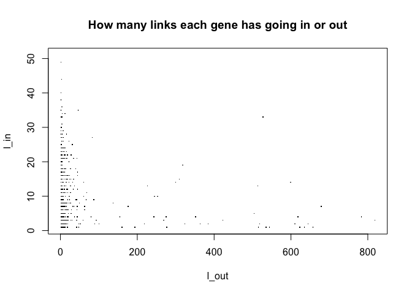

#### GO Enrichment Heatmap (-log10(pval)) subsetting by p-val

```r
if (exists("hgCondA.dt") & exists("hgCondB.dt")){
  tocombine.A <- data.table(-log10(hgCondA.dt$Pvalue), hgCondA.dt$Term)
  tocombine.B <- data.table(-log10(hgCondB.dt$Pvalue), hgCondB.dt$Term)
  combined <- merge(tocombine.A, tocombine.B, by="V2", all=T)
  colnames(combined) <- c("term", "Causal", "Affected")
  
  # Causal <- combined$Causal
  # Affected <- combined$Affected

  if (!file.exists("results/figures/heatmap_enrichmentpvals_0.01pval.pdf") | update_genelist){
    
    pdf("results/figures/heatmap_enrichmentpvals_0.01pval.pdf")
    combined[is.na(Causal)]$Causal <- 0
    combined[is.na(Affected)]$Affected <- 0
    plot_enrichment_heatmap(combined[Causal > -log10(0.01) | Affected > -log10(0.01)])
    dev.off()
    plot_enrichment_heatmap(combined[Causal > -log10(0.01) | Affected > -log10(0.01)])
  } else {
    combined[is.na(Causal)]$Causal <- 0
    combined[is.na(Affected)]$Affected <- 0
    plot_enrichment_heatmap(combined[Causal > -log10(0.01) | Affected > -log10(0.01)])
  }
} else {
  stop("Please perform the conditional hypergeometric test")
}
```

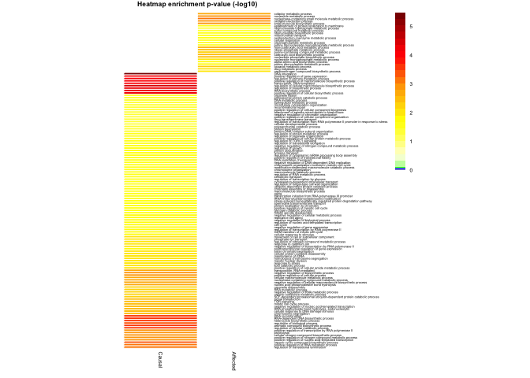

## Using a subset of the causal and the affected genes

```r
if (!exists("find.effects_TF")){
  find.effects_TF <- fread("results/findeffects_TF_newparams.gz")
}
numlinks_from_geneA <- unique(find.effects_TF[, .(geneA, geneB)])[, .(l_out = .N), by = geneA]
numlinks_from_geneB <- unique(find.effects_TF[, .(geneA, geneB)])[, .(l_in = .N), by = geneB]

# table with how many links go in and out of a gene
genes <-data.table(genes = unique(c(find.effects_TF$geneA, find.effects_TF$geneB)))
merge_lin <-merge( genes, numlinks_from_geneA, by. = "genes", by.y = "geneA", all.x = T)
genes_nlinks <-merge( merge_lin, numlinks_from_geneB, by.x = "genes", by.y = "geneB", all.x = T)
# genes_nlinks[order(-l_out, l_in)]

# scatterplot of link distribution
plot(genes_nlinks[, .(l_out, l_in)], main = "How many links each gene has going in or out", pch =".")
```

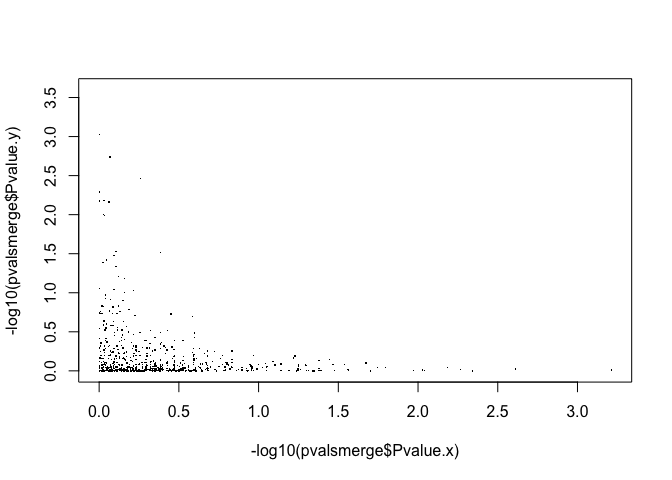

```r
plot(genes_nlinks[, .(l_out, l_in)], xlim = c(0, 200), pch = ".")
abline(v = 20)
```

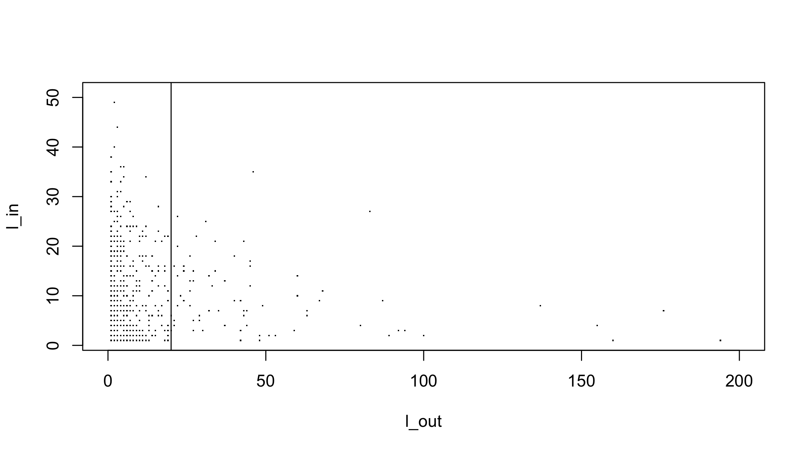

There are 1 genes that have more links going in than out in the causal genes.  

### Conditional hypergeometric test with new subset of causal and affected genes

```r
# creating the sets of genes to use
# defined causalgenes as the genes that have more than 20 links going out
causalgenes <- genes_nlinks[l_out > 20]
# defined affectedgenes as the genes that have no links going out
affectedgenes <- genes_nlinks[is.na(l_out) & !is.na(l_in)]

# the "interesting genes" - either genesA (the causal ones) or genesB (on the receiving end)
# the "universe" - in this case, only the genes that are involved in the causality
genesA <- causalgenes$genes
genesB <- affectedgenes$genes

universe <- unlist(unique(c(find.effects_TF[, geneA], find.effects_TF[, geneB])))

# create geneset
gs <- getgeneset(goframeData)

# get enrichment for genesA
hgCondA.sub <- getenrichment(gs, universe = universe, interestinggenes = genesA, cond = T)
hgCondA.sub.dt <- data.table(summary(hgCondA.sub))

hgCondB.sub <- getenrichment(gs, universe = universe, interestinggenes = genesB, cond = T)
hgCondB.sub.dt <- data.table(summary(hgCondB.sub))


# table with all enriched GO terms found for both the causal and the affected genes with the corresponding enrichment p-val
tocombine.A <- data.table(-log10(hgCondA.dt$Pvalue), hgCondA.dt$Term)
tocombine.B <- data.table(-log10(hgCondB.dt$Pvalue), hgCondB.dt$Term)
combined <- merge(tocombine.A, tocombine.B, by = "V2", all = T)
colnames(combined) <- c("term", "Causal", "Affected")
combined[is.na(Causal)]$Causal <- 0
combined[is.na(Affected)]$Affected <- 0

if (!file.exists("results/figures/heatmap_enrichmentpvals_geneslinks_c20.pdf") | update_genelist){
  # plot GO enrichment heatmap
  pdf("results/figures/heatmap_enrichmentpvals_geneslinks_c20.pdf")
  plot_enrichment_heatmap(combined)
  dev.off()
  
  plot_enrichment_heatmap(combined)
} else {
  plot_enrichment_heatmap(combined)
}
```

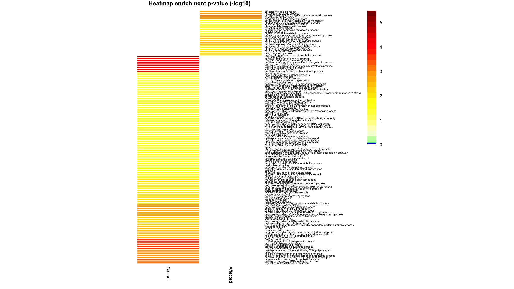


#### Plot of the p-values of enrichment of all terms for all genes 
(subset of causal and affected genes)

```r
hgCondA.nopvallim <- getenrichment(gs, universe = universe, interestinggenes = genesA, cond = T, pval = 1)
hgCondA.nopvallim.dt <- data.table(summary(hgCondA.nopvallim))

hgCondB.nopvallim <- getenrichment(gs, universe = universe, interestinggenes = genesB, cond = T, pval = 1)
hgCondB.nopvallim.dt <- data.table(summary(hgCondB.nopvallim))

pvalsmerge <- merge(hgCondA.nopvallim.dt[,.(GOBPID, Term, Pvalue)], hgCondB.nopvallim.dt[,.(GOBPID, Term, Pvalue)], by=c("GOBPID", "Term"), all=T)
plot(-log10(pvalsmerge$Pvalue.x), -log10(pvalsmerge$Pvalue.y), pch=".")
```

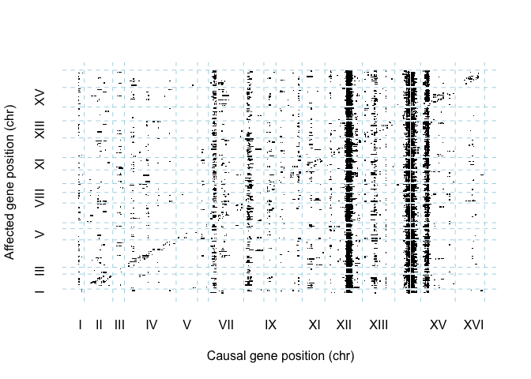

# Plot similar to the one from the paper
Albert FW, Bloom JS, Siegel J, Day L, Kruglyak L. 2018. Genetics of trans-regulatory variation in gene expression. eLife 7: 1–39.

## get gene position


```python
# Sometimes breaks Rstudio, might be better to run it in a script/python console
import os.path
from os import path
os.chdir("/Users/Carolina/Documents/GitHub/DegreeProject/summarizing/")

if not path.isfile("results/gene_pos.gz"):
  # The line below will be needed if you are running this script with python 2.
  #from __future__ import print_function
  # The following two lines will be needed in every python script:
  from intermine.webservice import Service
  yeastmineAPItoken_file = open('/Users/Carolina/Documents/GitHub/DegreeProject/code/2020-02-05/yeastmineAPI.txt', 'r')
  yeastmineAPItoken = yeastmineAPItoken_file.readline().rstrip()
  service = Service("https://yeastmine.yeastgenome.org/yeastmine/service", token = yeastmineAPItoken)
  # Get a new query on the class (table) you will be querying:
  query = service.new_query("Gene")
  # The view specifies the output columns
  query.add_view(
      "secondaryIdentifier", "chromosomeLocation.strand",
      "chromosomeLocation.start", "chromosomeLocation.end", "chromosome.primaryIdentifier"
  )
  # You can edit the constraint values below
  query.add_constraint("Gene", "IN", "allgenes", code = "A")
  terms = "gene", "chr.strand", "chr.start", "chr.end", "chr.id"
  terms_query = ["secondaryIdentifier", "chromosomeLocation.strand", "chromosomeLocation.start", "chromosomeLocation.end", "chromosome.primaryIdentifier"]
  with open("results/gene_pos.gz", "w") as file:
    for term in terms[:-1]:
      file.write(term)
      file.write ("\t")
    else:
      file.write(terms[-1])
    file.write('\n')
    for row in query.rows():
      for t in terms_query[:-1]:
        if row[t] != None:
          file.write(str(row[t]))
          file.write("\t")
        else:
          file.write("NA")
          file.write("\t")
      if row[terms_query[-1]] != None:
        file.write(row[terms_query[-1]])
      else:
        file.write("NA")
      file.write("\n")
```


### Plot affected genes x causal genes

```r
genepos <- fread("results/gene_pos.gz")
if (!exists("find.effects_TF")){
  find.effects_TF <- fread("results/findeffects_TF_newparams.gz")
}

# Add chomosome and start position to each gene
causal.pos.A <- merge(find.effects_TF, genepos, by.x="geneA", by.y="gene", all.x=T)
colnames(causal.pos.A) <- c("geneA", "geneB", "eqtl.A", "eqtl.B", "A->B", "B->A", "strand.A", "start.A","end.A", "chr.A")
causal.pos.B <- merge(causal.pos.A, genepos, by.x="geneB", by.y="gene", all.x=T)


# Keep olnly columns with genes, start positions and chromosomes
gene.location <- unique(causal.pos.B[,.(geneA, geneB, start.A,end.A, chr.A, chr.start,chr.end, chr.id, strand.A, chr.strand)])
colnames(gene.location) <- c("geneA", "geneB", "start.A","end.A", "chr.A", "start.B","end.B", "chr.B", "strand.A", "strand.B")

## transform chromosome ids into numbers
# remove "chr" part of the chromosome name
gene.location$chr.A <-gsub('chr', '', gene.location$chr.A)
gene.location$chr.B <-gsub('chr', '', gene.location$chr.B)

# convert roman chromosome numbers to numbers
gene.location$chr.A <- as.numeric(as.roman(gene.location$chr.A))
gene.location$chr.B <- as.numeric(as.roman(gene.location$chr.B))

# order values
gene.location.order <- gene.location[order(chr.A, start.A, chr.B, start.B)]


# organize coordinates so that they are ordered by chromosome
# vector of chromosomes
vchr <- 1:16
# how much space will be separating chromosomes
separator <- 1e5

coordinates_plot.start <- sort_by_chr(vchr = vchr, gene.location.order, separator = separator)
coordinates_plot.end <- sort_by_chr(vchr = vchr, gene.location.order, separator = separator, coordA = 4, coordB = 7 )

coordinates_plot <- merge(coordinates_plot.start[,.(geneA, geneB, start.A, chr.A, start.B, chr.B, strand.A, strand.B)], 
                          coordinates_plot.end[,.(geneA, geneB, end.A, end.B)], 
                          by=c("geneA", "geneB"))
setcolorder(coordinates_plot, c("geneA","geneB", "start.A", "end.A", "chr.A", "start.B", "end.B", "chr.B"))

plot_sorted_coordinates(coordinates_plot, separator = separator)
```

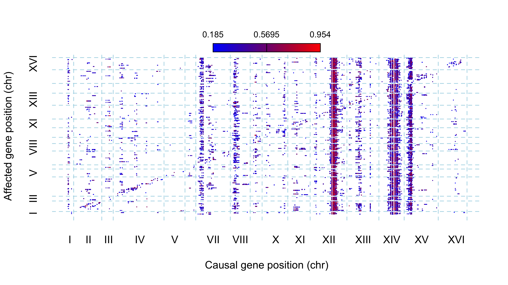


#### color by correlation value

```r
if (!exists("find.effects")){
  find.effects <- fread("results/findeffects_all_newparams.gz")
}
#Create a function to generate a continuous color palette
rbPal <- colorRampPalette(c('blue','red'))


coordinates_plot_cor <- merge(coordinates_plot, find.effects[,.(geneA, geneB, cor)], by=c("geneA", "geneB"), all.x=T)
coordinates_plot_cor$cor <- abs(coordinates_plot_cor$cor)
coordinates_plot_cor <- coordinates_plot_cor[order(cor)]
coordinates_plot_cor$col <- rbPal(100)[as.numeric(cut(coordinates_plot_cor$cor,breaks = 100))]

#save(coordinates_plot_cor, file="results/coordinates_plot_cor.Rdata")
plot_sorted_coordinates(coordinates_plot_cor, separator = separator, col = coordinates_plot_cor$col)
gradientLegend(format(round(coordinates_plot_cor$cor, 3), nsmall = 3), rbPal(100), inside=F, side=3)
```

<div class="figure">
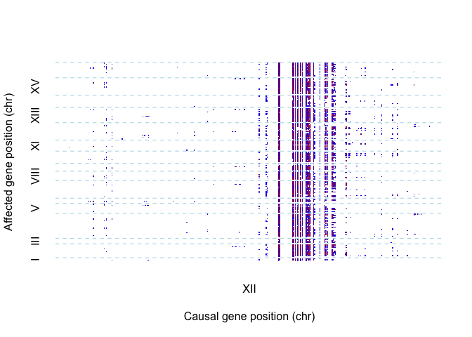
<p class="caption">Pairs of genes where the gene on the x-axis if affecting the gene on the y-axis. Colored by correlation value and sorted by chromosome and position</p>
</div>


### Which genes in the paper are also in my results   
Table with the number of times a gene form the paper is the causal or the affected gene

```r
# genes in hotspots referred to in the text
genes_in_text <- c("GPA1", "ERC1", "STB5", "HAP1", "KRE33", "MKT1", "IRA2")

# genes from the list above that are in my dataset 
my_genes_in_text <- unique(genes_GO.bio[symbol %in% genes_in_text, .(gene, symbol)])

# keep causality results where either geneA or geneB are in the list above
my_genes_in_text.effects <- find.effects_TF[geneA %in% my_genes_in_text$gene | 
                                            geneB %in% my_genes_in_text$gene]
# my_genes_in_text.effects <- find.effects_TF[geneA %in% my_genes_in_text$gene]

# replace my geneIds with the gene symbol (like what they have in the paper)
for (rown in 1:nrow(my_genes_in_text)){
  my_genes_in_text.effects[geneA == my_genes_in_text[rown]$gene]$geneA <- my_genes_in_text[rown]$symbol
  my_genes_in_text.effects[geneB == my_genes_in_text[rown]$gene]$geneB <- my_genes_in_text[rown]$symbol
}
# my_genes_in_text.effects[geneA %in% my_genes_in_text$symbol,.N, by=geneA]
# my_genes_in_text.effects[geneB %in% my_genes_in_text$symbol,.N, by=geneB]
# number of times a gene is the causal one or the affected one
mygenes_paper.count <- merge(my_genes_in_text.effects[geneA %in% my_genes_in_text$symbol,.N, by=geneA], 
      my_genes_in_text.effects[geneB %in% my_genes_in_text$symbol,.N, by=geneB],
      by.x="geneA", by.y="geneB", all=T)
setnames(mygenes_paper.count, c("gene", "causal", "affected"))
mygenes_paper.count[order(-causal)]
```

<div class="kable-table">

gene     causal   affected
------  -------  ---------
GPA1         68         11
ERC1         27          8
STB5          7         NA
KRE33        NA          6

</div>


# Focus on causal gene 12

```r
# coordinates_plot_cor[chr.A==12]
plot_sorted_coordinates(coordinates_plot_cor[chr.A==12], separator = separator, col = coordinates_plot_cor[chr.A==12]$col)
```

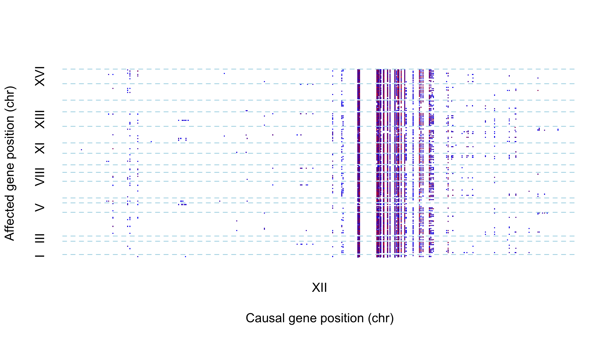

## Focus on the group of vertical bands
Chromosome 3 seems to mostly be affected by the genes in the vertical bands so I'm going to look closer at chromosome 3

```r
# the first gene of chromosome 12 that affects chromosome 3
lower_limit <- coordinates_plot_cor[chr.A==12 & chr.B==3][order(start.A)][1]$start.A
# the last gene on chromosome 12 that affects chromosome 3 and that's in the band (there's an extra gene further away from the band)
top_limit <- coordinates_plot_cor[chr.A==12 & chr.B==3][order(start.A)][nrow(coordinates_plot_cor[chr.A==12 & chr.B==3])-1]$start.A

# plot chromosome 12 - the green lines are the limits of the group of vertical bands
plot_sorted_coordinates(coordinates_plot_cor[chr.A==12], separator = separator, col = coordinates_plot_cor[chr.A==12]$col)
abline(v = c(lower_limit-1500, top_limit+1500), col="green")
```

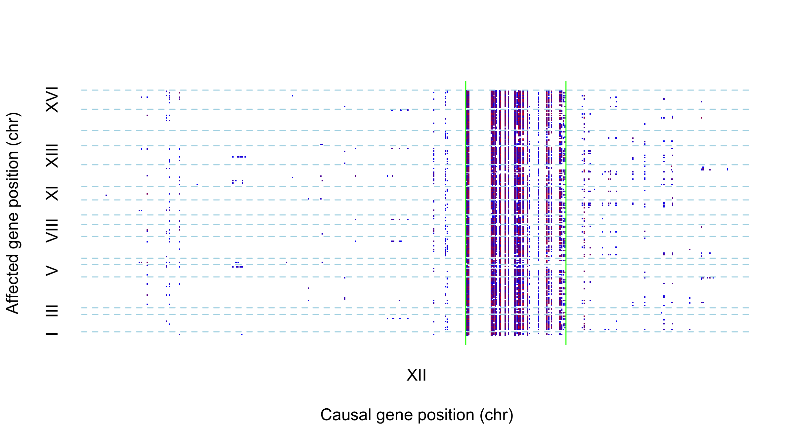


there are 30 genes between the two green bands

### get gene names for genes on chromosome 12

```r
if (!exists("genes_GO.bio")){
  genes_GO.table <- fread("results/genelistwithGOterm.txt")
  genes_GO.table <- unique(genes_GO.table)
  genes_GO.bio   <- unique(genes_GO.table[GO.namespace=="biological_process"])
}
```


```r
genesA_start_order <- unique(coordinates_plot_cor[chr.A == 12 & chr.B == 3][order(start.A)][, .(geneA, start.A)])
chr12_genenames_chr3 <- merge(genesA_start_order, unique(genes_GO.bio[,.(gene, symbol, gene.name, GO.term)]), by.x="geneA", by.y="gene")
chr12_genenames <- merge(unique(coordinates_plot_cor[chr.A == 12][order(start.A)][, .(geneA, start.A)]), unique(genes_GO.bio[,.(gene, symbol, gene.name, GO.term)]), by.x="geneA", by.y="gene")
```

### Look at the first group

```r
# genes that are affecting chromosome 3 + positions
band1.left <- min(genesA_start_order$start.A)
band1.right <- 8323026
plot_sorted_coordinates(
  coordinates_plot_cor[chr.A == 12],
  separator = separator,
  col = coordinates_plot_cor[chr.A==12]$col,
  xlim = c(band1.left, top_limit)
)
abline(v=c(band1.left-1500, band1.right+1500), col="green")
```

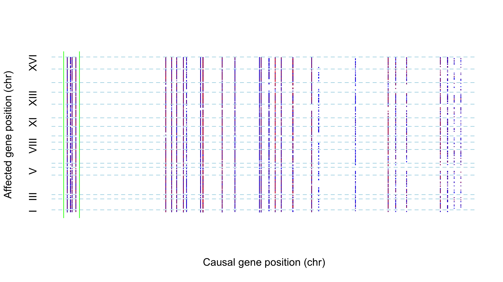

There are 31 between the green lines


```r
# genes that are affecting chromosome 3 + positions
plot_sorted_coordinates(
  coordinates_plot_cor[chr.A == 12],
  separator = separator,
  col = coordinates_plot_cor[chr.A==12]$col,
  xlim=c(band1.left, band1.right)
)
abline(v=c(band1.left-100, band1.right+100), col="green")
```

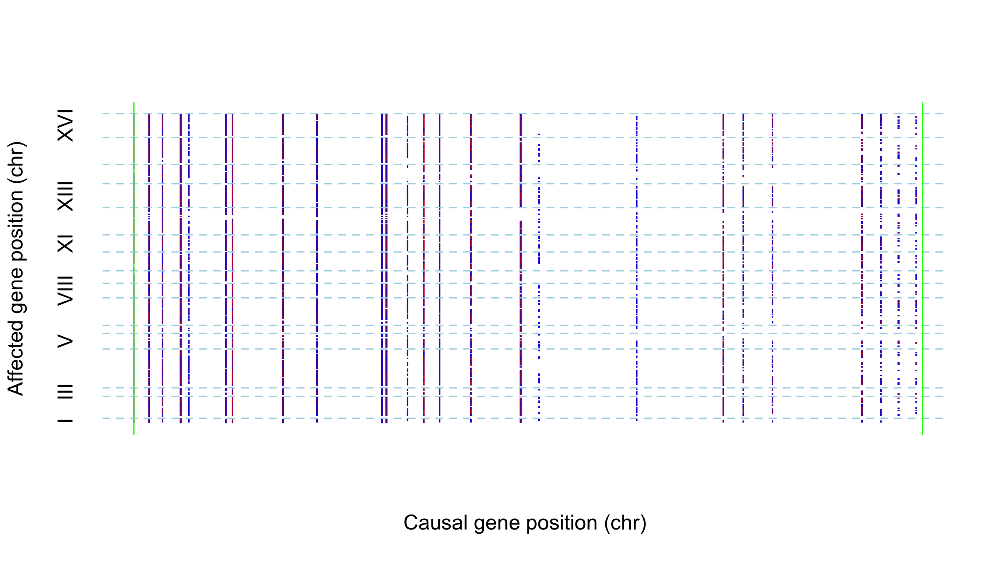

#### genes on the first "band" of chromosome 12

```r
# gene names
unique(chr12_genenames[between(start.A,band1.left, band1.right)]$gene.name)
```

```
## [1] "Methionine AminoPeptidase"       "CytiDine Deaminase"             
## [3] "Effect on Ras Function"          "Increased Recombination Centers"
```

```r
# GO terms present
unique(chr12_genenames[between(start.A,band1.left-100, band1.right+100)]$GO.term)
```

```
##  [1] "proteolysis"                                                        
##  [2] "negative regulation of gene expression"                             
##  [3] "protein initiator methionine removal involved in protein maturation"
##  [4] "protein initiator methionine removal"                               
##  [5] "cytidine catabolic process"                                         
##  [6] "deoxycytidine catabolic process"                                    
##  [7] "pyrimidine-containing compound salvage"                             
##  [8] "cytidine deamination"                                               
##  [9] "protein targeting to membrane"                                      
## [10] "peptidyl-L-cysteine S-palmitoylation"                               
## [11] "protein palmitoylation"                                             
## [12] "double-strand break repair via nonhomologous end joining"           
## [13] "protein ubiquitination"                                             
## [14] "double-strand break repair via synthesis-dependent strand annealing"
```

### Look at the second group

```r
band2.left <- 8360186
plot_sorted_coordinates(
  coordinates_plot_cor[chr.A == 12],
  separator = separator,
  col = coordinates_plot_cor[chr.A==12]$col,
  xlim = c(band2.left, top_limit)
)
abline(v=c(band2.left, top_limit+1000), col="green")
```


There are 26 genes between the green lines


#### genes on the second band of chromsome 12

```r
# gene names
unique(chr12_genenames[between(start.A,band2.left-1500, top_limit+1500)]$gene.name)
```

```
##  [1] "Long-Chain Base"                                                                            
##  [2] "Vacuolar Protein Sorting"                                                                   
##  [3] "Yeast Protein Two"                                                                          
##  [4] "REDuctional division"                                                                       
##  [5] "Ribosomal Protein of the Small subunit"                                                     
##  [6] "Nonhomologous End-Joining defective"                                                        
##  [7] "SECretory"                                                                                  
##  [8] "DeCapping Scavenger"                                                                        
##  [9] "Protein Interacting with Gsy2p"                                                             
## [10] NA                                                                                           
## [11] "mitochondrial protein Related to Spastic paraplegia with Optic atrophy and neuropathy SPG55"
## [12] "ChiTinaSe"                                                                                  
## [13] "Mitosis Entry Checkpoint"                                                                   
## [14] "General Control Derepressed"                                                                
## [15] "ExtraCellular Mutant"                                                                       
## [16] "EXo-1,3-beta-Glucanase"                                                                     
## [17] "UBiquitin-Conjugating"                                                                      
## [18] "AuTophaGy related"                                                                          
## [19] "SPa2 Homolog"                                                                               
## [20] "tRNA-specific Adenosine Deaminase"                                                          
## [21] "PEroXisome related"                                                                         
## [22] "Nicotinamide Mononucleotide Adenylyltransferase"                                            
## [23] "CHitin Synthase-related"
```

```r
# GO terms present
unique(chr12_genenames[between(start.A,band2.left-1500, top_limit+1500)]$GO.term)
```

```
##   [1] "lipid metabolic process"                                                                         
##   [2] "sphingolipid metabolic process"                                                                  
##   [3] "response to heat"                                                                                
##   [4] "phosphorylation"                                                                                 
##   [5] "calcium-mediated signaling"                                                                      
##   [6] "lipid phosphorylation"                                                                           
##   [7] "protein targeting to vacuole"                                                                    
##   [8] "retrograde transport, vesicle recycling within Golgi"                                            
##   [9] "intracellular protein transport"                                                                 
##  [10] "retrograde vesicle-mediated transport, Golgi to endoplasmic reticulum"                           
##  [11] "intra-Golgi vesicle-mediated transport"                                                          
##  [12] "Golgi to endosome transport"                                                                     
##  [13] "protein transport"                                                                               
##  [14] "macroautophagy"                                                                                  
##  [15] "cytoplasm to vacuole transport by the Cvt pathway"                                               
##  [16] "Rab protein signal transduction"                                                                 
##  [17] "protein localization to phagophore assembly site"                                                
##  [18] "cellular protein-containing complex localization"                                                
##  [19] "retrograde transport, endosome to Golgi"                                                         
##  [20] "synaptonemal complex assembly"                                                                   
##  [21] "reciprocal meiotic recombination"                                                                
##  [22] "sporulation resulting in formation of a cellular spore"                                          
##  [23] "positive regulation of catalytic activity"                                                       
##  [24] "meiotic cell cycle"                                                                              
##  [25] "meiotic recombination checkpoint"                                                                
##  [26] "ribosomal small subunit assembly"                                                                
##  [27] "cytoplasmic translation"                                                                         
##  [28] "rRNA export from nucleus"                                                                        
##  [29] "translation"                                                                                     
##  [30] "maturation of SSU-rRNA"                                                                          
##  [31] "positive regulation of nuclear-transcribed mRNA catabolic process, deadenylation-dependent decay"
##  [32] "DNA repair"                                                                                      
##  [33] "double-strand break repair"                                                                      
##  [34] "double-strand break repair via nonhomologous end joining"                                        
##  [35] "cellular response to DNA damage stimulus"                                                        
##  [36] "homologous recombination"                                                                        
##  [37] "double-strand break repair via single-strand annealing"                                          
##  [38] "endoplasmic reticulum to Golgi vesicle-mediated transport"                                       
##  [39] "vesicle fusion"                                                                                  
##  [40] "vesicle-mediated transport"                                                                      
##  [41] "vesicle fusion with endoplasmic reticulum"                                                       
##  [42] "vesicle fusion with Golgi apparatus"                                                             
##  [43] "deadenylation-dependent decapping of nuclear-transcribed mRNA"                                   
##  [44] "cellular response to starvation"                                                                 
##  [45] "nuclear-transcribed mRNA catabolic process, deadenylation-independent decay"                     
##  [46] "positive regulation of exoribonuclease activity"                                                 
##  [47] "glycogen biosynthetic process"                                                                   
##  [48] "regulation of glycogen biosynthetic process"                                                     
##  [49] "regulation of phosphoprotein phosphatase activity"                                               
##  [50] "spliceosomal snRNP assembly"                                                                     
##  [51] "mRNA processing"                                                                                 
##  [52] "biological_process"                                                                              
##  [53] "RNA splicing"                                                                                    
##  [54] "translational termination"                                                                       
##  [55] "polysaccharide catabolic process"                                                                
##  [56] "septum digestion after cytokinesis"                                                              
##  [57] "carbohydrate metabolic process"                                                                  
##  [58] "chitin catabolic process"                                                                        
##  [59] "metabolic process"                                                                               
##  [60] "cell wall organization"                                                                          
##  [61] "regulation of cell cycle"                                                                        
##  [62] "DNA damage checkpoint"                                                                           
##  [63] "telomere maintenance via recombination"                                                          
##  [64] "telomere maintenance"                                                                            
##  [65] "double-strand break repair via homologous recombination"                                         
##  [66] "nucleotide-excision repair"                                                                      
##  [67] "chromatin silencing at telomere"                                                                 
##  [68] "cell cycle"                                                                                      
##  [69] "intra-S DNA damage checkpoint"                                                                   
##  [70] "mitotic DNA replication checkpoint"                                                              
##  [71] "meiotic DNA integrity checkpoint"                                                                
##  [72] "translational initiation"                                                                        
##  [73] "regulation of translation"                                                                       
##  [74] "regulation of translational initiation"                                                          
##  [75] "cellular metabolic process"                                                                      
##  [76] "regulation of catalytic activity"                                                                
##  [77] "proteolysis"                                                                                     
##  [78] "glutathione metabolic process"                                                                   
##  [79] "glutathione catabolic process"                                                                   
##  [80] "xenobiotic metabolic process"                                                                    
##  [81] "cellular glucan metabolic process"                                                               
##  [82] "glucan catabolic process"                                                                        
##  [83] "fungal-type cell wall organization"                                                              
##  [84] "protein ubiquitination"                                                                          
##  [85] "protein neddylation"                                                                             
##  [86] "autophagy"                                                                                       
##  [87] "autophagy of nucleus"                                                                            
##  [88] "reticulophagy"                                                                                   
##  [89] "conjugation"                                                                                     
##  [90] "bipolar cellular bud site selection"                                                             
##  [91] "pseudohyphal growth"                                                                             
##  [92] "regulation of cell shape"                                                                        
##  [93] "mating projection formation"                                                                     
##  [94] "invasive filamentous growth"                                                                     
##  [95] "positive regulation of MAPK cascade"                                                             
##  [96] "tRNA wobble adenosine to inosine editing"                                                        
##  [97] "tRNA modification"                                                                               
##  [98] "tRNA processing"                                                                                 
##  [99] "peroxisome organization"                                                                         
## [100] "ER-dependent peroxisome organization"                                                            
## [101] "membrane tubulation"                                                                             
## [102] "regulation of peroxisome organization"                                                           
## [103] "biosynthetic process"                                                                            
## [104] "NAD biosynthetic process"                                                                        
## [105] "pyridine nucleotide biosynthetic process"                                                        
## [106] "cellular bud site selection"                                                                     
## [107] "conjugation with cellular fusion"                                                                
## [108] "cell wall chitin catabolic process"                                                              
## [109] "regulation of transcription, DNA-templated"                                                      
## [110] "Golgi to plasma membrane transport"                                                              
## [111] "ascospore wall assembly"
```


# Look at hotspots

```r
hotspot_data <- fread("data/SI_Data_08_hotspotTableForPaper_topGenes100_170420_page1.csv")
```


```r
hotspot_data.interval <- hotspot_data[,.(hotspotMarker, chromosome, bootstrapIntervalLeft, bootstrapIntervalRight)]
# remove "chr" part of the chromosome name
hotspot_data.interval$chromosome <-gsub('chr', '', hotspot_data.interval$chromosome)

# convert roman chromosome numbers to numbers
hotspot_data.interval$chromosome <- as.numeric(as.roman(hotspot_data.interval$chromosome))
```

# Get hotspot locations ordered

```r
vchr <- unique(hotspot_data.interval$chromosome)
hotspot_data.interval$left.map <- 0
hotspot_data.interval$right.map <- 0
for (i in 1:length(vchr)){
  if (vchr[i] != 1) {
    previous <- vchr[i-1]
    hotspot_data.interval[chromosome == vchr[i]]$left.map <- max(coordinates_plot_cor[chr.A==previous]$start.A) + separator + hotspot_data.interval[chromosome==vchr[i]]$bootstrapIntervalLeft
    hotspot_data.interval[chromosome == vchr[i]]$right.map <- max(coordinates_plot_cor[chr.A==previous]$start.A) + separator + hotspot_data.interval[chromosome==vchr[i]]$bootstrapIntervalRight
  } else if (vchr[i] == 1){
    hotspot_data.interval[chromosome == vchr[i]]$left.map <- hotspot_data.interval[chromosome==vchr[i]]$bootstrapIntervalLeft
    hotspot_data.interval[chromosome == vchr[i]]$right.map <- hotspot_data.interval[chromosome==vchr[i]]$bootstrapIntervalRight
  }
}
```

## Get genes that are inside the hotspots

```r
granges.A <- GRanges(seqnames = gene.location.order$chr.A,
        ranges=IRanges(start=gene.location.order$start.A,
                       end = gene.location.order$end.A),
        strand= gene.location.order$strand.A)
names(granges.A) <- gene.location.order$geneA
granges.A <- unique(granges.A)

granges.B <- GRanges(seqnames = gene.location.order$chr.B,
                     ranges=IRanges(start=gene.location.order$start.B,
                                    end = gene.location.order$end.B),
                     strand= gene.location.order$strand.B)
names(granges.B) <- gene.location.order$geneB
granges.B <- unique(granges.B)


granges.hotspots <- GRanges(seqnames = hotspot_data.interval$chromosome,
                            ranges=IRanges(start=hotspot_data.interval$bootstrapIntervalLeft,
                                           end=hotspot_data.interval$bootstrapIntervalRight))
names(granges.hotspots) <- hotspot_data.interval$hotspotMarker


# genes that are in hotspots
overlapping_genesA <- subsetByOverlaps(granges.A, granges.hotspots)
genes_in_hotspot <- unique(gene.location.order[geneA %in% names(overlapping_genesA)][,.(geneA, start.A, end.A, chr.A, strand.A)])

overlap <- findOverlaps(granges.A, granges.hotspots, ignore.strand=T)
genes_in_hotspot$hotspot <- names(granges.hotspots[subjectHits(overlap)])
genes_in_hotspot_poshot <-  merge(genes_in_hotspot, hotspot_data.interval[,.(hotspotMarker, bootstrapIntervalLeft, bootstrapIntervalRight, left.map, right.map)], by.x="hotspot", by.y="hotspotMarker")
genes_in_hotspot_pos <- unique(merge(genes_in_hotspot_poshot, coordinates_plot_cor[,.(geneA, start.A.map=start.A, end.A.map =end.A)],  by="geneA"))
```

Only 15.11% of the causal genes are in the hotspots.  
Most of the causal genes were not located in the hotspots

#### number of genes in hotspots and number of hotspots in each chromosome in and how many causal genes are in each hotspot

```r
# how many hotspots are in each chromosome and how many genes overlapping with hotspots are in each chromosome
hotspot_genes_in_chr <- genes_in_hotspot_pos[,.N, by=chr.A]
hotspots_in_chr <- hotspot_data.interval[,.N, by=chromosome]

hotspots_per_chr <- merge(hotspot_genes_in_chr, hotspots_in_chr, by.x="chr.A", by.y="chromosome")
setnames(hotspots_per_chr, c("chr", "n_genes", "n_hotspots"))
head(hotspots_per_chr[order(-n_genes)])
```

<div class="kable-table">

 chr   n_genes   n_hotspots
----  --------  -----------
   4        13           12
   7        12            9
  15        11           10
  12         9            6
  13         9            8
  10         8            8

</div>

```r
# how many causal genes are in the each hotspot (that contains causal genes) (ordered by number of genes)
head(genes_in_hotspot[,.(n_genes=.N),  by=hotspot][order(-n_genes)])
```

<div class="kable-table">

hotspot              n_genes
------------------  --------
chrIV:461656_A/G           8
chrXII:848842_A/G          6
chrII:619028_C/A           5
chrVII:178509_T/C          5
chrIX:105090_T/C           5
chrVII:850923_T/C          4

</div>

### Plot number of hotspots that have a certain number of causal genes

```r
ngenes_hotspot <- genes_in_hotspot[,.(n_genes=.N),  by=hotspot]
nhotspots_genes <- ngenes_hotspot[,.N, by=n_genes][order(n_genes)]
bp <- barplot(nhotspots_genes$N, names.arg = nhotspots_genes$n_genes, xlab = "Number of genes in hotspot", ylab="Number of hotspots", ylim=c(0,max(nhotspots_genes$N)+2))
text(bp, nhotspots_genes$N, labels=nhotspots_genes$N, pos = 3)
```

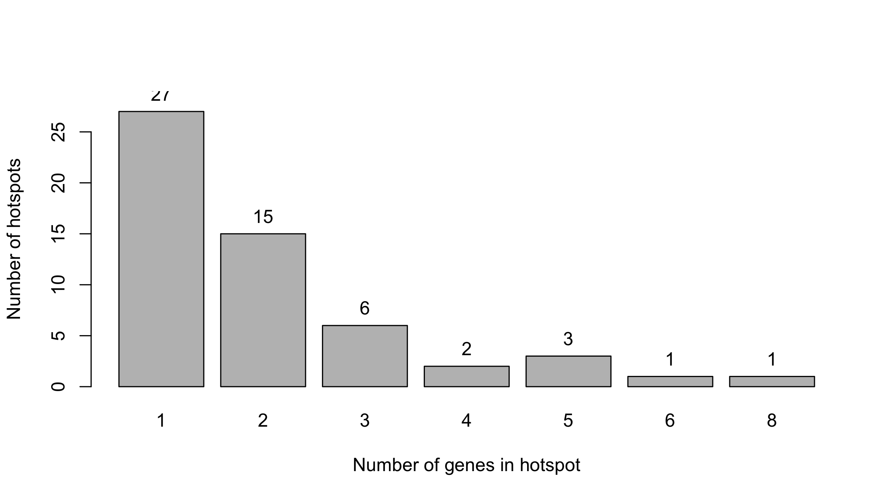


## comparison of found causal genes in hotspots with genes from paper in hotspots

```r
genes_hotspot_paper <- hotspot_data[,.(hotspotMarker, allGenesInInterval)]
genes_in_hotspot.names <- merge(genes_in_hotspot, unique(genes_GO.bio[,.(gene, symbol, gene.name)]), by.x="geneA", by.y="gene")

# genes_in_hotspot.names[geneA %in% unlist(strsplit(genes_hotspot_paper$allGenesInInterval, split = ";")) | symbol %in% unlist(strsplit(genes_hotspot_paper$allGenesInInterval, split = ";"))]

if (all(genes_in_hotspot.names$geneA %in% unlist(strsplit(genes_hotspot_paper$allGenesInInterval, split = ";")) | genes_in_hotspot.names$symbol %in% unlist(strsplit(genes_hotspot_paper$allGenesInInterval, split = ";")))){
  print("All the causal genes found in the hotspots have been reported by the paper")
} else {
  print("Some of the causal genes are not reported in the paper")
}
```

```
## [1] "All the causal genes found in the hotspots have been reported by the paper"
```

## Genes that are being affected by genes in a hotspot

```r
genes_affected_byhotspot <- unique(find.effects_TF[geneA %in% genes_in_hotspot$geneA][,.(geneA, geneB)])
```
In total, there are 1593 genes affected by genes in a hotspot


```r
genes_affected_byhotspotB <- unique(merge(unique(gene.location.order[geneA %in% names(overlapping_genesA)]), genes_in_hotspot[,.(geneA, hotspot)], by="geneA")[,.(geneB, start.B, end.B, chr.B, hotspot, chr.A)])
toplot <- unique(genes_affected_byhotspotB[,.(chr.A,.N), hotspot][order(chr.A)])
color = grDevices::colors()[grep('gr(a|e)y', grDevices::colors(), invert = T)]
pal <- sample(color, length(unique(toplot$chr.A)))
toplot$col <-pal[toplot$chr.A]
barplot(
  toplot$N,
  names.arg = toplot$hotspot,
  las = 2,
  cex.names = 0.5,
  col=toplot$col, 
  main ="Number of genes each hotspot affects"
)
legend(x = "topright", legend = unique(toplot$chr.A), col = pal, pch=20, title="chr", cex = 0.7)
```

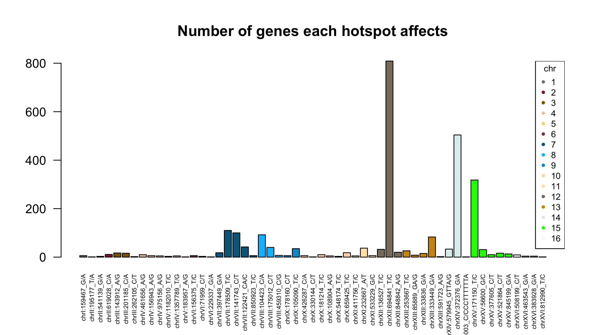


## Plot gene 12 with described hotspots

```r
plot_sorted_coordinates(
  coordinates_plot_cor[chr.A==12],
  separator = separator,
  col = coordinates_plot_cor[chr.A==12]$col
)


nCol <- nrow(hotspot_data.interval[chromosome==12])
col<- rep(1:nCol, each = 2)

hotspots <- data.table(c(hotspot_data.interval[chromosome==12]$left.map, hotspot_data.interval[chromosome==12]$right.map))
hotspots <- hotspots[order(V1)]
abline(v=unlist(hotspots$V1), 
       col=as.factor(col), lwd=1)
```

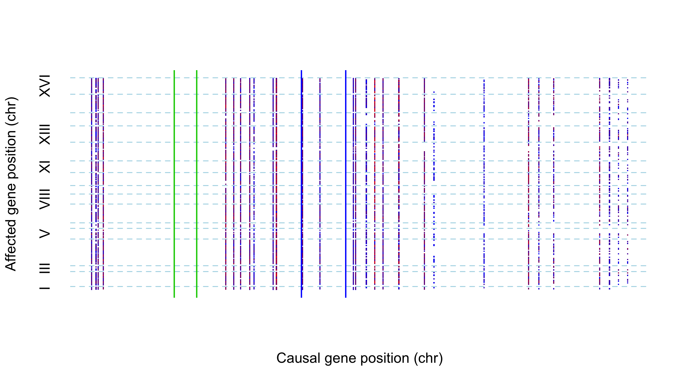

### closer look 

```r
# genes that are affecting chromosome 3 + positions
# genes that are affecting chromosome 3 + positions
band1.left <- min(genesA_start_order$start.A)
band1.right <- 8525907
plot_sorted_coordinates(
  coordinates_plot_cor[chr.A == 12],
  separator = separator,
  col = coordinates_plot_cor[chr.A==12]$col,
  xlim = c(min(genesA_start_order$start.A), top_limit)
)
# abline(v=c(band1.left-1500, band1.right+1500), col="green")
abline(v=unlist(hotspots$V1), 
       col=as.factor(col), lwd=1.5)
```

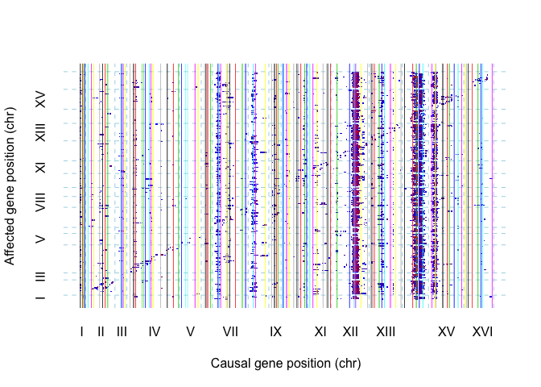

### genes in chromosome 12 that overlap with hotspots

```r
unique(chr12_genenames[chr12_genenames[, geneA %in% genes_in_hotspot_pos[chr.A==12]$geneA]][,.(geneA, start.A, symbol, gene.name)])
```

<div class="kable-table">

geneA        start.A  symbol   gene.name                        
----------  --------  -------  ---------------------------------
YLL007C      7828644  LMO1     eLMO homolog                     
YLR273C      8383425  PIG1     Protein Interacting with Gsy2p   
YLR275W      8388720  SMD2     NA                               
YLR361C-A    8543725  NA       NA                               
YLR364W      8548404  GRX8     GlutaRedoXin                     
YLR369W      8553894  SSQ1     Stress-Seventy subfamily Q       
YLR371W      8557056  ROM2     RhO1 Multicopy suppressor        
YLR375W      8566039  STP3     protein with similarity to Stp1p 
YLR376C      8567168  PSY3     Platinum SensitivitY             

</div>

### All hotspots plotted

```r
plot_sorted_coordinates(
  coordinates_plot_cor,
  separator = separator,
  col = coordinates_plot_cor$col
)


nCol <- nrow(hotspot_data.interval)
col<- rep(1:nCol, each = 2)

hotspots <- data.table(c(hotspot_data.interval$left.map, hotspot_data.interval$right.map))
hotspots <- hotspots[order(V1)]
abline(v=unlist(hotspots$V1), 
       col=as.factor(col), lwd=0.5)
```

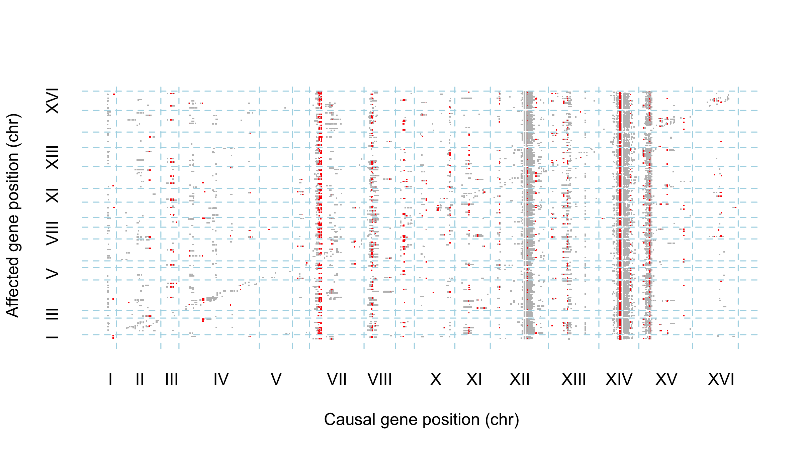

### Only hotspots that contain causal genes plotted

```r
plot_sorted_coordinates(
  coordinates_plot_cor,
  separator = separator,
  col = coordinates_plot_cor$col
)


hotspots_causalgenes <- unique(genes_in_hotspot_pos[,.(hotspot, left.map, right.map)])
nCol <- nrow(hotspots_causalgenes)
col<- rep(1:nCol, each = 2)

hotspots <- data.table(c(hotspots_causalgenes$left.map, hotspots_causalgenes$right.map))
hotspots <- hotspots[order(V1)]
abline(v=unlist(hotspots$V1), 
       col=as.factor(col), lwd=0.5)
```

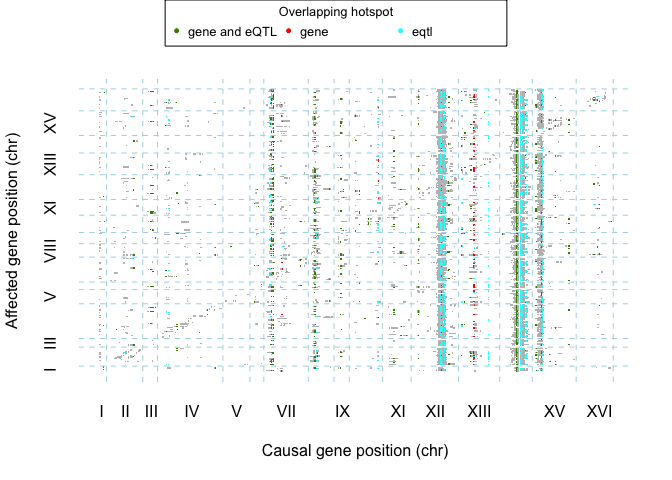

### Color the gene pairs where the causal gene overlaps an eQTL hotspot

```r
coordinates_plot_cor$hotspotcol <- "grey"
coordinates_plot_cor[geneA %in% genes_in_hotspot_pos$geneA]$hotspotcol <- "red"

plot_sorted_coordinates(
  coordinates_plot_cor,
  separator = separator,
  col = coordinates_plot_cor$hotspotcol
)
```


### Color the gene pairs where either the causal gene overlaps the hotspot, the marker overlaps the hotspot or both

Color the plot if  
* the causal gene overlaps the hotspot
* the causal gene's eQTL overlaps the hotspot
* the causal gene and its eQTL overlaps the hotspot


```r
colorbymarker <- unique(merge(find.effects_TF, unique(eqtl_results[,.(gene, pmarker, CI.l, CI.r)]), by.x=c("geneA", "eqtl.A"), by.y=c("gene", "pmarker")))

colorbymarker <- separate(colorbymarker, col = CI.l, c("marker.chr", "marker.pos.l", "marker.other.l"), sep = "[:_]+", remove = F,
         convert = T, extra = "warn", fill = "warn")
colorbymarker <- separate(colorbymarker, col = CI.r, c("marker.chr.r", "marker.pos.r", "marker.other.r"), sep = "[:_]+", remove = F,
                          convert = T, extra = "warn", fill = "warn")

# remove extra columns
colstoremove <-  c("CI.l", "CI.r", "marker.chr.r", "marker.other.l", "marker.other.r")
colorbymarker[,(colstoremove):=NULL]

## transform chromosome ids into numbers
# remove "chr" part of the chromosome name
colorbymarker$marker.chr <-gsub('chr', '', colorbymarker$marker.chr)


colorbymarker$marker.chr <- as.numeric(as.roman(colorbymarker$marker.chr))

colorbymarker_toGR <- unique(colorbymarker[,.(geneA, eqtl.A, marker.chr, marker.pos.l, marker.pos.r)])

granges.marker <- GRanges(seqnames = colorbymarker_toGR$marker.chr,
                     ranges=IRanges(start=colorbymarker_toGR$marker.pos.l,
                                    end = colorbymarker_toGR$marker.pos.r))
names(granges.marker) <- colorbymarker_toGR$eqtl.A

granges.hotspots <- GRanges(seqnames = hotspot_data.interval$chromosome,
                            ranges=IRanges(start=hotspot_data.interval$bootstrapIntervalLeft,
                                           end=hotspot_data.interval$bootstrapIntervalRight))
names(granges.hotspots) <- hotspot_data.interval$hotspotMarker


# markers that are in hotspots
overlapping_markers <- subsetByOverlaps(granges.marker, granges.hotspots)
markers_in_hotspot <- colorbymarker_toGR[eqtl.A %in% names(overlapping_markers)]

coordinates_plot_cor$hotspotcol <- "grey"
# cases where the gene and the marker overlap the hotspot
coordinates_plot_cor[geneA %in% markers_in_hotspot$geneA & geneA %in% genes_in_hotspot_pos$geneA]$hotspotcol <- "chartreuse4"
# cases where the gene overlaps the hotspot but the marker doesn't
coordinates_plot_cor[!geneA %in% markers_in_hotspot$geneA & geneA %in% genes_in_hotspot_pos$geneA]$hotspotcol <- "red"
# cases where the marker overlaps the hotspot but the gene doesn't
coordinates_plot_cor[geneA %in% markers_in_hotspot$geneA & !geneA %in% genes_in_hotspot_pos$geneA]$hotspotcol <- "cyan"


plot_sorted_coordinates(
  coordinates_plot_cor,
  separator = separator,
  col = coordinates_plot_cor$hotspotcol
)
add_legend("top", legend=c("gene and eQTL", "gene", "eqtl"), pch=20, 
           col=c("chartreuse4", "red", "cyan"),,
           horiz=TRUE, cex=0.8, title="Overlapping hotspot")
```

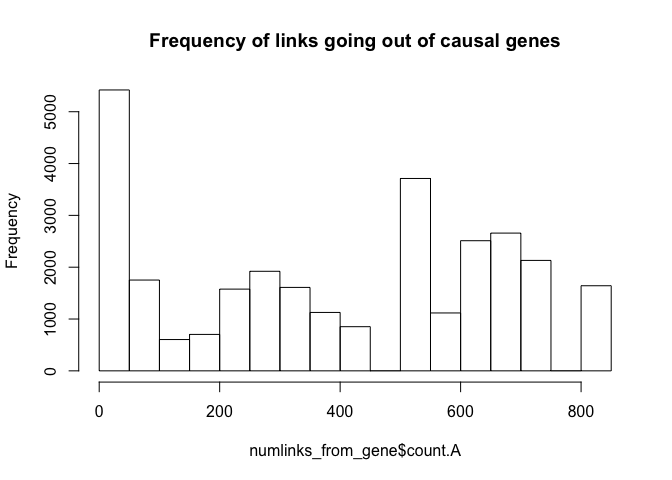


```r
if (!exists("numlinks_from_gene")){
  numlinks_from_gene.A <- find.effects_TF[, .(geneB, count.A=.N), by=geneA]
  numlinks_from_gene.B <- find.effects_TF[, .(count.B=.N), by=geneB]
  numlinks_from_gene <- merge(numlinks_from_gene.A, numlinks_from_gene.B, by="geneB", all=T)
  setcolorder(numlinks_from_gene, c("geneA", "geneB", "count.A", "count.B"))
}
```


```r
hist(numlinks_from_gene$count.A, main = "Frequency of links going out of causal genes")
```

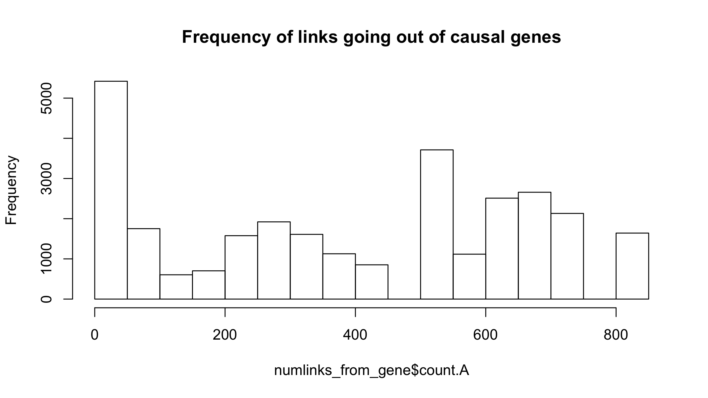


see which genes that have more than 200 links going out overlap with the hotspots
# See overlap of genes that have > 200 links going out with the hotspots
Add number of links going out to the coordinates table

```r
coordinates_plot_links <- merge(coordinates_plot_cor, unique(numlinks_from_gene[,.(geneA, count.A)])[order(-count.A)], by="geneA")
```

## Plot where causal genes have > 200 links going out and the existing hotspots in the chromosomes they are in

```r
coordinates_plot_links.200 <- coordinates_plot_links[count.A>=200]

plot_sorted_coordinates(
  coordinates_plot_links.200,
  separator = separator,
  col = coordinates_plot_links.200$col
)

chrom_to_plot <- unique(coordinates_plot_links.200$chr.A)

nCol <- nrow(hotspot_data.interval)
col<- rep(1:nCol, each = 2)

hotspots <- data.table(c(hotspot_data.interval[chromosome %in% chrom_to_plot]$left.map, hotspot_data.interval[chromosome %in% chrom_to_plot]$right.map))
hotspots <- hotspots[order(V1)]
abline(v=unlist(hotspots$V1),
       col=as.factor(col), lwd=1)
```

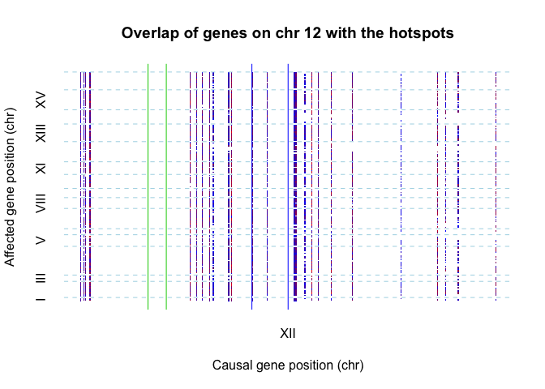

### How many genes that have more than 200 links going out overlap the hotspots

```r
genes_hotspot_links.200 <- genes_in_hotspot_pos[geneA %in% coordinates_plot_links.200$geneA]
genes_hotspot_links.200.names <- unique(merge(genes_hotspot_links.200[,.(geneA, hotspot, chr.A)], genes_GO.bio[,.(gene, symbol, gene.name)], by.x="geneA", by.y="gene"))
genes_hotspot_links.200.names
```

<div class="kable-table">

geneA     hotspot              chr.A  symbol   gene.name                         
--------  ------------------  ------  -------  ----------------------------------
YLR273C   chrXII:694841_T/C       12  PIG1     Protein Interacting with Gsy2p    
YLR275W   chrXII:694841_T/C       12  SMD2     NA                                
YNL135C   chrXIV:372376_G/A       14  FPR1     Fk 506-sensitive Proline Rotamase 
YOL082W   chrXV:171150_T/C        15  ATG19    AuTophaGy related                 

</div>

There are 4 genes overlapping 3 hotspots


```r
chrom_to_plot <- unique(genes_hotspot_links.200.names$chr.A)
for (chr in unique(genes_hotspot_links.200.names$chr.A)){
  plot_sorted_coordinates(
    coordinates_plot_links.200[chr.A==chr],
    separator = separator,
    col = coordinates_plot_links.200[chr.A==chr]$col, 
    main = paste("Overlap of genes on chr", chr,"with the hotspots" ,sep=" ")
  )
 
  chrom_to_plot <- unique(coordinates_plot_links.200$chr.A)
  
  nCol <- nrow(hotspot_data.interval)
  col<- rep(1:nCol, each = 2)
  
  hotspots <- data.table(c(hotspot_data.interval[chromosome %in% chrom_to_plot]$left.map, hotspot_data.interval[chromosome %in% chrom_to_plot]$right.map))
  hotspots <- hotspots[order(V1)]
  abline(v=unlist(hotspots$V1), 
         col=as.factor(col), lwd=1)
  
  print(genes_hotspot_links.200.names[chr.A== chr])
}
```

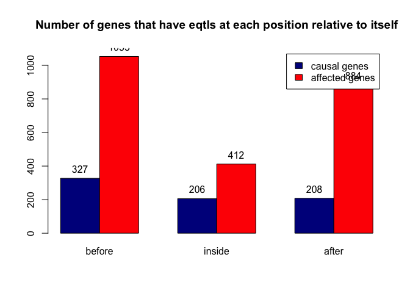

```
##      geneA           hotspot chr.A symbol                      gene.name
## 1: YLR273C chrXII:694841_T/C    12   PIG1 Protein Interacting with Gsy2p
## 2: YLR275W chrXII:694841_T/C    12   SMD2                           <NA>
```

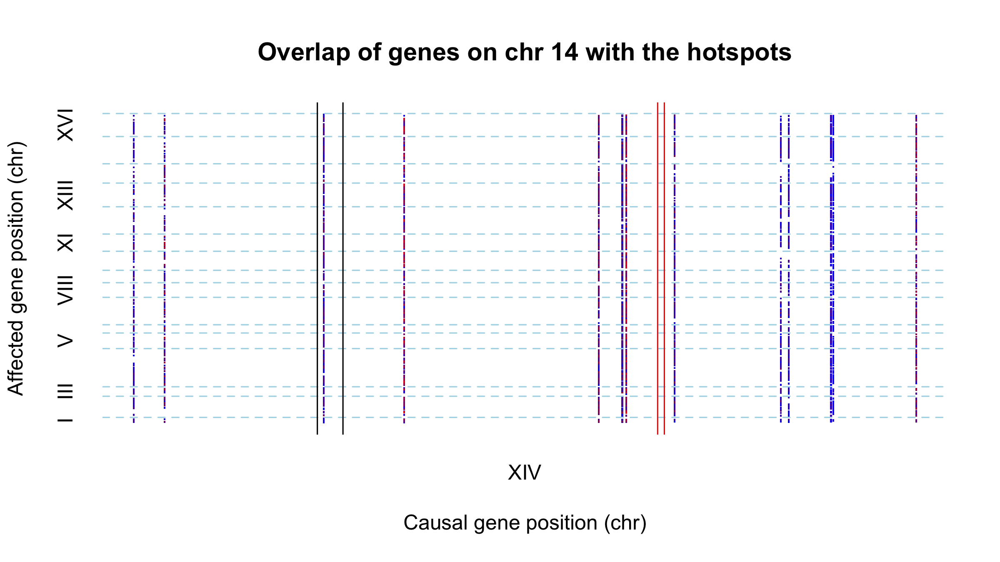

```
##      geneA           hotspot chr.A symbol                         gene.name
## 1: YNL135C chrXIV:372376_G/A    14   FPR1 Fk 506-sensitive Proline Rotamase
```

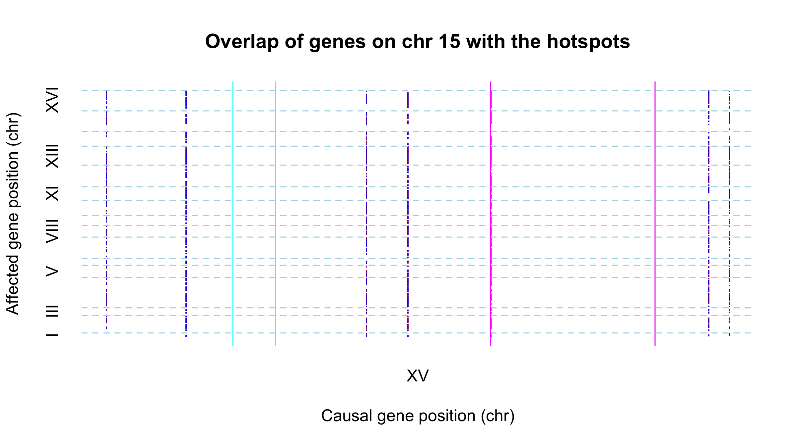

```
##      geneA          hotspot chr.A symbol         gene.name
## 1: YOL082W chrXV:171150_T/C    15  ATG19 AuTophaGy related
```


## Values
Only 15.11% of the causal genes are in the hotspots.  
Most of the causal genes were not located in the hotspots

In total, there are 1593 genes affected by genes in a hotspot


# Read counts

```r
load("data/counts.RData")
# matrix where 1 if the gene is absent in that individual (if the field's value is zero), 0 if it's present
# For all genes
getzeros <- apply(counts$pheno, 1, function(x) {ifelse(x==0, 1, 0)})
# sum the number of individuals that don't have that gene
howmany <- colSums(getzeros)
# How many samples each gene has missing
count_missinggene <- data.table(gene=names(howmany), nsamples_missing =howmany)
count_missinggene <- count_missinggene[order(-nsamples_missing)]

# How many samples each *causal* gene has missing
causalgenes_counts <- merge(unique(find.effects_TF[,.(geneA, eqtl.A)]), count_missinggene, by.x="geneA", by.y="gene")
causalgenes_counts <- causalgenes_counts[order(-nsamples_missing)]

# add coordinates and chromosome
causalgenes_counts.coord <- unique(merge(causalgenes_counts, coordinates_plot_cor[,.(geneA, start.A, end.A, chr.A)], by="geneA"))

# keep the genes that are in chromosome 12, 14 or 15 - chromosomes that show the strongest bands
causalgenes_counts.coord.bands <- causalgenes_counts.coord[chr.A %in% c(12,14, 15)][order(-nsamples_missing)]

# transform counts$pheno into dt and transposing
counts_pheno.dt <- data.table(t(counts$pheno), keep.rownames = T)
```

## Violin plot of read counts for all causal genes in chr 12, 14 and 15

```r
genes_to_plot.causal <- causalgenes_counts.coord.bands$geneA
counts_genes_to_plot.causal <- counts_pheno.dt[,..genes_to_plot.causal]

res <- data.table(NULL)
for (gene in names(counts_genes_to_plot.causal)){
  res <- rbind(res, data.table(gene, unlist(counts_pheno.dt[,..gene]), "causal", causalgenes_counts.coord.bands[geneA==gene]$chr.A))
}
setnames(res, c("gene", "counts", "causal", "chr"))


p <- ggplot(res, aes(x=gene, y=counts, fill=as.factor(chr))) + 
  geom_violin() + 
  labs(title="Counts distribution for causal genes in chr 12, 14 and 15")
p + theme(axis.text.x = element_text(angle = 90, hjust = 1)) 
```

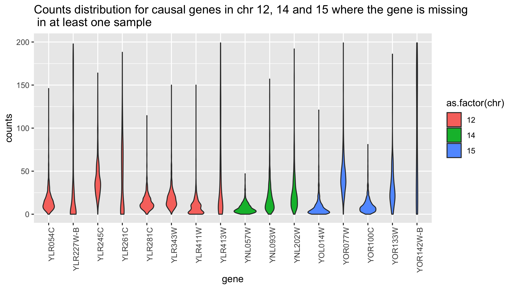

## Violin plot of read counts for causal genes in chr 12, 14 and 15 that have one or more individuals missing

```r
# causal genes that genes that are in chr 12, 14 or 15 and are missing in at least one individual
genes_to_plot.causal <- causalgenes_counts.coord.bands[nsamples_missing>0]$geneA

# get read counts for those genes
counts_genes_to_plot.causal <- counts_pheno.dt[,..genes_to_plot.causal]

res.sub <- data.table(NULL)
for (gene in names(counts_genes_to_plot.causal)){
  res.sub <- rbind(res.sub, data.table(gene, unlist(counts_pheno.dt[,..gene]), "causal", causalgenes_counts.coord.bands[geneA==gene]$chr.A))
}
setnames(res.sub, c("gene", "counts", "causal", "chr"))


p.sub <- ggplot(res.sub, aes(x=gene, y=counts, fill=as.factor(chr))) + 
  geom_violin() + 
  ylim(0,200) +
  labs(title="Counts distribution for causal genes in chr 12, 14 and 15 where the gene is missing \n in at least one sample")
p.sub + theme(axis.text.x = element_text(angle = 90, hjust = 1)) 
```


## Algorithm to find hotspots
1. Find genes that are affecting at least 10 other genes
2. Hotspot where there are 10 or more genes in a row that are affecting 10 other genes

```r
causalgenes.pos.count1 <- unique(coordinates_plot_links[order(chr.A,start.A)][,.(geneA, start.A, end.A, chr.A, count.A)])

allgenes.location <- genepos

## transform chromosome ids into numbers
# remove "chr" part of the chromosome name
allgenes.location$chr.id <- gsub('chr', '', allgenes.location$chr.id)
# convert roman chromosome numbers to numbers
allgenes.location$chr.id <- as.numeric(as.roman(allgenes.location$chr.id))
# geneA with counts, sorted position and original position
causalgenes.pos.count <- merge(causalgenes.pos.count1, allgenes.location, by.x=c("geneA", "chr.A"), by.y=c("gene", "chr.id"))
causalgenes.pos.count <- causalgenes.pos.count[order(chr.A, start.A, end.A)]

# For each chromosome get the sequence of values that follow a certain condition
# condition == count.A>lim
# True - causal genes affect "lim" or more genes
# False - causal genes affect less than "lim" genes

# create list of tables - one for each chr
# each table has the runs for the condition count.A>lim

rle.res.list <- rle_causalgenes(causalgenes.pos.count, lim = 10)


# find hotspots and plot them
# pdf(file = "results/figures/my_causal_hotspots.pdf", onefile = T)
plot_sorted_coordinates(coordinates_plot_cor, separator = separator, col = coordinates_plot_cor[chr.A==chr]$col)
```

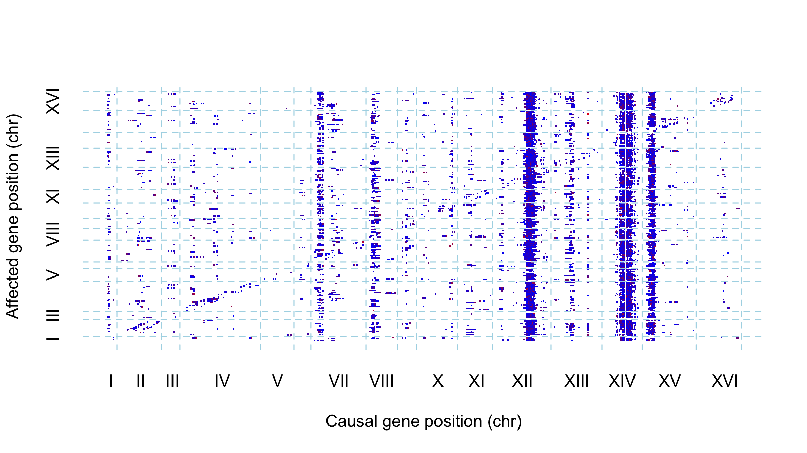

```r
hot <- find_hotspots(rle.list = rle.res.list, coordinates_plot = coordinates_plot_cor, causalgenes = causalgenes.pos.count, lim = 10, plt = T)
```

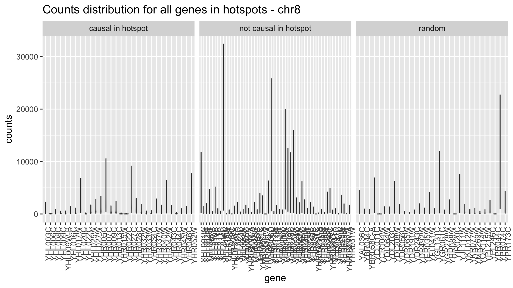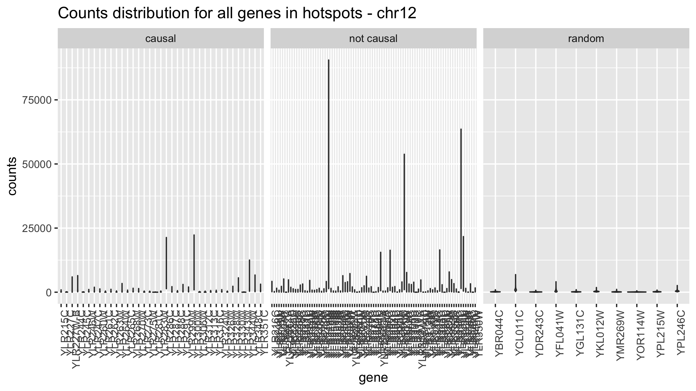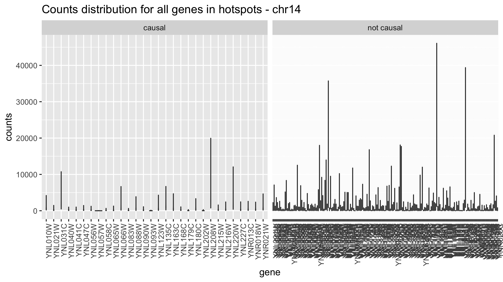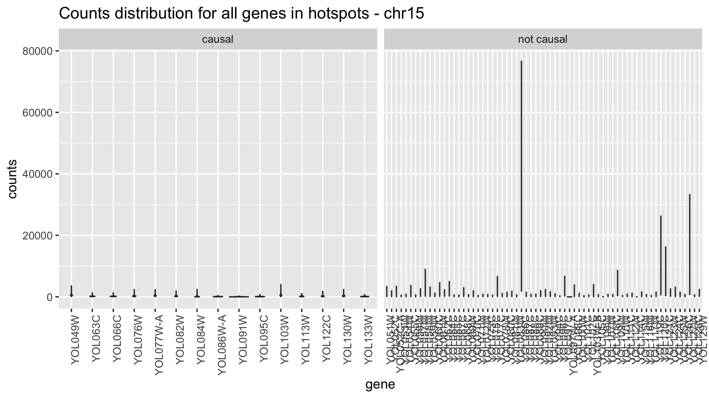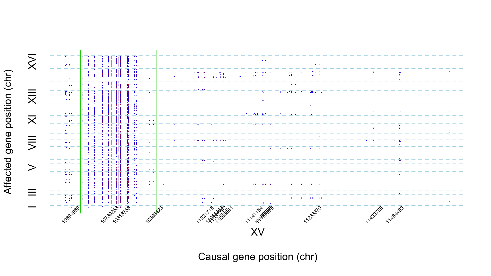

```r
# dev.off()

# save the hotspot intervals in a grange object (also available in a table)
granges_myhotspots <- GRanges(seqnames = hot$chr,
                            ranges=IRanges(start=hot$start,
                                           end=hot$end))
granges_myhotspots.original <- GRanges(seqnames = hot$chr,
                                       ranges=IRanges(start=hot$start_original,
                                                      end=hot$end_original))
```

### Get genes in hotstpot
Get genes in hotspot with causal effect and genes without causal effect

```r
# get granges for all the genes
allgenes.location[is.na(chr.id)]$chr.id <- 17
granges_allgenes <- GRanges(seqnames = allgenes.location$chr.id, 
                            ranges = IRanges(start=allgenes.location$chr.start, 
                                             end=allgenes.location$chr.end))
names(granges_allgenes) <- allgenes.location$gene

# get granges that define hotspots
granges_myhotspots.original <- GRanges(seqnames = hot$chr,
                                       ranges=IRanges(start=hot$start_original,
                                                      end=hot$end_original))

# granges for genes that are in a hotspot
granges_genesinhotspot <- subsetByOverlaps(granges_allgenes, granges_myhotspots.original)
# name hotspots
names(granges_myhotspots.original) <- paste0("h_", seqnames(granges_myhotspots.original), "_", ranges(granges_myhotspots.original))

genesinhotspot <- allgenes.location[gene %in% names(granges_genesinhotspot)]
genesinhotspot_notcausal <- genesinhotspot[!gene %in% causalgenes.pos.count$geneA]
# granges for causal genes in a hotspot
causalgenes_in_hotspot <- causalgenes.pos.count[geneA %in% genesinhotspot$gene]
```

### Compare all genes in hotspots to random genes not in hotspots (read counts)

```r
genes_to_plot.all <- genesinhotspot$gene
counts_genes_to_plot.all <- counts_pheno.dt[,..genes_to_plot.all]

res <- data.table(NULL)
for (ngene in names(counts_genes_to_plot.all)){
  res <- rbind(res, data.table(ngene, unlist(counts_pheno.dt[,..ngene]), ifelse(ngene %in% causalgenes_in_hotspot$geneA, "causal in hotspot", "not causal in hotspot"), genesinhotspot[gene==ngene]$chr.id))
}
setnames(res, c("gene", "counts", "causal", "chr"))

# genes not in hotspots and not causal & not a causal gene
cond1  <- data.table(genes = names(counts_pheno.dt[,2:ncol(counts_pheno.dt)]))
# in the dataset genes & not in a hotspot 
cond <- unlist(cond1[genes %in% allgenes.location$gene][!genes %in% genesinhotspot$gene][!genes %in% causalgenes.pos.count$geneA])

counts_notinhotspots <- counts_pheno.dt[,..cond]

# get random 10 genes that are not in hotspots or causal
set.seed(1)
random_genes_nothotspots <- sample(names(counts_notinhotspots), 30)

res.rand <- res
for (ngene in random_genes_nothotspots){
  res.rand <- rbind(res.rand, data.table(gene=ngene, counts=unlist(counts_pheno.dt[,..ngene]), causal="random", chr=allgenes.location[gene==ngene]$chr.id))
}

res.rand <- res.rand[order(chr)]

for (ch in unique(res.rand[causal != "random"]$chr)){
  p <- ggplot(res.rand[chr==ch | causal=="random"], aes(x=gene, y=counts)) + 
    geom_violin() + 
    facet_grid(~causal, scales = "free_x") +
    theme(axis.text.x = element_text(angle = 90, hjust = 1))+
    labs(title=paste0("Counts distribution for all genes in hotspots - chr", ch))
  print(p)
}
```

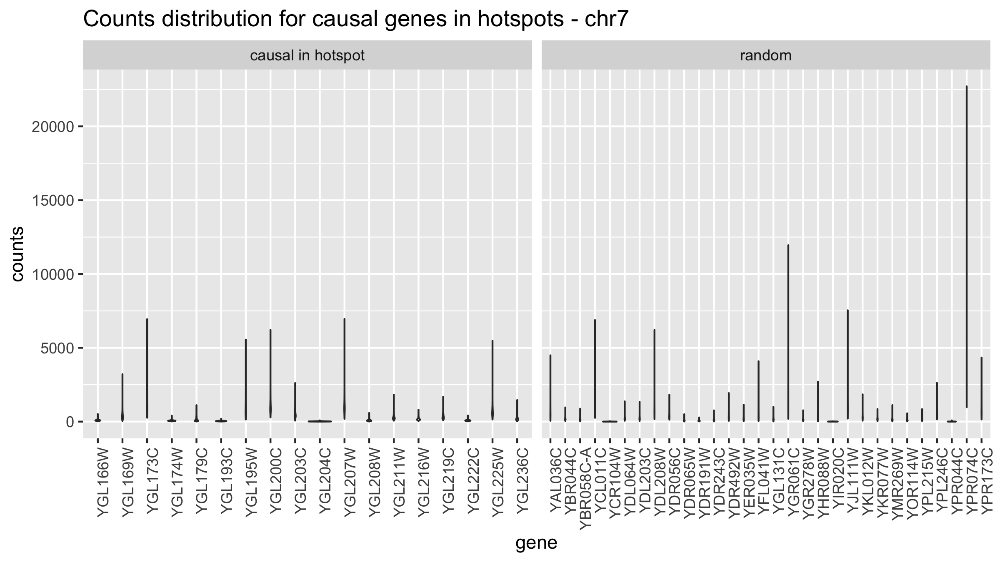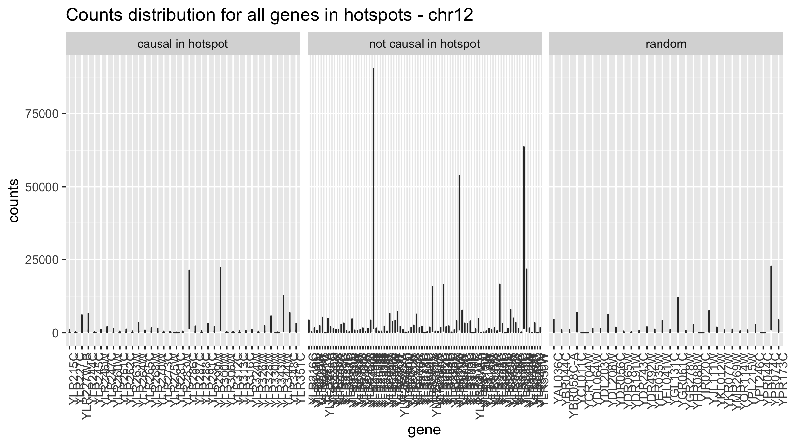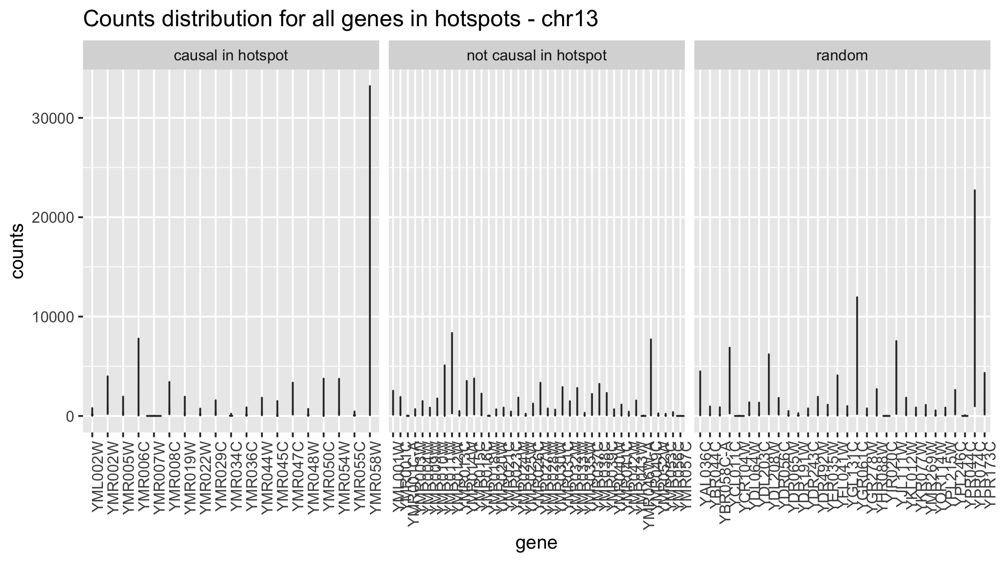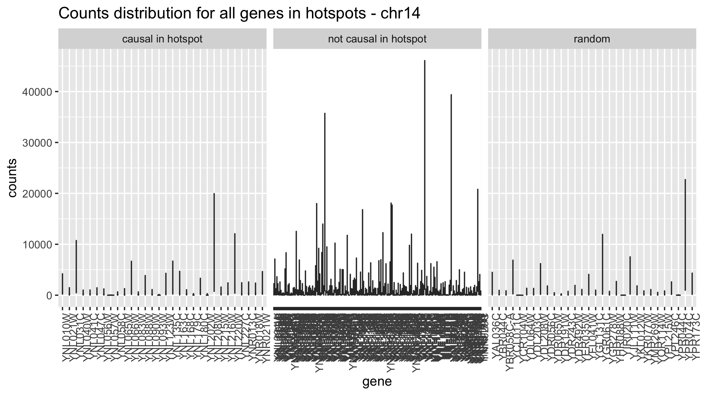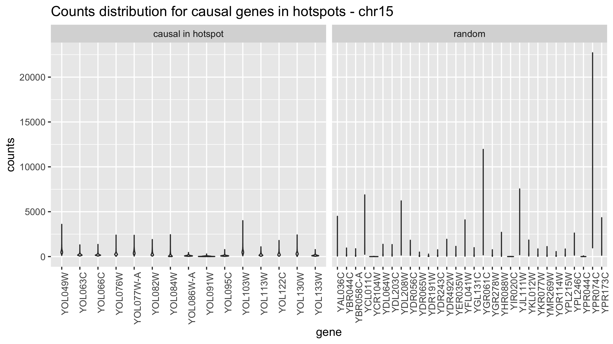

#### Count distribution of 60 random genes (not causal and not in hotspots) 

```r
set.seed(1)
random_genes_nothotspots <- sample(names(counts_notinhotspots), 60)

res.rand <- res
for (ngene in random_genes_nothotspots){
  res.rand <- rbind(res.rand, data.table(gene=ngene, counts=unlist(counts_pheno.dt[,..ngene]), causal="random", chr=allgenes.location[gene==ngene]$chr.id))
}

res.rand <- res.rand[order(chr)]


p <- ggplot(res.rand[causal=="random"], aes(x=gene, y=counts)) + 
    geom_violin() + 
    facet_grid(~causal, scales = "free_x") +
    theme(axis.text.x = element_text(angle = 90, hjust = 1))+
    labs(title="Counts distribution for 60 random genes")
print(p)
```

#### Count distribution causal genes in hotspots

```r
for (ch in unique(res.rand[causal == "causal in hotspot"]$chr)){
  p <- ggplot(res.rand[(chr==ch & causal=="causal in hotspot") |   causal =="random"], aes(x=gene, y=counts)) + 
    geom_violin() + 
    facet_grid(~causal, scales = "free_x") +
    theme(axis.text.x = element_text(angle = 90, hjust = 1))+
    labs(title=paste0("Counts distribution for causal genes in hotspots - chr", ch))
  print(p)
}
```

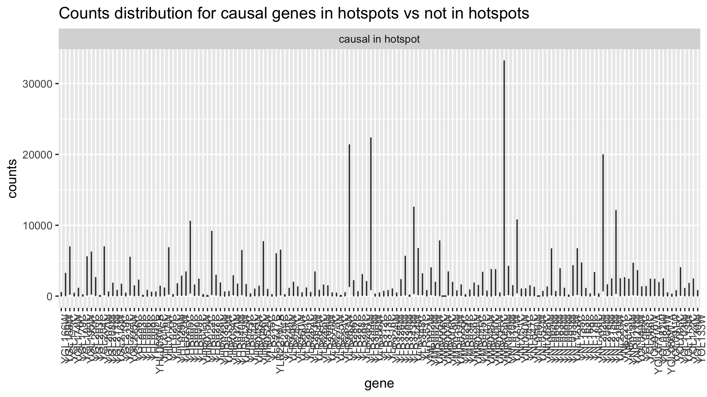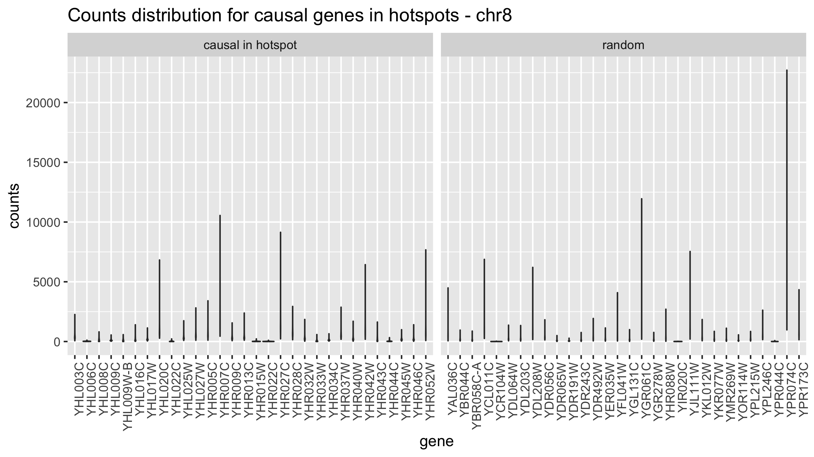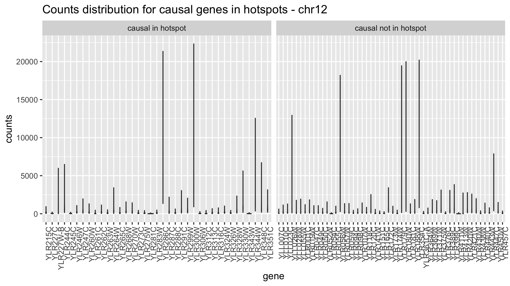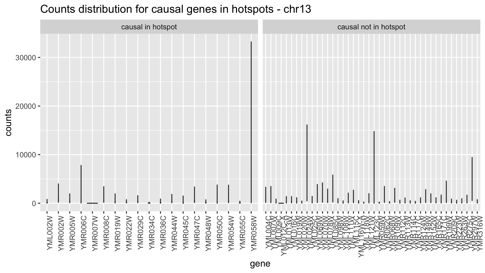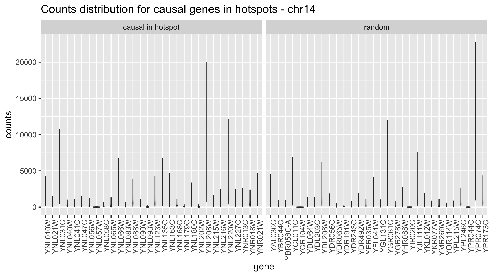

#### Count distribution causal genes in hotspots vs causal genes not in hotspots (by chr)

```r
causalgenes_notin_hotspot <- causalgenes.pos.count[!geneA %in% genesinhotspot$gene]

res.causal <- res
for (ngene in unique(causalgenes_notin_hotspot$geneA)){
  res.causal <- rbind(res.causal, data.table(gene=ngene, counts=unlist(counts_pheno.dt[,..ngene]), causal="causal not in hotspot", chr=allgenes.location[gene==ngene]$chr.id))
}
res.causal <- res.causal[order(chr)]

for (ch in unique(res.causal[causal=="causal in hotspot"]$chr)){
  p <- ggplot(res.causal[chr==ch & causal %in% c("causal in hotspot", "causal not in hotspot")], aes(x=gene, y=counts)) + 
    geom_violin() + 
    facet_grid(~causal, scales = "free_x") +
    theme(axis.text.x = element_text(angle = 90, hjust = 1))+
    labs(title=paste0("Counts distribution for causal genes in hotspots - chr", ch))
  print(p)
}
```

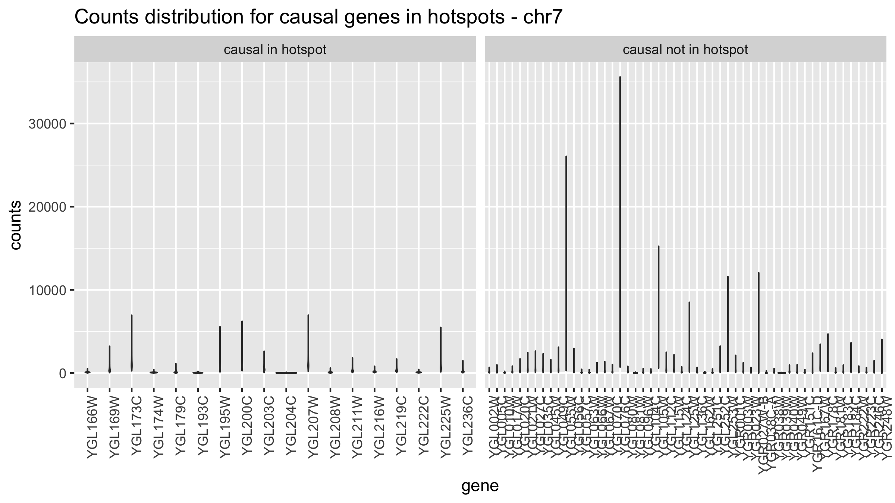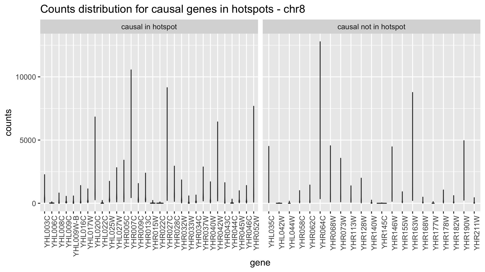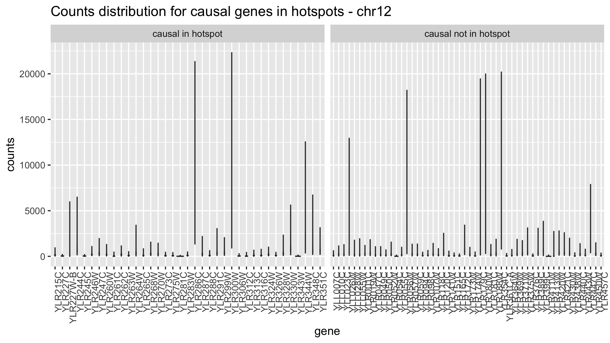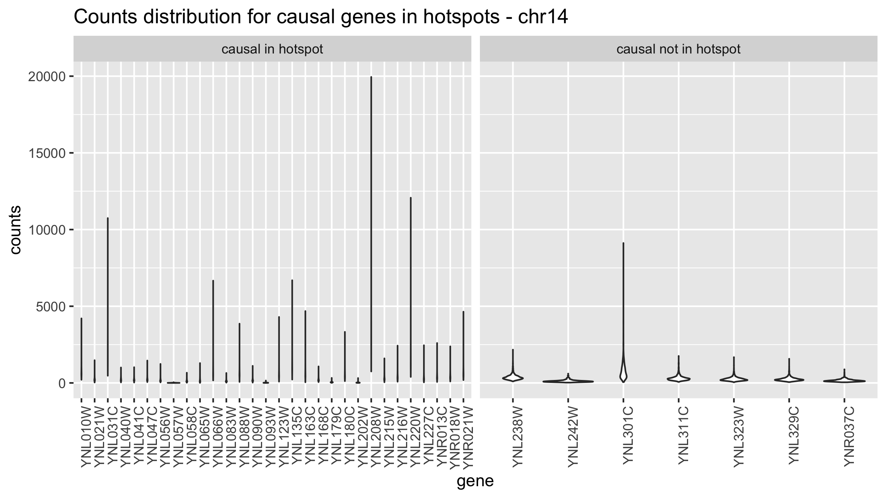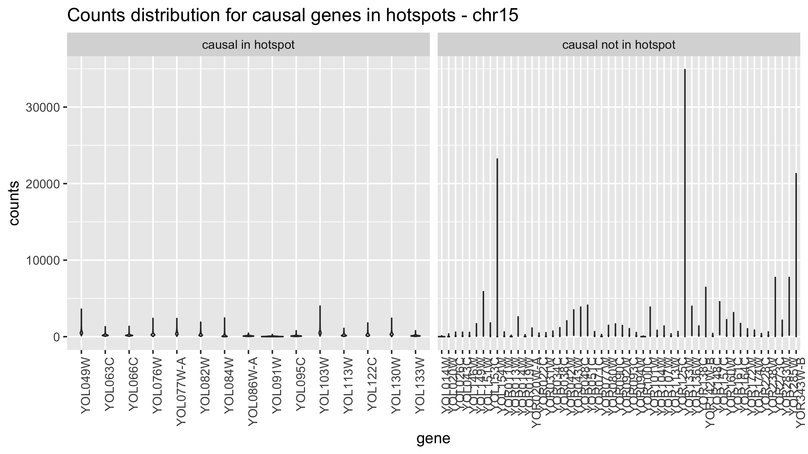

#### Count distribution causal genes in hotspots vs causal genes not in hotspots

```r
p <- ggplot(res.causal[causal %in% c("causal in hotspot", "causal not in hotspot")], aes(x=gene, y=counts)) + 
  geom_violin() + 
  facet_grid(~causal, scales = "free_x") +
  theme(axis.text.x = element_text(angle = 90, hjust = 1))+
  labs(title="Counts distribution for causal genes in hotspots vs not in hotspots")
print(p)
```

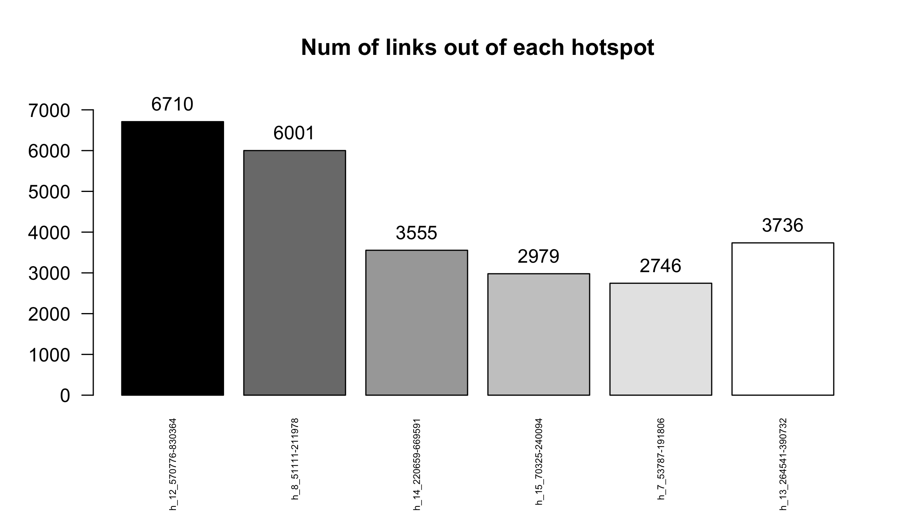

### Get hotspot name for each causal gene in hotspot

```r
# get grange for causal genes in hotspots
causalgenes_in_hotspot.grange <- granges_genesinhotspot[names(granges_genesinhotspot) %in% causalgenes_in_hotspot$geneA] 

hot_overlaps <- findOverlaps(causalgenes_in_hotspot.grange, granges_myhotspots.original)
hot_overlaps.dt <- data.table(query=queryHits(hot_overlaps), subject=subjectHits(hot_overlaps))
hot_overlaps.dt$gnames <- names(causalgenes_in_hotspot.grange)[queryHits(hot_overlaps)]

# Add hotspot name to causal genes in hotspot
causalgenes_in_hotspot.hotspot <- merge(causalgenes_in_hotspot, hot_overlaps.dt, by.x="geneA", by.y="gnames")
causalgenes_in_hotspot.hotspot$hotspot <- names(granges_myhotspots.original)[causalgenes_in_hotspot.hotspot$subject]

# causalgenes_in_hotspot.hotspot[geneA %in% hot_overlaps.dt$gnames]$hotspot <- names(granges_myhotspots.original[hot_overlaps.dt$subject])
causalgenes_in_hotspot.hotspot[,c("query", "subject"):=NULL]
```

### Plot number of unique genes affected by  each hotspot 

```r
# can have repeated affected genes (if two causal genes affect the same gene)
# n_affectedby_hotspot <- causalgenes_in_hotspot.hotspot[, sum(count.A), by=hotspot]

# number of unique genes being affected
n_affectedby_hotspot.geneB <- merge(causalgenes_in_hotspot.hotspot, unique(find.effects_TF[,.(geneA, geneB)]), all.x=T, by="geneA")
n_affectedby_hotspot <- unique(n_affectedby_hotspot.geneB[,.(geneB, hotspot)])[,.N, by=hotspot]


g.ramp <- gray.colors(length(n_affectedby_hotspot$hotspot), start = 0, end = 1)
bp <- barplot(n_affectedby_hotspot$N, 
        col = g.ramp, 
        names.arg = n_affectedby_hotspot$hotspot, 
        las=2, 
        cex.names = 0.5, 
        main="Num of links out of each hotspot", 
        ylim=c(0,max(n_affectedby_hotspot$N)+1500))
# add numbers on top of the bars
text(
  bp,
  n_affectedby_hotspot$N,
  n_affectedby_hotspot$N,
  pos = 3
)
```

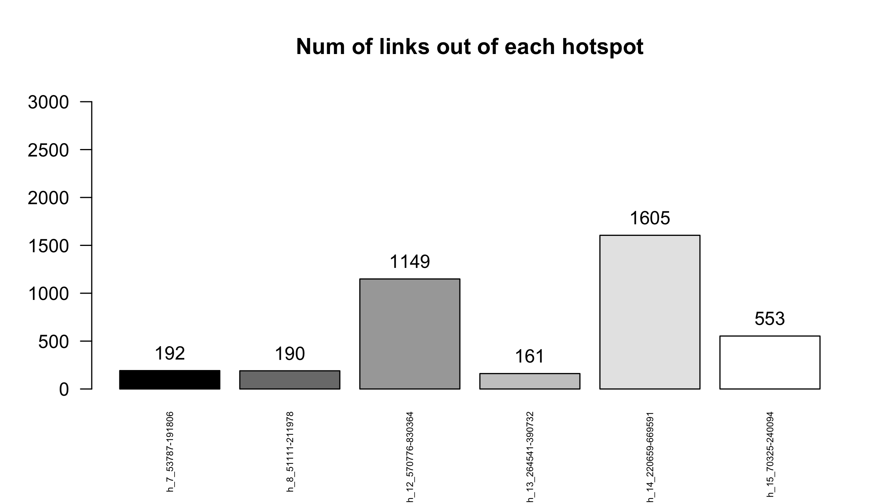
The number of links might be higher than the number of genes in the dataset since several genes in the same hotspot might be affecting the same gene, which the plot does not take into account

#### Get number of different genes and eqtls in each hotspot

```r
causalgenes_in_hotspot.hot.eqtl <- merge(unique(find.effects_TF[,.(geneA, eqtl.A)]), causalgenes_in_hotspot.hotspot, by="geneA")

num_eqtls_hotspot <-unique(causalgenes_in_hotspot.hot.eqtl[,.(eqtl.A, hotspot)])[,.N, by=hotspot]
num_genes_hotspot <-causalgenes_in_hotspot.hot.eqtl[,.(geneA, hotspot)][,.N, by=hotspot]

num_genes_eqtls_hotspot <- merge(num_eqtls_hotspot, num_genes_hotspot, by="hotspot")
colnames(num_genes_eqtls_hotspot) <- c("hotspot", "num.eqtls", "num.genes") 
num_genes_eqtls_hotspot
```

<div class="kable-table">

hotspot               num.eqtls   num.genes
-------------------  ----------  ----------
h_12_570776-830364           32          37
h_13_264541-390732           18          19
h_14_220659-669591           28          30
h_15_70325-240094            15          15
h_7_53787-191806             18          18
h_8_51111-211978             27          30

</div>

## Number of individuals in each gene with expression <=10

```r
# for each gene, get number of samples that has expression <= 10
getless10 <- apply(counts$pheno, 1, function(x) {ifelse(x<=10, 1, 0)})
howmany_less10 <- colSums(getless10)
count_less10 <- data.table(gene=names(howmany_less10), nsamples_less10 =howmany_less10)
count_less10 <- count_less10[order(-nsamples_less10)]

# get fraction of samples have expr <=10 for each gene
count_less10[,fraction:= nsamples_less10/ncol(counts$pheno)]

# subset to get the causal genes
fract_less10 <- count_less10[gene %in% causalgenes.pos.count$geneA]

# add causal category - causal in hotspot or causal not in hotspot
fract_less10[,causal:=ifelse(gene %in% causalgenes_in_hotspot.hotspot$geneA, "causal in hotspot", "causal not in hotspot")]

# subset to get the genes with no causal effects
count_less10_notcausal <- count_less10[!gene %in% find.effects_TF$geneA & gene %in% allgenes.location$gene]

# add causal category - not causal in hotspot or not causal not in hotspot
count_less10_notcausal[,causal := ifelse(gene %in% names(counts_notinhotspots), "not causal not in hotspot", "not causal in hotspot")]

# join the two groups - genes with causal effects and without
fract_less10_toplot <- rbind(fract_less10, count_less10_notcausal)

# boxplot of fraction of samples with expr <=10, separated by causal category 
box <- ggplot(fract_less10_toplot, aes(x=causal, y=fraction)) + 
  geom_boxplot()+
  # scale_y_continuous(trans='log10')
  # scale_y_log10()+
  ggtitle("Fraction individuals with expression <=10 per gene")
plot(box)
```

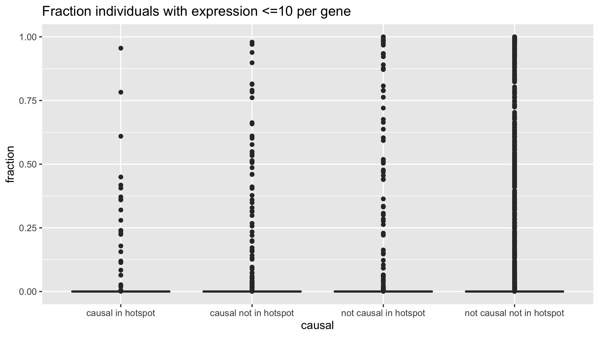

```r
# boxplot of fraction of samples with expr <=10, separated by causal category + log10 scale
breaks <- seq(0,1,0.25)
box <- ggplot(fract_less10_toplot, aes(x=causal, y=fraction)) + 
  geom_boxplot()+
  scale_y_log10("fraction (log10) - showing original values", breaks = breaks, labels = breaks)+
  # scale_y_log10("fraction (log10)", oob=squish_infinite, breaks = breaks, labels = breaks)+ # use squish_infinite to "squish infitite values into range"
  ggtitle("Fraction individuals with expression <=10 per gene")

plot(box)
```

```
## Warning: Transformation introduced infinite values in continuous y-axis
```

```
## Warning: Removed 4565 rows containing non-finite values (stat_boxplot).
```

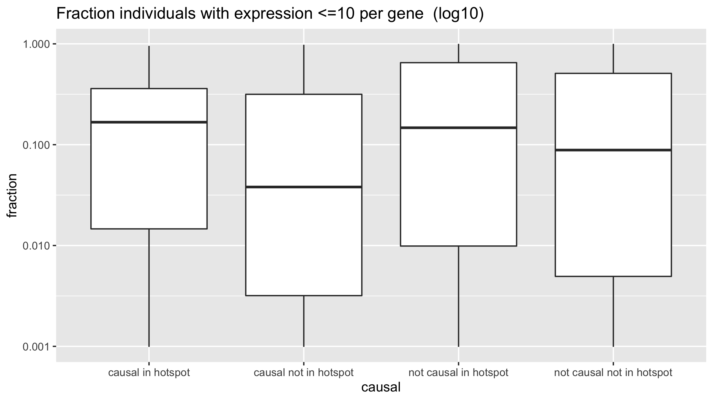

```r
# violing plot
violin <- ggplot(fract_less10_toplot, aes(x=causal, y=fraction)) + 
  geom_violin() +
  ggtitle("Fraction individuals with expression <=10 per gene")

plot(violin)
```

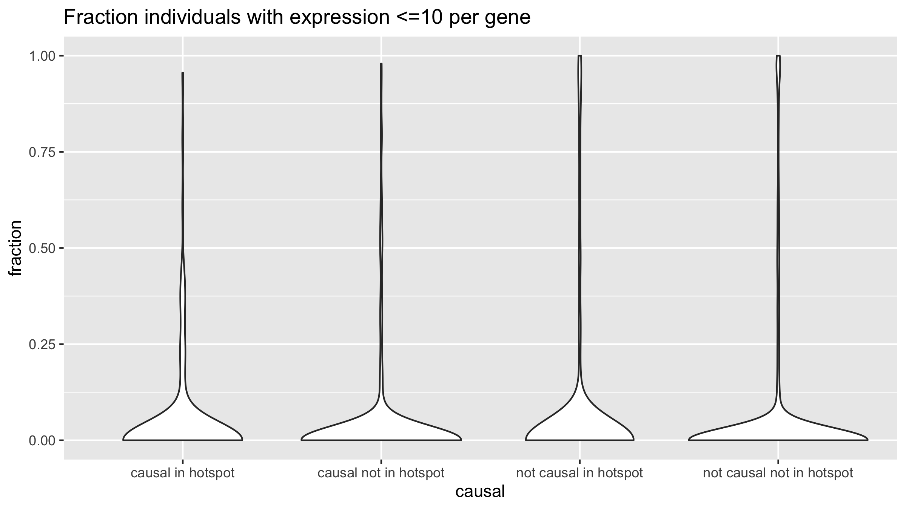
The genes that are not in a hotspot seem to have less individuals with expression <=10 (?)

## Histogram of fraction individuals with expression <=10 per gene

```r
hist <- ggplot(fract_less10_toplot[causal %in% c("causal in hotspot", "not causal not in hotspot")], aes(x=fraction, color=causal, fill=causal)) + 
  geom_histogram(alpha=0.3, position="identity")+
  ggtitle("Fraction individuals with expression <=10 per gene") + 
  scale_y_sqrt()+
  # theme(legend.position="top")+ 
  coord_flip()
plot(hist)
```

```
## `stat_bin()` using `bins = 30`. Pick better value with `binwidth`.
```


### Get sample of not causal not in hotspot that is the same size as causal in hotspot

```r
# take random sample of "not causal not in hotspot" the same size as causal in hotspot
nsample <- length(fract_less10_toplot[causal=="causal in hotspot"]$gene)
notcausal_nothotspot_sample <- sample(fract_less10_toplot[causal=="not causal not in hotspot"]$gene, nsample)

# plot histogram
hist <- ggplot(fract_less10_toplot[causal %in% c("causal in hotspot") | (causal %in% "not causal not in hotspot" & gene %in% notcausal_nothotspot_sample)], aes(x=fraction, color=causal, fill=causal)) + 
  geom_histogram(alpha=0.3, position="identity")+
  ggtitle("Fraction individuals with expression <=10 per gene") + 
  scale_y_sqrt()+
  # theme(legend.position="top")+ 
  coord_flip()
plot(hist)
```

```
## `stat_bin()` using `bins = 30`. Pick better value with `binwidth`.
```

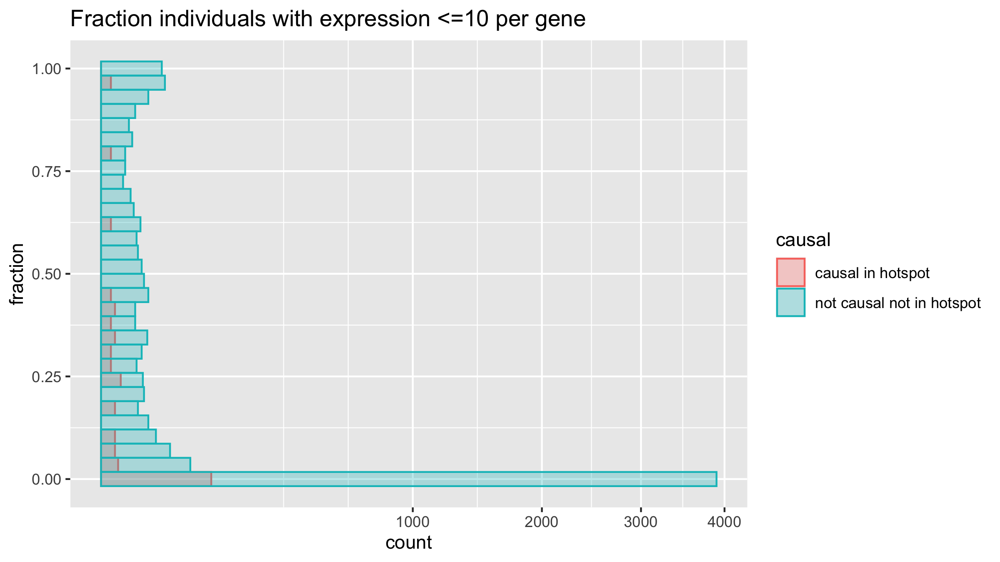


## GO enrichment for causal genes in hotspots
which universe - causal genes + affected genes or only causal genes?


```r
if (!exists("genes_GO.bio")){
  genes_GO.table <- fread("results/genelistwithGOterm.txt")
  genes_GO.table <- unique(genes_GO.table)
  genes_GO.bio   <- unique(genes_GO.table[GO.namespace=="biological_process"])
}

# create geneset
goframeData <- unique(genes_GO.bio[,.(GO.identifier, evidence, gene)])
gs <- getgeneset(goframeData)


causal.hotspot <- unlist(unique(causalgenes_in_hotspot.hot.eqtl$geneA))

# universe is genes involved in causality
universe <- unique(find.effects_TF$geneA)
universe <- unique(c(find.effects_TF$geneA, find.effects_TF$geneB))

# get enrichment for genesA
res.causalhotspot <- getenrichment(gs, universe = universe, interestinggenes = causal.hotspot, cond = T)
res.causalhotspot.dt <- data.table(summary(res.causalhotspot))
res.causalhotspot.dt
```

<div class="kable-table">

GOBPID           Pvalue   OddsRatio     ExpCount   Count   Size  Term                                                                
-----------  ----------  ----------  -----------  ------  -----  --------------------------------------------------------------------
GO:0048869    0.0036080    2.444776    7.0427456      15    115  cellular developmental process                                      
GO:0046688    0.0037269         Inf    0.1224825       2      2  response to copper ion                                              
GO:0032482    0.0065644   11.712329    0.4286889       3      7  Rab protein signal transduction                                     
GO:0035825    0.0090705    4.630311    1.3473079       5     22  homologous recombination                                            
GO:0007049    0.0098659    1.783646   16.4126593      26    268  cell cycle                                                          
GO:0006032    0.0107298   31.061225    0.1837238       2      3  chitin catabolic process                                            
GO:0046348    0.0107298   31.061225    0.1837238       2      3  amino sugar catabolic process                                       
GO:0006281    0.0111363    2.251977    6.4915742      13    106  DNA repair                                                          
GO:0034293    0.0123384    3.167606    2.5721332       7     42  sexual sporulation                                                  
GO:0007165    0.0164184    1.961267    9.0637074      16    148  signal transduction                                                 
GO:1903046    0.0175392    2.506704    4.0449251       9     68  meiotic cell cycle process                                          
GO:0045132    0.0185921    3.741733    1.5922729       5     26  meiotic chromosome segregation                                      
GO:0000712    0.0205989   15.523810    0.2449651       2      4  resolution of meiotic recombination intermediates                   
GO:0045116    0.0205989   15.523810    0.2449651       2      4  protein neddylation                                                 
GO:0030435    0.0208933    2.424334    4.1644061       9     68  sporulation resulting in formation of a cellular spore              
GO:0009653    0.0209187    2.422993    4.1645308       9     69  anatomical structure morphogenesis                                  
GO:0000003    0.0210568    1.858722   10.1048089      17    165  reproduction                                                        
GO:0050789    0.0220923    1.459015   41.6440608      53    680  regulation of biological process                                    
GO:0008360    0.0258120    5.845890    0.6736539       3     11  regulation of cell shape                                            
GO:0044703    0.0292953    2.266326    4.4093711       9     72  multi-organism reproductive process                                 
GO:0007264    0.0324516    2.776635    2.4496506       6     40  small GTPase mediated signal transduction                           
GO:0000272    0.0329018    5.194064    0.7348952       3     12  polysaccharide catabolic process                                    
GO:0000917    0.0329018    5.194064    0.7348952       3     12  division septum assembly                                            
GO:0046475    0.0329612   10.344671    0.3062063       2      5  glycerophospholipid catabolic process                               
GO:0006895    0.0329612   10.344671    0.3062063       2      5  Golgi to endosome transport                                         
GO:0034765    0.0329612   10.344671    0.3062063       2      5  regulation of ion transmembrane transport                           
GO:0006560    0.0329612   10.344671    0.3062063       2      5  proline metabolic process                                           
GO:0033313    0.0329612   10.344671    0.3062063       2      5  meiotic cell cycle checkpoint                                       
GO:0061014    0.0329612   10.344671    0.3062063       2      5  positive regulation of mRNA catabolic process                       
GO:0035335    0.0329612   10.344671    0.3062063       2      5  peptidyl-tyrosine dephosphorylation                                 
GO:0000076    0.0329612   10.344671    0.3062063       2      5  DNA replication checkpoint                                          
GO:0006333    0.0357252    3.678702    1.2860666       4     21  chromatin assembly or disassembly                                   
GO:0030010    0.0357252    3.678702    1.2860666       4     21  establishment of cell polarity                                      
GO:0030437    0.0361592    2.696104    2.5108919       6     41  ascospore formation                                                 
GO:0051301    0.0381178    1.912993    6.8590218      12    112  cell division                                                       
GO:0050896    0.0387948    1.429679   32.7028360      42    534  response to stimulus                                                
GO:0006310    0.0433974    2.201396    4.0016591       8     67  DNA recombination                                                   
GO:0051276    0.0467898    1.597974   13.5955610      20    222  chromosome organization                                             
GO:0045003    0.0474786    7.755102    0.3674476       2      6  double-strand break repair via synthesis-dependent strand annealing 
GO:0000741    0.0474786    7.755102    0.3674476       2      6  karyogamy                                                           
GO:0006474    0.0474786    7.755102    0.3674476       2      6  N-terminal protein amino acid acetylation                           
GO:0046834    0.0474786    7.755102    0.3674476       2      6  lipid phosphorylation                                               
GO:0030473    0.0474786    7.755102    0.3674476       2      6  nuclear migration along microtubule                                 
GO:0051647    0.0474786    7.755102    0.3674476       2      6  nucleus localization                                                
GO:0007018    0.0474786    7.755102    0.3674476       2      6  microtubule-based movement                                          
GO:0010970    0.0474786    7.755102    0.3674476       2      6  transport along microtubule                                         
GO:0035435    0.0474786    7.755102    0.3674476       2      6  phosphate ion transmembrane transport                               
GO:0000492    0.0474786    7.755102    0.3674476       2      6  box C/D snoRNP assembly                                             
GO:0007346    0.0492007    2.139680    4.1031648       8     67  regulation of mitotic cell cycle                                    
GO:0000902    0.0497748    4.245953    0.8573777       3     14  cell morphogenesis                                                  
GO:0022603    0.0497748    4.245953    0.8573777       3     14  regulation of anatomical structure morphogenesis                    

</div>

# Some comparisons with paper

## which genes from the paper have causal effects
(not testing all for now)

```r
# genes mentioned in the paper
ge <- data.table(gene =   c("YNL132W", "YNL199C", "YNL198C", "YNL197C","YNL196C", "YNL085W", "YOL081W", "YHR005C", "YHR178W", "YHR032W", "YFL021W", "YOR032C", "YKL015W", "YLR176C", "YCR018C", "YBR150C", "YOR172W", "YMR019W", "YLR256W", "YNL085W", "YHR005C", "YBR158W", "YDR160W"),
                 symbol = c("KRE33",   "GCR2",    "YNL198C", "WHI3",   "SLZ1",    "MKT1",    "IRA2",    "TIM10",   "STB5",    "ERC1" ,   "GAT1", "HMS1", "PUT3", "RFX1", "SRD1","TBS1", "YRM1","STB4", "HAP1", "MKT1", "GPA1", "AMN1", "SSY1"))


causalgenes.pos.count.name <- merge(causalgenes.pos.count, unique(genes_GO.bio[,.(gene, symbol, gene.name)]), by.x="geneA", by.y="gene", all.x=T)
causalgenes.pos.count.name[geneA %in% ge$gene]
```

<div class="kable-table">

geneA      chr.A    start.A      end.A   count.A   chr.strand   chr.start   chr.end  symbol   gene.name                              
--------  ------  ---------  ---------  --------  -----------  ----------  --------  -------  ---------------------------------------
YBR150C        2     801806     808680         3           -1      541209    544493  TBS1     ThiaBendazole Sensitive                
YBR158W        2     817146     822385         4            1      556549    558198  AMN1     Antagonist of Mitotic exit Network     
YCR018C        3    1292508    1297662        16           -1      148238    148903  SRD1     NA                                     
YHR005C        8    5298022    5307569        68           -1      113499    114917  GPA1     G Protein Alpha subunit                
YHR032W        8    5357867    5367741        27            1      173344    175089  ERC1     Ethionine Resistance Conferring        
YHR178W        8    5643822    5654182         7            1      459299    461530  STB5     Sin Three Binding protein              
YMR019W       13    9162310    9180579        49            1      312156    315005  STB4     Sin Three Binding protein              
YOR172W       15   11304241   11323306        10            1      654210    656570  YRM1     Yeast Reveromycin resistance Modulator 

</div>

## which genes are in a causal hotspot

```r
causalgenes_in_hotspot.hot.eqtl[geneA %in% causalgenes.pos.count.name[geneA %in% ge$gene]$geneA]
```

<div class="kable-table">

geneA     eqtl.A                chr.A   start.A     end.A   count.A   chr.strand   chr.start   chr.end  hotspot            
--------  -------------------  ------  --------  --------  --------  -----------  ----------  --------  -------------------
YHR005C   chrVIII:105298_T/A        8   5298022   5307569        68           -1      113499    114917  h_8_51111-211978   
YHR032W   chrVIII:172443_G/A        8   5357867   5367741        27            1      173344    175089  h_8_51111-211978   
YMR019W   chrXIII:313064_C/T       13   9162310   9180579        49            1      312156    315005  h_13_264541-390732 

</div>


```r
find.effects_TF.names <- merge(unique(find.effects_TF[,.(geneA, geneB)]), unique(genes_GO.bio[,.(gene, symbol, gene.name, GO.identifier, GO.term)]), by.x="geneB", by.y="gene", allow.cartesian=T)
setnames(find.effects_TF.names, old=c("symbol", "gene.name", "GO.identifier", "GO.term"), new=c("symbol.B", "gene.name.B", "GO.identifier.B", "GO.term.B"))
find.effects_TF.names <- merge(find.effects_TF.names, unique(genes_GO.bio[,.(gene, symbol, gene.name, GO.identifier, GO.term)]), by.x="geneA", by.y="gene", allow.cartesian=T)
setcolorder(find.effects_TF.names, neworder = c("geneA", "geneB", "symbol", "symbol.B", "gene.name", "GO.identifier", "GO.term"))

# find.effects_TF.names[symbol=="ERC1"]
```

The paper mentions that "the ERC1 frameshift variant is linked to reduced mean expression levels of multiple genes in the methionine biosynthesis pathway"
Is ERC1 affecting any gene involved in the methionine biosynthesis pathway?

```r
find.effects_TF.names[symbol=="ERC1" & grepl("methionine",GO.term.B, fixed = F)]
```

<div class="kable-table">

geneA     geneB     symbol   symbol.B   gene.name                         GO.identifier   GO.term                                     gene.name.B            GO.identifier.B   GO.term.B                                
--------  --------  -------  ---------  --------------------------------  --------------  ------------------------------------------  ---------------------  ----------------  -----------------------------------------
YHR032W   YGR055W   ERC1     MUP1       Ethionine Resistance Conferring   GO:0006556      S-adenosylmethionine biosynthetic process   Methionine UPtake      GO:1903692        methionine import across plasma membrane 
YHR032W   YGR055W   ERC1     MUP1       Ethionine Resistance Conferring   GO:0042908      xenobiotic transport                        Methionine UPtake      GO:1903692        methionine import across plasma membrane 
YHR032W   YGR055W   ERC1     MUP1       Ethionine Resistance Conferring   GO:0055085      transmembrane transport                     Methionine UPtake      GO:1903692        methionine import across plasma membrane 
YHR032W   YGR204W   ERC1     ADE3       Ethionine Resistance Conferring   GO:0006556      S-adenosylmethionine biosynthetic process   ADEnine requiring      GO:0009086        methionine biosynthetic process          
YHR032W   YGR204W   ERC1     ADE3       Ethionine Resistance Conferring   GO:0042908      xenobiotic transport                        ADEnine requiring      GO:0009086        methionine biosynthetic process          
YHR032W   YGR204W   ERC1     ADE3       Ethionine Resistance Conferring   GO:0055085      transmembrane transport                     ADEnine requiring      GO:0009086        methionine biosynthetic process          
YHR032W   YIL046W   ERC1     MET30      Ethionine Resistance Conferring   GO:0006556      S-adenosylmethionine biosynthetic process   METhionine requiring   GO:0009086        methionine biosynthetic process          
YHR032W   YIL046W   ERC1     MET30      Ethionine Resistance Conferring   GO:0042908      xenobiotic transport                        METhionine requiring   GO:0009086        methionine biosynthetic process          
YHR032W   YIL046W   ERC1     MET30      Ethionine Resistance Conferring   GO:0055085      transmembrane transport                     METhionine requiring   GO:0009086        methionine biosynthetic process          
YHR032W   YIR017C   ERC1     MET28      Ethionine Resistance Conferring   GO:0006556      S-adenosylmethionine biosynthetic process   METhionine             GO:0009086        methionine biosynthetic process          
YHR032W   YIR017C   ERC1     MET28      Ethionine Resistance Conferring   GO:0042908      xenobiotic transport                        METhionine             GO:0009086        methionine biosynthetic process          
YHR032W   YIR017C   ERC1     MET28      Ethionine Resistance Conferring   GO:0055085      transmembrane transport                     METhionine             GO:0009086        methionine biosynthetic process          
YHR032W   YKR069W   ERC1     MET1       Ethionine Resistance Conferring   GO:0006556      S-adenosylmethionine biosynthetic process   METhionine requiring   GO:0009086        methionine biosynthetic process          
YHR032W   YKR069W   ERC1     MET1       Ethionine Resistance Conferring   GO:0042908      xenobiotic transport                        METhionine requiring   GO:0009086        methionine biosynthetic process          
YHR032W   YKR069W   ERC1     MET1       Ethionine Resistance Conferring   GO:0055085      transmembrane transport                     METhionine requiring   GO:0009086        methionine biosynthetic process          

</div>
ERC1 is affecting 5 genes that have a GO term associated with the methionine pathway. The genes are YGR055W, YGR204W, YIL046W, YIR017C, YKR069W (MUP1, ADE3, MET30, MET28, MET1)  


The paper mentions that the most known causal variants underlying yeast eQTL hotspots are coding. Genes -> HAP1, MKT1, GPA1, AMN1, SSY1


```r
# with causal effect
causalgenes.pos.count.name[symbol %in% c("HAP1", "MKT1", "GPA1", "AMN1","SSY1")]
```

<div class="kable-table">

geneA      chr.A   start.A     end.A   count.A   chr.strand   chr.start   chr.end  symbol   gene.name                          
--------  ------  --------  --------  --------  -----------  ----------  --------  -------  -----------------------------------
YBR158W        2    817146    822385         4            1      556549    558198  AMN1     Antagonist of Mitotic exit Network 
YHR005C        8   5298022   5307569        68           -1      113499    114917  GPA1     G Protein Alpha subunit            

</div>

```r
# in hotspot
causalgenes_in_hotspot.hot.eqtl[geneA %in% causalgenes.pos.count.name[symbol %in% c("HAP1", "MKT1", "GPA1", "AMN1","SSY1")]$geneA]
```

<div class="kable-table">

geneA     eqtl.A                chr.A   start.A     end.A   count.A   chr.strand   chr.start   chr.end  hotspot          
--------  -------------------  ------  --------  --------  --------  -----------  ----------  --------  -----------------
YHR005C   chrVIII:105298_T/A        8   5298022   5307569        68           -1      113499    114917  h_8_51111-211978 

</div>


# Heritability
Get causal genes with heritability >=0.9

According to the paper, "The single eQTLs that by themselves generated heritability of >=0.9 were all local eQTLs for genes in regions of the genome with high, structurally complex variation".  
By looking for causal genes that have heritability >= 0.9, I can find genes with structurally commplex variation

```r
heritability_excel <- read_excel_allsheets("data/SI_Data_05_heritability.xlsx")
for_heritability <- heritability_excel$heritability_A
for_heritability[,h:=(A/(A+E))]

heritability <- merge(causalgenes.pos.count.name, for_heritability, by.x="geneA", by.y="...1")

heritability[h >= 0.9]
```

<div class="kable-table">

geneA      chr.A   start.A     end.A   count.A   chr.strand   chr.start   chr.end  symbol      gene.name                            A           E           h
--------  ------  --------  --------  --------  -----------  ----------  --------  ----------  --------------------------  ----------  ----------  ----------
YCR039C        3   1343816   1348937        12           -1      199546    200178  MATALPHA2   MATing type protein ALPHA    1.3876988   0.1234378   0.9183146
YCR040W        3   1344712   1349728        16            1      200442    200969  MATALPHA1   MATing type protein ALPHA    1.4727897   0.0706636   0.9542172
YHL044W        8   5198088   5206924         5            1       13565     14272  NA          NA                           1.4451590   0.1414489   0.9108482
YLR179C       12   8208450   8223516         5           -1      514108    514713  NA          NA                           0.9825025   0.0766358   0.9276432

</div>

```r
# find if there are ENA genes in the causal genes
heritability[grepl("ENA", symbol)]
```

<div class="kable-table">

geneA      chr.A   start.A     end.A   count.A   chr.strand   chr.start   chr.end  symbol   gene.name                                     A           E           h
--------  ------  --------  --------  --------  -----------  ----------  --------  -------  ------------------------------------  ---------  ----------  ----------
YDR040C        4   2039040   2047187         4           -1      535192    538467  ENA1     Exitus NAtru (Latin, "exit sodium")    1.092867   0.1626103   0.8704793

</div>


## Chi-square heritability
H0: The two categories have the same number of genes above and below hcut  
H1: They do not

Testing if the expression of the causal genes is more/less heritable than the non-causal ones

```r
chi2.causal <- data.table(for_heritability)
chi2.causal[,causal := ifelse(...1 %in% causalgenes.pos.count.name$geneA, "causal", "not causal")]

h.cutoff <- seq(0.5,0.95,0.05)
chi2.res <- data.table(h.cutoff, pval=numeric(), "over/under.causal"=numeric(), "over/under.notcausal"=numeric())
for (hcut in h.cutoff){
  higher <- chi2.causal[h>=hcut, .N, by="causal"][order(causal)]
  lower <- chi2.causal[h<hcut, .N, by="causal"][order(causal)]
  
  table.chi2 <- data.table(causal=c("causal", "not causal"),higher=higher$N, lower=lower$N)
  table.chi2 <- transpose(table.chi2, keep.names = "cond", make.names = "causal")
  
  chi2.result <- chisq.test(table.chi2[,2:ncol(table.chi2)])
  chi2.res[h.cutoff==hcut]$pval <- chi2.result$p.value
  
  chi2.res[h.cutoff==hcut]$`over/under.causal` <- table.chi2[cond=="higher"]$causal/table.chi2[cond=="lower"]$causal
  chi2.res[h.cutoff==hcut]$`over/under.notcausal` <- table.chi2[cond=="higher"]$`not causal`/table.chi2[cond=="lower"]$`not causal`
}
print(chi2.res)
```

```
##     h.cutoff         pval over/under.causal over/under.notcausal
##  1:     0.50 8.005096e-58       0.512244898         0.1310767833
##  2:     0.55 1.038775e-49       0.362132353         0.0918859649
##  3:     0.60 1.412253e-31       0.218750000         0.0618468757
##  4:     0.65 1.718501e-28       0.165094340         0.0435967302
##  5:     0.70 9.750816e-24       0.119335347         0.0299958626
##  6:     0.75 4.354398e-15       0.075471698         0.0202868852
##  7:     0.80 1.717123e-08       0.045133992         0.0136400651
##  8:     0.85 3.761463e-03       0.020661157         0.0083029567
##  9:     0.90 1.000000e+00       0.005427408         0.0048435923
## 10:     0.95 1.000000e+00       0.001351351         0.0008040201
```

There's a difference in heritability between causal and non-causal genes


```r
plot(x=chi2.res$h.cutoff, y=chi2.res$`over/under.causal`, xlab="h2 cutoff", ylab="Over/under", type="b", col="green")
lines(x=chi2.res$h.cutoff, y=chi2.res$`over/under.notcausal`, type="b", col="blue")
legend("topright", legend=c("Causal", "Not causal"),
       col=c("green", "blue"), lty=1, cex=0.8)
```

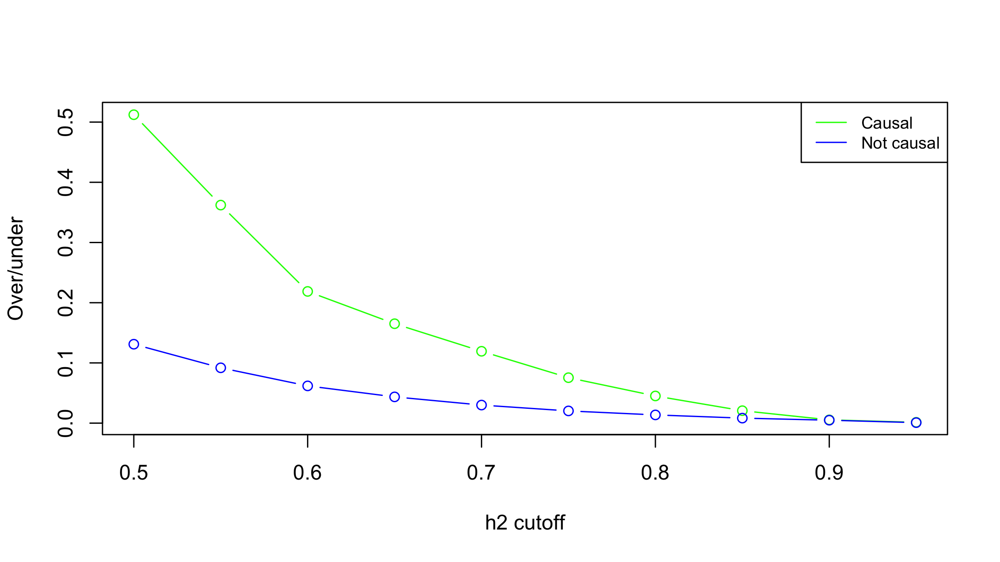
There's enrichment for high heritability genes in the causal set of genes  

How to read it:  
if Over/under (O/U) = 0.5, there are double amount of genes with h2 < cutoff than with h2 > cutoff  
if O/U = 0.1, there are 10 times more genes with h2 < cutoff than with h2 > cutoff  
Lower O/U == more genes with lower heritability than with higher heritability  

### Separating into in hotspot and not in hotspot

```r
chi2.causal.2 <- merge(for_heritability, fract_less10_toplot[,.(gene, causal)], by.x="...1", by.y="gene")


h.cutoff <- seq(0.5,0.95,0.05)
chi2.res <- data.table(h.cutoff, pval=numeric(), "O/U.causal.nothot"=numeric(), "O/U.causal.hot"=numeric(), "O/U.notcausal.nothot"=numeric(), "O/U.notcausal.hot"=numeric())
for (hcut in h.cutoff){
  higher <- chi2.causal.2[h>=hcut, .N, by="causal"][order(causal)]
  lower <- chi2.causal.2[h<hcut, .N, by="causal"][order(causal)]
  
  
  for (ca in unique(chi2.causal.2$causal)){
    if (!ca %in% higher$causal){
      toadd <- data.table(causal=ca, N=0)
      higher <- rbind(higher, toadd)
    }
    if (!ca %in% higher$causal){
      toadd <- data.table(causal=ca, N=0)
      lower <- rbind(lower, toadd)
    }
  }
  
  table.chi2 <- data.table(causal=unique(chi2.causal.2$causal),higher=higher$N, lower=lower$N)
  table.chi2 <- transpose(table.chi2, keep.names = "cond", make.names = "causal")
  
  chi2.result <- chisq.test(table.chi2[,2:ncol(table.chi2)])
  chi2.res[h.cutoff==hcut]$pval <- chi2.result$p.value
  
  chi2.res[h.cutoff==hcut]$`O/U.causal.nothot` <- table.chi2[cond=="higher"]$`causal not in hotspot`/table.chi2[cond=="lower"]$`causal not in hotspot`
  chi2.res[h.cutoff==hcut]$`O/U.causal.hot` <- table.chi2[cond=="higher"]$`causal in hotspot`/table.chi2[cond=="lower"]$`causal in hotspot`
  chi2.res[h.cutoff==hcut]$`O/U.notcausal.nothot` <- table.chi2[cond=="higher"]$`not causal not in hotspot`/table.chi2[cond=="lower"]$`not causal not in hotspot`
  chi2.res[h.cutoff==hcut]$`O/U.notcausal.hot` <- table.chi2[cond=="higher"]$`not causal in hotspot`/table.chi2[cond=="lower"]$`not causal in hotspot`
}
print(chi2.res)
```

```
##     h.cutoff         pval O/U.causal.nothot O/U.causal.hot O/U.notcausal.nothot
##  1:     0.50 2.565101e-56        0.52971576    0.111856823          0.446601942
##  2:     0.55 2.071208e-48        0.37354988    0.071120690          0.318584071
##  3:     0.60 4.982245e-30        0.21560575    0.050739958          0.231404959
##  4:     0.65 5.063340e-27        0.16535433    0.033264033          0.164062500
##  5:     0.70 1.380872e-22        0.12121212    0.018442623          0.111940299
##  6:     0.75 1.716722e-14        0.07832423    0.008113590          0.064285714
##  7:     0.80 6.409213e-08        0.04778761    0.006072874          0.034722222
##  8:     0.85 1.407116e-02        0.02068966    0.004040404          0.020547945
##  9:     0.90 9.841837e-44        0.00170068    0.046370968          0.026845638
## 10:     0.95 2.627666e-07        0.00676819    0.000000000          0.006711409
##     O/U.notcausal.hot
##  1:       0.133249052
##  2:       0.094238281
##  3:       0.063092979
##  4:       0.044755245
##  5:       0.031293143
##  6:       0.021654889
##  7:       0.014486193
##  8:       0.008777853
##  9:       0.000000000
## 10:       0.000000000
```


```r
plot(x=chi2.res$h.cutoff, y=chi2.res$`O/U.causal.nothot`, xlab="h2 cutoff", ylab="Over/under", type="b", col="darkgreen")
lines(x=chi2.res$h.cutoff, y=chi2.res$`O/U.causal.hot`, type="b", col="green")
lines(x=chi2.res$h.cutoff, y=chi2.res$`O/U.notcausal.nothot`, type="b", col="darkblue")
lines(x=chi2.res$h.cutoff, y=chi2.res$`O/U.notcausal.hot`, type="b", col="blue")
legend("topright", legend=c("Causal not in hotspot", "Causal in hotspot", "Not causal not in hotspot", "Not causal in hotspot"),
       col=c("darkgreen", "green", "darkblue", "blue"), lty=1, cex=0.8)
```

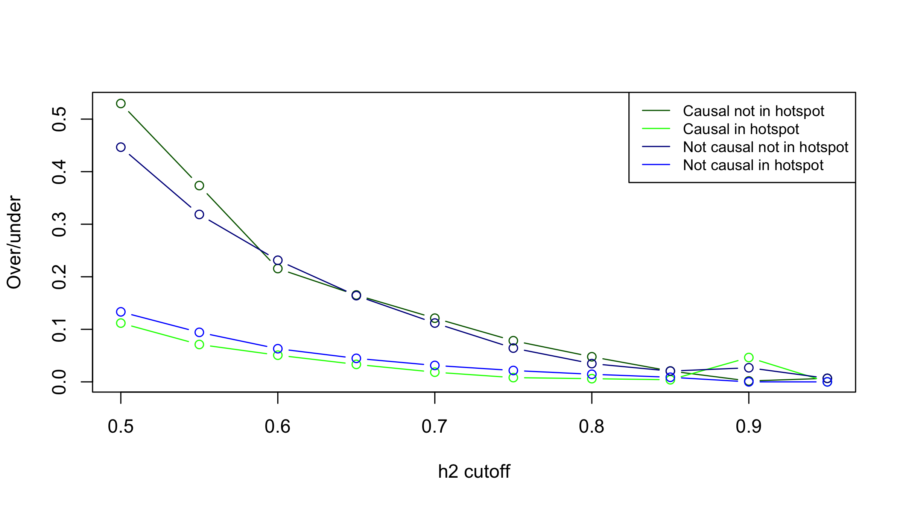

There's a difference in heritability in genes in hotspot and genes not in hotspot

# Validate causal pairs by comparing with list of eqtls
If a gene-eqtl pair is in the reported list of genes with eqtls, then it means that the eqtl is affecting the gene. Applied to our causal genes: the eqtl of geneA is affecting gene B == geneA is affecting gene B. If the eqtl of geneA is in the reported list paired with geneB, then there's a confirmation that geneA affects geneB


```r
# add chr to find.effects_TF
find.effects_TF.chr <- unique(merge(find.effects_TF, coordinates_plot_cor[,.(geneA, geneB, chr.A, chr.B)], by=c("geneA", "geneB")), all.x=T)

# find cases in the reported gene-eqtl pairs where the eqtl of a causal gene is an eqtl for an affected gene
find.effects_TF.trans <- unique(merge(find.effects_TF.chr, eqtl_results[,.(gene, pmarker, cis)], by.x=c("geneB", "eqtl.A"), by.y=c("gene", "pmarker")), all.x=T)
```
Out of 28466 geneA affecting geneB pairs, 589 geneB-eqtlA pairs were in the reported list.  
There are 2 cases where the gene and eqtl are in cis and 587 where eqtlA is in trans with geneB

# Others
### Get distance between gene and eqtl

```r
if (!exists("genepos")){
  genepos <- fread("results/gene_pos.gz")
}
if (!exists("find.effects_TF")){
  find.effects_TF <- fread("results/findeffects_TF_newparams.gz")
}

# Add chomosome and start position to each gene
causal.pos.A <- merge(find.effects_TF, genepos, by.x="geneA", by.y="gene", all.x=T)
colnames(causal.pos.A) <- c("geneA", "geneB", "eqtl.A", "eqtl.B", "A->B", "B->A", "strand.A", "start.A","end.A", "chr.A")
causal.pos.B <- merge(causal.pos.A, genepos, by.x="geneB", by.y="gene", all.x=T)

# separate eqtl name into chromosome number and position of the eqtl
causal.pos.eqtlA <- separate(causal.pos.B, eqtl.A, c("eqtlA.chr", "eqtlA.pos", "eqtlA.other"), sep = "[:_]+", remove = F,
                             convert = T, extra = "warn", fill = "warn")
causal.pos.eqtlB <- separate(causal.pos.eqtlA, eqtl.B, c("eqtlB.chr", "eqtlB.pos", "eqtlB.other"), sep = "[:_]+", remove = F,
                             convert = T, extra = "warn", fill = "warn")

# tidy up
colstoremove <-  c("eqtlA.other", "eqtlB.other", "strand.A", "chr.strand")
causal.pos.eqtlB[,paste0(colstoremove):=NULL]
setnames(causal.pos.eqtlB, c("geneB", "geneA","eqtl.A","eqtlA.chr", "eqtlA.pos", 
                             "eqtl.B","eqtlB.chr", "eqtlB.pos", "A->B", "B->A", 
                             "start.A","end.A", "chr.A", "start.B","end.B","chr.B"))
setcolorder(causal.pos.eqtlB, c("geneA", "geneB", "eqtl.A", "eqtl.B","chr.A", 
                                "start.A","end.A","chr.B", "start.B","end.B","eqtlA.chr", 
                                "eqtlA.pos", "eqtlB.chr", "eqtlB.pos"))

# remove "chr" from chromosome number
cols = c("chr.A","chr.B", "eqtlA.chr", "eqtlB.chr")   # define which columns to work with
causal.pos.eqtlB[ , (cols) := lapply(.SD, function(x) {gsub("chr", "", x)}), .SDcols = cols] # replace
# "translate" into roman numerals into numeric
causal.pos.eqtlB[ , (cols) := lapply(.SD, function(x) {as.numeric(as.roman(x))}), .SDcols = cols]

# calculate distance between gene and eqtl
causal.pos.eqtlB[,("dist.A"):=start.A-eqtlA.pos]
causal.pos.eqtlB[,("dist.B"):=start.B-eqtlB.pos]

# plot distance between gene and eqtl (ordered by distance value)
plot(unique(causal.pos.eqtlB[,.(geneB, eqtl.B, dist.B)])[order(-dist.B)]$dist.B, pch=".", col="red",
     cex=2, ylab="distance", xlab="gene-eqtl pair", main="Distance between eqtl and gene")
legend("topright", legend=c("geneA-eqtlA", "geneB-eqtlB"),col=c("blue", "red"), lty=1, cex=0.8, inset=.02)
points(unique(causal.pos.eqtlB[,.(geneA, eqtl.A, dist.A)])[order(-dist.A)]$dist.A, pch=".", col="blue", cex=2)
```


### Plot where (relative to the gene) the eqtls are located

```r
# Get genes that have eqtls "inside" the gene
# unique(causal.pos.eqtlB[,.(geneA, eqtl.A, dist.A)])[order(-dist.A)][abs(dist.A) <= 100]

# negative distances mean that the eqtl is "inside" or after the gene
# positive numbers mean that the eqtl is before the gene 
# genesA that have an eqtl "inside"
distance.A <- unique(causal.pos.eqtlB[,.(geneA, eqtl.A, chr.A, start.A, end.A, eqtlA.chr,eqtlA.pos, dist.A)])
distance.B <- unique(causal.pos.eqtlB[,.(geneB, eqtl.B, chr.B, start.B, end.B, eqtlB.chr,eqtlB.pos, dist.B)])

# genes that have an eqtl "inside" the gene 
distA.inside <- distance.A[start.A < eqtlA.pos & eqtlA.pos < end.A][order(-dist.A)]
# genesA that have an eqtl before their start position
distA.before <- distance.A[start.A > eqtlA.pos][order(-dist.A)]
# genes that have an eqtl after their end position
distA.after <- distance.A[eqtlA.pos > end.A][order(-dist.A)]


# genes that have an eqtl "inside" the gene 
distB.inside <- distance.B[start.B < eqtlB.pos & eqtlB.pos < end.B][order(-dist.B)]
# genesA that have an eqtl before their start position
distB.before <- distance.B[start.B > eqtlB.pos][order(-dist.B)]
# genes that have an eqtl after their end position
distB.after <- distance.B[eqtlB.pos > end.B][order(-dist.B)]

### sanity check
comb.inside <- distA.inside %>% unite(gene_eqtl, geneA, eqtl.A, sep = "__")
comb.before <- distA.before %>% unite(gene_eqtl, geneA, eqtl.A, sep = "__")
comb.after <- distA.after %>% unite(gene_eqtl, geneA, eqtl.A, sep = "__")
if(any(comb.inside %in% comb.before | comb.inside %in% comb.after | comb.before %in% comb.after)){
  stop("Something's wrong with the gene-eqtl distance calculation")
}
###
# Plot number of genes that have eqtls before the gene start site, within the gene or after the gene's end site
toplotA <- c(before=nrow(distA.before), inside=nrow(distA.inside), after=nrow(distA.after))
toplotB <- c(before=nrow(distB.before), inside=nrow(distB.inside), after=nrow(distB.after))

toplotAB <- rbind(toplotA, toplotB)
bpAB <- barplot(toplotAB, main="Number of genes that have eqtls at each position relative to itself", col=c("darkblue","red"),
        legend = c("causal genes", "affected genes"), beside=TRUE, ylim=c(0,max(toplotAB)+50))
text(bpAB, toplotAB, labels=toplotAB, cex=1, pos=3)
```

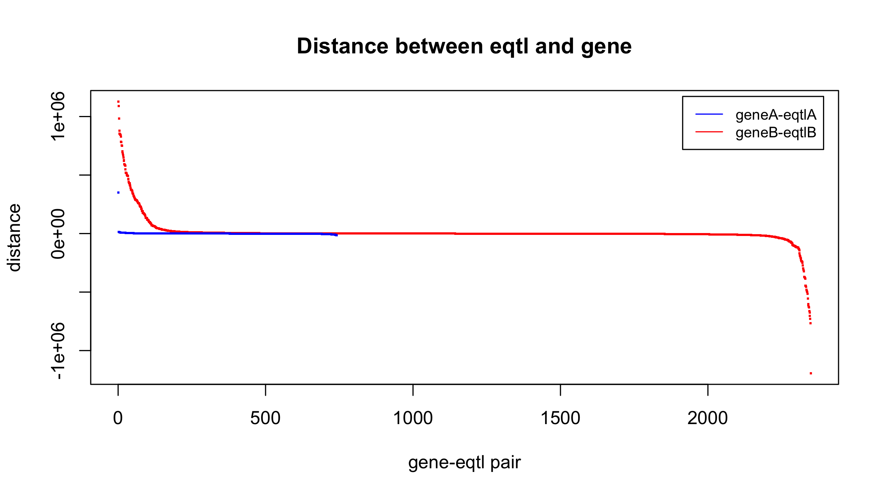

```r
# bpB <- barplot(toplotB, 
#               main = "Number of genes that have eqtls at each position relative to itself \n (causal genes)", 
#               ylim = c(0, max(toplotB)+50))
# text(bpB, toplotB, labels=toplotB, cex=1, pos=3)

toplotA <- c(before=nrow(distA.before), inside=nrow(distA.inside), after=nrow(distA.after))
bpA <- barplot(toplotA, main = "Number of genes that have eqtls at each position relative to itself \n (causal genes)", 
        ylim = c(0, max(toplotA)+50), col="darkblue")
text(bpA, toplotA, labels=toplotA, cex=1, pos=3)
```

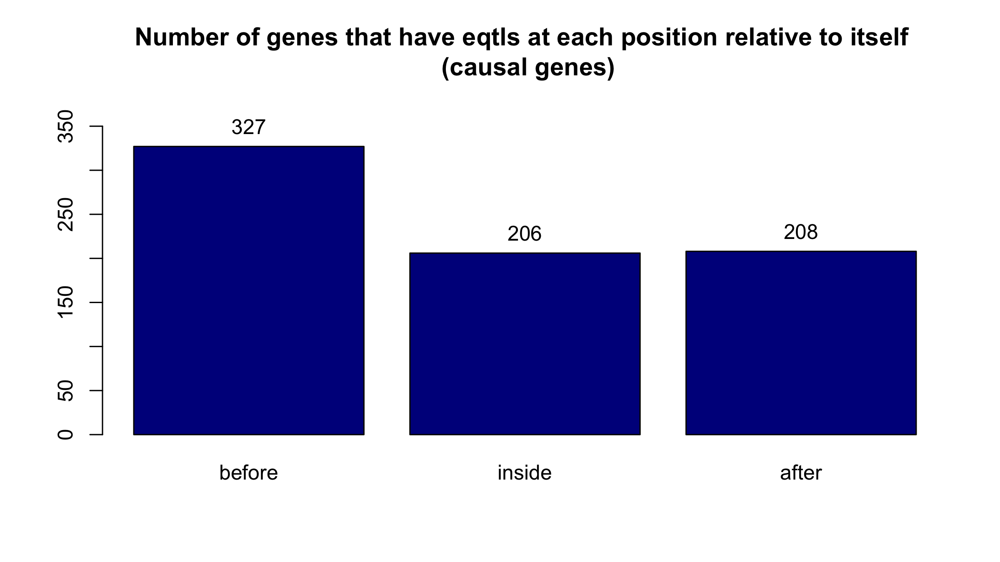

Most of the eqtls seem to be located before the gene.  

### How many gene-eqtl pairs are not in the paper's reported pairs

```r
geneeqtlA.sub <- unique(find.effects_TF[,.(geneA, eqtl.A)])
geneeqtlB.sub <- unique(find.effects_TF[,.(geneB, eqtl.B)])
genepmarker.sub <- eqtl_results[,.(gene, pmarker)]

combinegeneeqtlA <- geneeqtlA.sub %>% unite(gene_eqtl, geneA, eqtl.A, sep = "__")
combinegeneeqtlB <- geneeqtlB.sub %>% unite(gene_eqtl, geneB, eqtl.B, sep = "__")
combine_genepmarker <- genepmarker.sub %>% unite(gene_eqtl, gene, pmarker, sep = "__")


geneA.eqtlA.notinpaper <- combinegeneeqtlA[which(!combinegeneeqtlA %in% combine_genepmarker)]
geneB.eqtlB.notinpaper <- combinegeneeqtlB[which(!combinegeneeqtlB %in% combine_genepmarker)]
```

There are 1 gene-eqtl pairs for the causal genes not in the provided gene-eqtl table.  
There are 1 gene-eqtl pairs for the affected genes not in the provided gene-eqtl table  

