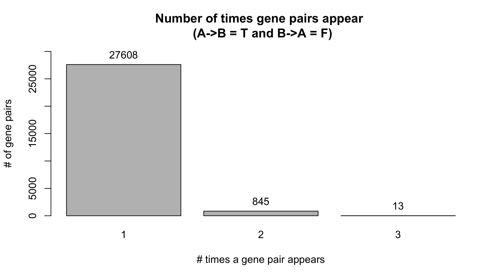
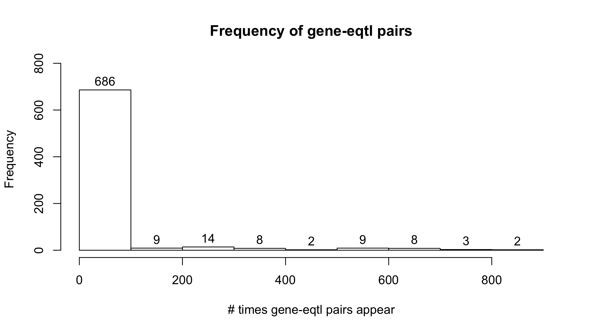
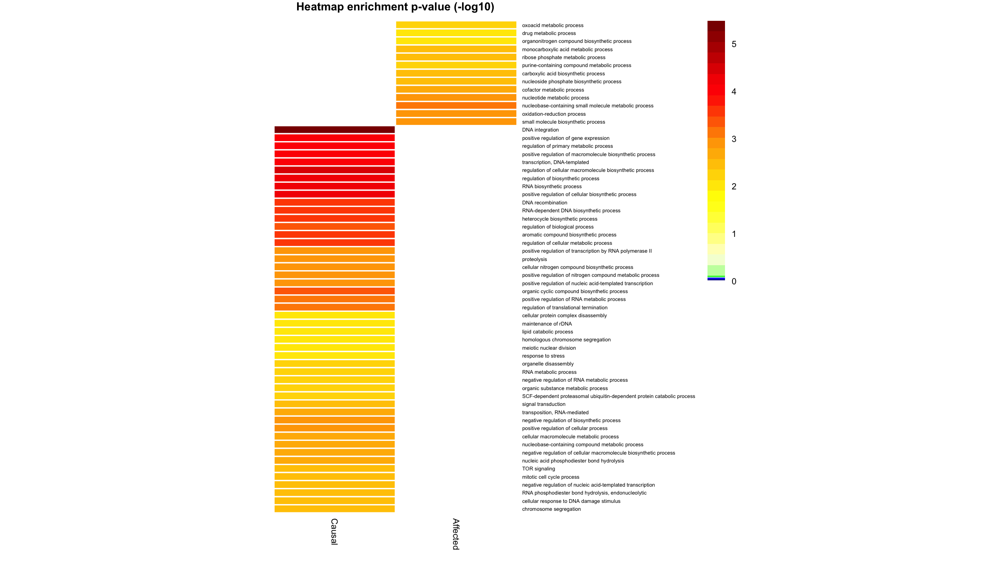

```r
files_in_zip <- unzip(zipfile = "data/zipped_data.zip", list = T)
for (datafile in files_in_zip$Name){
  if (!file.exists(paste0("data/", "datafile"))){
    unzip(zipfile = "data/zipped_data.zip", exdir = "data/")
  }
}
```


Data from **Albert FW, Bloom JS, Siegel J, Day L, Kruglyak L. 2018. Genetics of trans-regulatory variation in gene expression. eLife 7: 1–39.**  [Source data](https://elifesciences.org/articles/35471/figures#supp1) or [source data](https://figshare.com/s/83bddc1ddf3f97108ad4)  
Files to download:  
* SI_Data_01_expressionValues.txt (in the repo)
* SI_Data_03_genotypes.txt (too big for the repo)
* SI_Data_04_eQTL.csv

I started with :  
* **phenotype matrix** - contains the gene expression data (expression levels in units of log2(TPM) for all genes and segregants)  
* **genotype matrix** - contains the genotype information (genotypes at 42,052 markers for all segregants. BY (i.e. reference) alleles are denoted by ‘−1’. RM alleles are denoted by ‘1’.)  
* **eqtl_results** - Genes with a local eQTL and significant Allele-specific expression (ASE), and discordant direction of effect. (1) Positive values indicate higher expression in RM compared to BY. (2) Shown is the less sig- nificant p-value from the two ASE datasets. (3) The table shows only genes where both ASE datasets agreed in the direction of effect. Shown is the average effect.  

# for the actual analysis jump to "Do analysis with new parameters"

Original parameters used

```r
var.exp.lim <- 0.1

nSNPs <- length(colnames(genotype)) - 1
nGenes <- length(colnames(phenotype)) - 1
# nSNPs <- 42052
# nGenes <- 5720

snp.pval <- 0.05 / (as.numeric(nGenes) * as.numeric(nSNPs))
snp.pval.nsign <- as.numeric(1e-5)

corr.pval <-  0.05 / (nGenes * nGenes)
```


# Get effects table
Probably best to run in uppmax  

What's happening here:  
- create a table with all the possible combinations of geneA-eqtlA with geneB-eqtlB  
- ANOVA to test the effect of an eQTL on a gene  
- combines the anova results with the table with the geneA-eqtlA and geneB-eqtlB combinations  
- get correlation between genes  
- adds the correlation between genes to the previous table  
Output is a table with all combinations of gene-eqtl pairs (all geneA must have a cis-eqtl but not all of geneB have to have an eqtl (in cis or not)), if their eqtl is in cis or not, the variance explained by each gene-eqtl pair, the anova p-value and r2 of the effect of an eqtl on a gene and the correlation value and p-value between genes.

```r
library(data.table)
if (!file.exists("results/effects_table.Rdata")){
  
  eqtl_results.sub <- eqtl_results[,.(gene, pmarker, cis, var.exp)]
  
  genesB <- colnames(phenotype[,2:ncol(phenotype)])
  effectsA_B.sepA_B <- create_ini_table(eqtl_results.sub, genesB, var.exp.lim)
  
  ### Find effect of eqtls from geneA in expression of geneB ####
  eqtls.A <- unique(effectsA_B.sepA_B$eqtl.A)
  genes.B <- unique(effectsA_B.sepA_B$geneB)
  res.tot.eqtlA_geneB <- data.table(expand.grid(gene=genes.B, eqtl=eqtls.A))#, anv.res=NA))
  res.eqtlA_geneB <- res.tot.eqtlA_geneB
  
  # run anova in parallel -- effect of eqtlA on geneB
  message("running anova for the effect of eqtlA on geneB")
  cl = makeCluster(detectCores() - 1, type="FORK")
  res.eqtlA_geneB$anv.res <- parApply(cl=cl,res.eqtlA_geneB,1,effect_eqtl_gene, phenotype, genotype)
  stopCluster(cl)

  
  ### Find effect of eqtls from geneB in expression of geneA
  message("running anova for the effect of eqtlB on geneA")
  eqtls.B <- na.omit(unique(effectsA_B.sepA_B$eqtl.B))
  genes.A <- unique(effectsA_B.sepA_B$geneA)
  res.tot.eqtlB_geneA <- data.table(expand.grid(gene=genes.A, eqtl=eqtls.B))#, anv.res=NA))
  res.eqtlB_geneA <- res.tot.eqtlB_geneA
  
  # run the anova function in parallel -- effect of eqtlB on geneA
  cl = makeCluster(detectCores() - 1, type="FORK")
  res.eqtlB_geneA$anv.res <- parApply(cl=cl,res.eqtlB_geneA,1,effect_eqtl_gene, phenotype, genotype)
  stopCluster(cl)
  
  ## merge anova results with the information table to create an effects table
  
  # results from effect of eqtlA on geneB
  effects_table.eqtlA_geneB <- merge_after_anova(res.eqtlA_geneB, "B", "A", effectsA_B.sepA_B)
  
  # results from effect of eqtlB on geneA
  effects_table.anova <- merge_after_anova(res.eqtlB_geneA, gene.AB="A", eqtl.AB="B", effects_table.eqtlA_geneB )
  setcolorder(effects_table.anova, c("geneA", "geneB", "eqtl.A", "eqtl.B", "cis.A", "cis.B"))
  
  ### correlation ####
  message("getting correlation between genes")
  cor_traits <- rcorr(as.matrix(phenotype[,2:ncol(phenotype)])) # to remove the sample names
  
  cor_traits.cor <- cor_traits$r
  cor_traits.p <- cor_traits$P
  
  my_cor_matr_flat <- flat_cor_mat(cor_traits.cor,cor_traits.p)
  my_cor_matr_flat <- data.table(my_cor_matr_flat)
  
  cor_matr <- my_cor_matr_flat[!duplicated(t(apply(my_cor_matr_flat, 1, sort))), ]
  
  # merge the correlation values with the table that has the anova results
  setnames(cor_matr, old=c("row","column", "pval"), new=c("geneA","geneB", "cor.pval"))
  
  message("combining anova results with correlation")
  effects_table.cor <- merge(effects_table.anova, cor_matr, by=c("geneA","geneB"), all.x=T)
  
  message("saving effects table with correlation between genes")
  save(effects_table, file="results/effects_table.Rdata")
  
}
```

## Test different parameters and create summary table with results from testing the different parameters
Test different parameter values combinations to see if I there is a certain combination that gives optimal results in the causality inference.    
Takes a while, probably better to use uppmax    

Assumptions:  
* geneA is in cis with eqtlA  
* geneB is in cis with eqtlB  
* var.explained for geneA must be > var.exp.lim  
* correlation pval is < corr.pval    
Inferred if gene A is affecting geneB or if geneB is affecting geneA.  
* geneA != geneB  

There are two categories and several end results:    
Categories:  
* A affects B: A->B  
* B affects A: B->A  

End results:  
* **A->B = T and B->A = F** or **A->B = F and B->A = T** --> this is the case we are mostly interested in. It means we can say that a gene affects the other, but it's not affected by it.  
* **A->B = T and B->A = NA** or **A->B = NA and B->A = T** --> we can say that a gene affects the other, but we can't say if the second gene affects the first  
* **A->B = NA and B->A = NA** --> we can't say anything about causality  
* **A->B = F and B->A = T** or **A->B = F and B->A = T** --> neither gene affects the other  
* **A->B = T and B->A = T** or **A->B = T and B->A = T**  

How it works:    
* **A->B = T** if anova p-value for the effect of eqtlA on geneB is < snp.pval  
* **A->B = F** if the anova p-value of the effect of eqtlA on geneB is > snp.pval.nsign and geneA and geneB have different eqtls  
* **B->A = T** if anova p-value for the effect of eqtlB on geneA is < snp.pval  
* **B->A = F** if the anova p-value of the effect of eqtlB on geneA is > snp.pval.nsign and geneA and geneB have different eqtls  


What's happening here:  
- set different values for an effect or a correlation to be significant or non-significant  
- find causality (A->B and B->A) using the diferent parameters 
  - the object "res" is a list of tables where each table corresponds to the causality inference done with different parameters (specified in each table)  
  
geneA <- causal genes  
geneB <- affected genes  

- create table with a summary of the results:  
  - number of different geneA and geneB found    
  - number of different eqtlA and eqtlB found  
  - number of unique gene pairs  
  - number of different gene-eqtl pairs for geneA-eqtlA and geneB-eqtlB  
  - the parameter cutoffs  

```r
if (!file.exists("results/resparams.Rdata")){
  
  message("loading effects_table")
  load("results/effects_table.Rdata")
  
  sign_p <- c(1e-17, 1e-16, 1e-15, 1e-14, 1e-13, 1e-12, 1e-11, 1e-10, 1e-9, 1e-8, 1e-7, 1e-6, 1e-5, 1e-4, 1e-3, 1e-2)
  non_sign_p <- c(1e-7, 1e-6, 1e-5, 1e-4, 1e-3, 1e-2)
  cor_p <- c(1e-9, 1e-8, 1e-7, 1e-6, 1e-5, 1e-4, 1e-3, 1e-2)
  params0 <- data.table(expand.grid(sign_p=sign_p, non_sign_p=non_sign_p, cor_p=cor_p))
  
  message("testing parameters")
  
  cl = makeCluster(detectCores() - 1, type="FORK")
  res <- parApply(cl=cl,params0,1, testparams, effects_table, var.exp.lim)
  stopCluster(cl)

  save(res, file="results/resparams.Rdata")
  
}

if (!file.exists("results/res_table_params.Rdata")){
  message("loading resparams")
  load(file = "results/resparams.Rdata")
  
  # create summary table with results from testing the different parameters
  message("creating summary table")
  cl = makeCluster(detectCores()-1, type="FORK")
  res_table.temp <- parLapply(cl=cl, res, create_res_table)
  stopCluster(cl)
  
  res_table <- rbindlist(res_table.temp)
  res_table <- res_table[order(sign.p, -nonsign.p, cor.p)]
  
  save(res_table, file="results/res_table_params.Rdata")
  
} else if (file.exists("results/res_table_params.Rdata")){
  message("loading res_table with the results of testing the several parameters")
  load("results/res_table_params.Rdata")
}
```

```
## loading res_table with the results of testing the several parameters
```


### Plot number of times geneA -> geneB with the different parameters tested 
Only the cases where A->B=T and B->A=F

```r
par(mfrow=c(2,4))

cor.pvals <- unique(res_table$cor.p)
linetype <- c(1:length(unique(res_table$nonsign.p)))

for (p in cor.pvals){
  xrange <- range(-log(res_table$sign.p)) # set x-axis range
  yrange <- range(res_table$unique.genepairs) # set y-axis range
  plot(xrange, yrange, type = "n", main=paste("corr pval = ", p), xlab = "-log(sign.p)",
       ylab = " #unique gene pairs") # empty plot
  colors <- rainbow(length(unique(res_table$nonsign.p)))
  for (i in 1:length(unique(res_table$nonsign.p))){
    x <- -log(res_table[nonsign.p==nonsign.p[i] & cor.p==p]$sign.p)
    y <- res_table[nonsign.p==nonsign.p[i] & cor.p==p]$unique.genepairs
    lines(x,y,  type="l", lwd=1.5,lty=linetype[i], col=colors[i])
  }
  #legend(x=20, yrange[2], unique(res_table$nonsign.p), col=colors, lty=linetype, cex=0.8)
}
```


```r
par(mfrow=c(1,1))

xrange <- range(-log(res_table$sign.p)) # set x-axis range
yrange <- range(res_table$unique.genepairs) # set y-axis range
plot(xrange, yrange, type = "n", xlab = "-log(p)", ylab = "#unique gene pairs",  
     main="#gene pairs where A->B") # empty plot
colors <- rainbow(length(unique(res_table$nonsign.p)))
linetype <- c(1:length(unique(res_table$nonsign.p)))
for (i in 1:length(unique(res_table$nonsign.p))){
  x <- -log(res_table$sign.p[res_table$nonsign.p==unique(res_table$nonsign.p)[i]])
  y <- res_table$unique.genepairs[res_table$nonsign.p==unique(res_table$nonsign.p)[i]]
  lines(x,y,  type="l", lwd=1.5,lty=linetype[i], col=colors[i])
}
legend(x=20, yrange[2], unique(res_table$nonsign.p), col=colors, lty=linetype, cex=0.8)
```


# Inferring causality with new parameters

```r
var.exp.lim <- 0.1

# nSNPs <- length(colnames(genotype))-1
# nGenes <- length(colnames(phenotype))-1

nSNPs <- 42052
nGenes <- 5720

snp.pval <- 0.01
snp.pval.nsign <- as.numeric(1e-5)

corr.pval <- 0.05/choose(nGenes,2)
```

Assumptions (same as before):  
* geneA is in cis with eqtlA  
* geneB is in cis with eqtlB  
* var.explained for geneA must be > var.exp.lim  
* correlation pval is < corr.pval    
Inferred if gene A is affecting geneB or if geneB is affecting geneA.  
* geneA != geneB  

There are two categories and several end results:    
Categories:  
* A affects B: A->B  
* B affects A: B->A  

End results:  
* **A->B = T and B->A = F** or **A->B = F and B->A = T** --> this is the case we are mostly interested in. It means we can say that a gene affects the other, but it's not affected by it.  
* **A->B = T and B->A = NA** or **A->B = NA and B->A = T** --> we can say that a gene affects the other, but we can't say if the second gene affects the first  
* **A->B = NA and B->A = NA** --> we can't say anything about causality  
* **A->B = F and B->A = T** or **A->B = F and B->A = T** --> neither gene affects the other  
* **A->B = T and B->A = T** or **A->B = T and B->A = T**  

How it works:    
* **A->B = T** if anova p-value for the effect of eqtlA on geneB is < snp.pval  
* **A->B = F** if the anova p-value of the effect of eqtlA on geneB is > snp.pval.nsign and geneA and geneB have different eqtls  
* **B->A = T** if anova p-value for the effect of eqtlB on geneA is < snp.pval  
* **B->A = F** if the anova p-value of the effect of eqtlB on geneA is > snp.pval.nsign and geneA and geneB have different eqtls  


## Get the effect of each gene on the other and the cases where A->B = T and B->A = F


### Plot number of times a gene pair appears

```r
find.effects_TF.numpairs <- find.effects_TF[, .N, by=.(geneA, geneB)]

numpairs.table <- data.table(N = unique(find.effects_TF.numpairs$N), numpairs =NA)
for (i in 1:nrow(numpairs.table)){
  numpairs.table$numpairs[i] <- nrow(find.effects_TF.numpairs[N==numpairs.table$N[i]])
}

# plot the number of times a gene pair appears
bp <- barplot(numpairs.table[order(-numpairs)]$numpairs, 
              numpairs.table[order(-numpairs)]$N, names.arg=unique(find.effects_TF.numpairs[order(N)]$N), 
              width = 0.5, space=0.2, legend.text = F, ylim = c(0,max(numpairs.table$numpairs)+2500),
              main = "Number of times gene pairs appear \n (A->B = T and B->A = F)", xlab = "# times a gene pair appears", 
              ylab = "# of gene pairs")
text(bp,numpairs.table[order(-numpairs)]$numpairs, 
     labels=numpairs.table[order(-numpairs)]$numpairs, cex=1, pos=3)
```

<!-- -->

### Plot the number of times a gene-eqtl pair appears


### Frequency of gene-eqtl pairs

```r
find.effects_TF.geneeqtl.A <- find.effects_TF[, .N, by=.(geneA, eqtl.A)]
find.effects_TF.geneeqtl.A.plot <- find.effects_TF.geneeqtl.A %>% unite(gene_eqtlA, geneA, eqtl.A, sep = "__")
numpairs.table2 <- data.table(N = unique(find.effects_TF.geneeqtl.A.plot$N), numpairs =NA)
for (i in 1:nrow(numpairs.table2)){
  numpairs.table2$numpairs[i] <- nrow(find.effects_TF.geneeqtl.A[N==numpairs.table2$N[i]])
}
numpairs.table2 <- numpairs.table2[order(N)]

hist(find.effects_TF.geneeqtl.A.plot$N, main = "Frequency of gene-eqtl pairs", xlab = "# times gene-eqtl pairs appear",labels = T, ylim = c(0,780))
```

<!-- -->

```r
# the majority of gene-eqtl pairs appear between 0-100 times
```
### Plot the network
Takes a very long time and you can't really see anything so it's not very worth it.  
There are no subclusters, it's just one bit network


```r
plot_TF <- graph_from_edgelist(as.matrix(find.effects_TF[,.(geneA, geneB)]),directed=TRUE)
# components(plot_TF)

memb <- components(plot_TF)$membership
nodes <- data.table(id = names(memb),
                    group_id = memb)
nodes <- nodes[order(nodes$id), ]

if(length(unique(nodes$group_id))> 1){
  message(paste0("There are ", length(unique(nodes$group_id)), " subclusters!"))
} else {
  message("There are no subclusters")
}
```

```
## There are no subclusters
```

```r
#plot(plot_TF, layout=layout_with_gem,edge.arrow.size=.5, vertex.label=NA)
```

\newpage

# GO analysis
In order to find the GO terms associated with my genes I used YeastMine (Balakrishnan et al., 2012) (https://yeastmine.yeastgenome.org/yeastmine/begin.do). Since I was not being able to do it in R, using the YeastMine API, I used python to run my queries. To be able to run the queries with python, first I needed to create an account and request an API key. Since you can generate python code from the website, I used it as a guide and added/ removed parameters to get what I needed. 

To get an API key, go to https://yeastmine.yeastgenome.org/yeastmine/begin.do and create an account. Go to account details and create a new key. 
Save the key in a file called yeastmineAPI.txt  

"genelist" is a list of the genes involved in the causality - Uploaded into yeastmine and saved in my area   

1. create gene list

```r
if (!file.exists("data/genelist.txt")){
  genelist <- data.table(unique(c(find.effects_TF$geneA, find.effects_TF$geneB)))
  fwrite(genelist, "data/genelist.txt", col.names = F)
}

genelist <- fread("data/genelist.txt", header = F)
genes_in_find.effects <- data.table(unique(c(find.effects_TF$geneA, find.effects_TF$geneB)))
if (nrow(genelist) != nrow(genes_in_find.effects)){
  update_genelist <- T
  stop("YOU'LL NEED TO REUPLOAD THE GENELIST INTO YEASTMINE AND RERUN THE PYTHON CODE BELOW")
} else {
  update_genelist <- F
}
```
2. upload list into yeastmine giving it the name genelist
3. Continue once you have uploaded the genelist into yeastmine

Get table with geneID, gene symbol, gene name, GO identifier, GO term name, GO namespace and evidence code

```python
# Sometimes breaks Rstudio, might be better to run it in a script/python console
import os.path
from os import path
os.chdir("/Users/Carolina/Documents/GitHub/DegreeProject/summarizing/")
if not path.isfile("results/genelistwithGOterm.txt" or r.update_genelist):
  # The following lines will be needed in every python script:
  from intermine.webservice import Service
  yeastmineAPItoken_file = open('data/yeastmineAPI.txt', 'r')
  yeastmineAPItoken = yeastmineAPItoken_file.readline().rstrip()
  service = Service("https://yeastmine.yeastgenome.org/yeastmine/service", token = yeastmineAPItoken)
  
  # Get a new query on the class (table) you will be querying:
  query = service.new_query("Gene")
  
  # The view specifies the output columns
  query.add_view(
      "secondaryIdentifier", "symbol", "name",
      "ontologyAnnotations.ontologyTerm.identifier",
      "ontologyAnnotations.ontologyTerm.name",
      "ontologyAnnotations.ontologyTerm.namespace",
      "ontologyAnnotations.evidence.code.code"
  )
  
  # You can edit the constraint values below
  query.add_constraint("Gene", "IN", "genelist", code = "A")
  
  terms = "gene", "symbol", "gene.name", "GO.identifier", "GO.term", "GO.namespace", "evidence"
  
  terms_query = ["secondaryIdentifier", "symbol", "name", "ontologyAnnotations.ontologyTerm.identifier", "ontologyAnnotations.ontologyTerm.name", "ontologyAnnotations.ontologyTerm.namespace", "ontologyAnnotations.evidence.code.code"]
  print("saving file")
  with open("results/genelistwithGOterm.txt", "w") as file:
    # write headers
    for term in terms[:-1]:
      file.write(term)
      file.write("\t")
    else:
      file.write(terms[-1])
    file.write("\n")
    #write content
    for row in query.rows():
      for t in terms_query[:-1]:
        if row[t] != None:
          file.write(str(row[t]))
          file.write("\t")
        else:
          file.write("NA")
          file.write("\t")
      if row[terms_query[-1]] != None:
        file.write(row[terms_query[-1]])
      else:
        file.write("NA")
      file.write("\n")
else:
  print("file exists")
```

```
## file exists
```

Load file generated with python - contains gene, gene symbol, gene name, GO code, GO term, GO namespace and evidence code

```r
genes_GO.table <- fread("results/genelistwithGOterm.txt")
genes_GO.table <- unique(genes_GO.table)
```

Subset to have only the things we'll need for the next analysis - GO terms related to biological processes and remove unecessary columns

```r
genes_GO.bio <- unique(genes_GO.table[GO.namespace=="biological_process"])
genes_GO.bio.noevidence <- data.table(genes_GO.bio)
genes_GO.bio.noevidence[,evidence :=NULL]
genes_GO.bio.noevidence[,GO.namespace :=NULL]
genes_GO.bio.noevidence <- unique(genes_GO.bio.noevidence)
```

Run to get different measures

```r
#count number of times each ontology term appears (number of diferent genes that have this GO term)
GOterms.count <- genes_GO.bio.noevidence[, .(description=unique(GO.term), count = .N), by = GO.identifier][order(-count)]

# find genes that have "transcription factor" in the GO term
GO_trans_factor <- unique(genes_GO.bio.noevidence[grepl("transcription factor",GO.term, fixed = F)])

# gene symbol + GO term + gene name
GO_transc_reg <- unique(genes_GO.bio.noevidence[(grepl(" transcription ",GO.term, fixed = F) & grepl(" regulation ",GO.term, fixed = F)) | grepl("transcription factor",GO.term, fixed = F)])
```


### number of times each geneA and geneB point to another gene

```r
numlinks_from_gene.A <- find.effects_TF[, .(geneB, count.A=.N), by=geneA]
numlinks_from_gene.B <- find.effects_TF[, .(count.B=.N), by=geneB]
numlinks_from_gene <- merge(numlinks_from_gene.A, numlinks_from_gene.B, by="geneB", all=T)
setcolorder(numlinks_from_gene, c("geneA", "geneB", "count.A", "count.B"))
head(numlinks_from_gene[order(-count.A, count.B)])
```

<div class="kable-table">

geneA     geneB      count.A   count.B
--------  --------  --------  --------
YLR270W   YDR236C        897         2
YLR270W   YJL008C        897         2
YLR270W   YJL193W        897         3
YLR270W   YLR343W        897         3
YLR270W   YGL193C        897         4
YLR270W   YLR455W        897         4

</div>

### number of times each geneA points to another gene + GO term

```r
links_perGO_pergene <- merge(unique(genes_GO.bio.noevidence), 
                             unique(numlinks_from_gene[,.(geneA, count.A)]),
                             by.x="gene", by.y="geneA", all=T)
head(links_perGO_pergene[order(-count.A), .(gene, GO.identifier, GO.term, count.A)])
```

<div class="kable-table">

gene      GO.identifier   GO.term                                                                        count.A
--------  --------------  ----------------------------------------------------------------------------  --------
YLR270W   GO:0000290      deadenylation-dependent decapping of nuclear-transcribed mRNA                      897
YLR270W   GO:0009267      cellular response to starvation                                                    897
YLR270W   GO:0031086      nuclear-transcribed mRNA catabolic process, deadenylation-independent decay        897
YLR270W   GO:1901919      positive regulation of exoribonuclease activity                                    897
YLR264W   GO:0000028      ribosomal small subunit assembly                                                   834
YLR264W   GO:0002181      cytoplasmic translation                                                            834

</div>


```r
links_perGO <- links_perGO_pergene[,.(gocount=sum(count.A, na.rm = T)), by=c("GO.identifier", "GO.term")]
```

### find the GOs that have transcription factor or transcription regulation in the name

```r
links_perGO_transfactor <- links_perGO[(grepl(" transcription ",GO.term, fixed = F) & 
                                         grepl(" regulation ",GO.term, fixed = F)) | 
                                         grepl("transcription factor",GO.term, fixed = F)]
head(links_perGO_transfactor[order(-gocount)][,.(GO.term, gocount)])
```

<div class="kable-table">

GO.term                                                                            gocount
--------------------------------------------------------------------------------  --------
positive regulation of transcription by RNA polymerase II                              568
negative regulation of transcription by RNA polymerase II                              479
positive regulation of transcription elongation from RNA polymerase II promoter        127
negative regulation of transcription by transcription factor localization              119
positive regulation of transcription initiation from RNA polymerase II promoter        100
positive regulation of transcription by RNA polymerase I                                43

</div>
There are 65 different terms with "transcription" and "regulation" or "transcription factor" in their name


#### causal links GO is regulating transcription or a transcription factor

```r
bp <-
  barplot(
    links_perGO_transfactor[order(-gocount)][gocount>0]$gocount,
    names.arg = links_perGO_transfactor[gocount>0]$GO.identifier,
    ylab = "# links",
    xlab = "" ,
    ylim = c(0, 650),
    main = "Number of links going out", 
    las=2, 
    cex.names = 0.7
  )
text(
  bp,
  links_perGO_transfactor[order(-gocount)][gocount>0]$gocount,
  links_perGO_transfactor[order(-gocount)][gocount>0]$gocount,
  cex = 0.8,
  pos = 3
)
```


```r
hist(links_perGO_transfactor[order(-gocount)]$gocount, 
     main = "# causal links \n GO is regulating transcription or a transcription factor")
```


### Num of links going out of genes with "transcription" "regulation" or "transcription factor" as its GO term and number of links going out of genes with other descriptions

```r
data.table(links_perGO[(grepl(" transcription ",GO.term, fixed = F) & grepl(" regulation ",GO.term, fixed = F)) | grepl("transcription factor",GO.term, fixed = F) , .(sum_trans=sum(gocount, na.rm = T))], links_perGO[!((grepl(" transcription ",GO.term, fixed = F) & grepl(" regulation ",GO.term, fixed = F)) | grepl("transcription factor",GO.term, fixed = F)) , .(sum_others=sum(gocount, na.rm = T))])
```

<div class="kable-table">

 sum_trans   sum_others
----------  -----------
      1662       164609

</div>

### Num of links having "transcription" and "regulation" or "transcription factor" in the description
(with outliers)

```r
bp_tfactor <-
  boxplot(
    gocount ~ grepl("transcription factor", GO.term, fixed = F),
    data = links_perGO,
    outline = T,
    names = c("Other", "transcription factor"),
    xlab = "",
    ylab = "# links",
    main = "Number of arrows pointing from each GO category",
    ylim = c(-1, 195))

text(1:length(bp_tfactor$n),
     bp_tfactor$stats[5, ] + 5,
     paste("n=", bp_tfactor$n),
     pos = 4)

bp_tfactor_reg <-boxplot(
    gocount ~ ((grepl(" transcription ", GO.term, fixed = F) & 
                 grepl(" regulation ", GO.term, fixed = F)) |
                 grepl("transcription factor", GO.term, fixed = F)),
    data = links_perGO,
    outline = T,
    names = c("Other", "transcription factor or regulator"),
    xlab = "",
    ylab = "# links",
    main = "Number of arrows pointing from each GO category",
    ylim = c(-1, 195))

text(1:length(bp_tfactor_reg$n),
  bp_tfactor_reg$stats[5, ] + 5,
  paste("n=", bp_tfactor_reg$n),
  pos = 4)
```


would make sense for there to be an enrichment of transcription regulators/factors in the genes A

### Num of links having "transcription" and "regulation" or "transcription factor" in the description
(without outliers)

```r
links_perGO.nobioprocess <-
  links_perGO[!GO.term == "biological_process"]

bp_tfactor_reg <-boxplot(
    gocount ~ ((grepl(" transcription ", GO.term, fixed = F) &
                  grepl(" regulation ", GO.term, fixed = F)) |
                  grepl("transcription factor", GO.term, fixed = F)),
    data = links_perGO.nobioprocess,
    outline = F,
    names = c("Other", "transcription factor or regulator"),
    xlab = "",
    ylab = "# links",
    main = "Number of arrows pointing from each GO category", 
    ylim = c(0,60)
  )

text(
  1:length(bp_tfactor_reg$n),
  bp_tfactor_reg$stats[5, ] + 5,
  paste("n=", bp_tfactor_reg$n),
  pos = 4
)
```

<!-- -->

### 10 most represented GO categories

```r
nms <- links_perGO[order(-gocount)]$GO.term[1:10]
mytable <- links_perGO[order(-gocount)]$gocount[1:10]
# labels with count
lbls <- paste( links_perGO[order(-gocount)]$GO.term[1:10], " -- ", mytable, sep="") 
pie(mytable, labels = nms,
    main = "Top 10 most represented GO categories \n (in causal genes)")
```


According to [EBI](https://www.ebi.ac.uk/QuickGO/term/GO:0050789), the GO term "biological process" is "any process that modulates the frequency, rate or extent of a biological process" it's usually used when the actual function of the gene is not known.  

High values might be because there are many genes associated with a certain term or because the genes that are associated with that term have many "arrows" going out (they affect many other genes)

\newpage


# GO Enrichment

I used GOstats, an R package (bioconductor), to test GO terms for over representation. I used both a classical hypergeometric test and a conditional hypergeometric test, which uses the relationships among GO terms to decorrelate the results  

First I needed to define a few parameters:  
* **universe** - all the genes in the dataset (can be involved in the causality or not) (num genes = 5720)  
* **interesting genes** - causal genes (n=2658) or affected genes (n=2478)  

Falcon & Gentleman (2007) the universe can be reduced by not using the genes that are not being expressed (in this case I would say not involved in the causality).   Taking this into account, it would be interesting to perform the hypergeometric test using only the genes involved in the causality (genes that affect the expression of other genes and genes that are affected) as universe. Falcon & Gentleman (2007) also suggest removing genes that do not map to any GO term  
I'm performing the hypergeometric test twice, once for the causal genes and once for the affected genes to see if there's a different enrichment in both groups. It would be expected that the causal group would be enriched for genes involved in regulation.  

From Falcon & Gentleman (2007)    
"In the hypergeometric model, each term is treated as an independent classification. Each gene is classified according to whether or not it has been selected and whether or not it is annotated at a particular term. A hypergeometric probability is computed to assess whether the number of selected genes associated with the term is larger than expected."  

Performed new hypergeometric test with  
* **universe** - all the genes involved in the causality (num genes = 2861)  
* **interesting genes** - causal genes or affected genes  

I checked if the resulting enrichment table was the same for both universes tested and it was.  
I will continue by using the results from the second test, where the universe was comprised of genes involved in the causality.  

## Get enrichment for the "causal" genes and for the affected genes 
### Hypergeometric test
Causal - genesA   
Affected - genesB  

Test universe as all the genes in the dataset and universe as all the genes involved in the causality

```r
if (!exists("genes_GO.bio")){
  genes_GO.table <- fread("results/genelistwithGOterm.txt")
  genes_GO.table <- unique(genes_GO.table)
  genes_GO.bio   <- unique(genes_GO.table[GO.namespace=="biological_process"])
}

# create geneset
goframeData <- unique(genes_GO.bio[,.(GO.identifier, evidence, gene)])
gs <- getgeneset(goframeData)


genesA <- unlist(unique(find.effects_TF[,geneA]))
genesB <- unlist(unique(find.effects_TF[,geneB]))

# universe is genes involved in causality
universe <- unique(c(genesA, genesB))


# get enrichment for genesA
res.geneA <- getenrichment(gs, universe = universe, interestinggenes = genesA)
res.geneA.dt <- data.table(summary(res.geneA))

# get enrichment for genesB
res.geneB <- getenrichment(gs, universe = universe, interestinggenes = genesB)
res.geneB.dt <- data.table(summary(res.geneB))


# universe is all the genes
universe.all <- names(phenotype[,2:ncol(phenotype)])

res.geneA.uniall <- getenrichment(gs, universe = universe.all, interestinggenes = genesA)
res.geneA.uniall.dt <- data.table(summary(res.geneA.uniall))

# get enrichment for genesB
res.geneB.uniall <- getenrichment(gs, universe = universe.all, interestinggenes = genesB)
res.geneB.uniall.dt <- data.table(summary(res.geneB.uniall))


# check if I got the same results using the universe = all genes and universe = genes involved in causality
if (!isTRUE(all.equal(res.geneA, res.geneA.uniall)) | isTRUE(all.equal(res.geneB, res.geneB.uniall))) {
  message("the hypergeometric test with the different universes didn't give the same results")
} else {
  message("The hypergeometric test for the different universes gave the same results")
}
```

```
## the hypergeometric test with the different universes didn't give the same results
```

#### To get the GO term graph for the geneA or geneB enrichment 
(where universe is all the genes involved in the causality)

```r
#save all the graphs to a pdf
if (!file.exists("results/figures/termgraph_A.pdf") | update_genelist){
  
  termgrA <- termGraphs(res.geneA, use.terms = T, pvalue = 0.05)
  pdf(file = "results/figures/termgraph_A.pdf", onefile = T)
  for (i in 1:length(termgrA)){
    plotGOTermGraph(termgrA[[i]], r = res.geneA, add.counts = T, 
                    node.colors=c(sig="green", not="white"), max.nchar=30)
  }
  dev.off()
  message("saved the pdf with GO term graphs for the causal genes")
  
} else {
  message("pdf with graphs for the causal genes already exists")
}
```

```
## pdf with graphs for the causal genes already exists
```

```r
if (!file.exists("results/figures/termgraph_B.pdf") | update_genelist){
  
  termgrB <- termGraphs(res.geneB, use.terms = T, pvalue = 0.05)
  
  pdf(file = "results/figures/termgraph_B.pdf", onefile = T)
  for (i in 1:length(termgrB)){
    plotGOTermGraph(termgrB[[i]], r = res.geneB, add.counts = T, 
                    node.colors=c(sig="green", not="white"), max.nchar=30)
  }
  dev.off()
  message("saved the pdf with GO term graphs for the affected genes")
  
} else {
  message("pdf with graphs for the affected genes already exists")
}
```

```
## pdf with graphs for the affected genes already exists
```


### Conditional Hypergeometric test


```r
if (!exists("genes_GO.bio")){
  genes_GO.table <- fread("results/genelistwithGOterm.txt")
  genes_GO.table <- unique(genes_GO.table)
  genes_GO.bio   <- unique(genes_GO.table[GO.namespace=="biological_process"])
}

# create geneset
goframeData <- unique(genes_GO.bio[,.(GO.identifier, evidence, gene)])
gs <- getgeneset(goframeData)


genesA <- unlist(unique(find.effects_TF[,geneA]))
genesB <- unlist(unique(find.effects_TF[,geneB]))

# universe is genes involved in causality
universe <- unique(c(genesA, genesB))

# get enrichment
hgCondA <- getenrichment(gs, universe = universe, interestinggenes = genesA, cond = T)
hgCondA.dt <- data.table(summary(hgCondA))

hgCondB <- getenrichment(gs, universe = universe, interestinggenes = genesB, cond = T)
hgCondB.dt <- data.table(summary(hgCondB))

# causal genes
hgCondA
```

```
## Gene to GO BP Conditional test for over-representation 
## 3138 GO BP ids tested (137 have p < 0.05)
## Selected gene set size: 808 
##     Gene universe size: 2480 
##     Annotation package: Based on a GeneSetCollection Object
```

```r
# affected genes
hgCondB
```

```
## Gene to GO BP Conditional test for over-representation 
## 4337 GO BP ids tested (16 have p < 0.05)
## Selected gene set size: 2377 
##     Gene universe size: 2480 
##     Annotation package: Based on a GeneSetCollection Object
```

```r
hgCondA.dt
```

<div class="kable-table">

GOBPID           Pvalue   OddsRatio      ExpCount   Count   Size  Term                                                                                       
-----------  ----------  ----------  ------------  ------  -----  -------------------------------------------------------------------------------------------
GO:0015074    0.0000017    7.409149     8.7967742      21     27  DNA integration                                                                            
GO:0044260    0.0000493    1.407163   329.7161290     375   1012  cellular macromolecule metabolic process                                                   
GO:0032774    0.0001334    1.594596   100.0225806     129    307  RNA biosynthetic process                                                                   
GO:2000112    0.0001536    1.741600    65.0561509      89    204  regulation of cellular macromolecule biosynthetic process                                  
GO:0006310    0.0001578    2.588475    20.7334963      35     64  DNA recombination                                                                          
GO:0006351    0.0001738    1.585169    98.7193548     127    303  transcription, DNA-templated                                                               
GO:0050789    0.0002188    1.402571   219.7579204     257    678  regulation of biological process                                                           
GO:0031328    0.0002471    1.707768    65.8129032      89    202  positive regulation of cellular biosynthetic process                                       
GO:0009889    0.0002639    1.685235    68.4890228      92    215  regulation of biosynthetic process                                                         
GO:0006508    0.0003048    1.691701    66.1387097      89    203  proteolysis                                                                                
GO:0080090    0.0003075    1.572287    93.5558430     120    292  regulation of primary metabolic process                                                    
GO:0010557    0.0003752    1.691413    63.8580645      86    196  positive regulation of macromolecule biosynthetic process                                  
GO:0018130    0.0005465    1.421242   157.0387097     188    482  heterocycle biosynthetic process                                                           
GO:0032197    0.0005672    3.032484    12.7064516      23     39  transposition, RNA-mediated                                                                
GO:0006278    0.0005672    3.032484    12.7064516      23     39  RNA-dependent DNA biosynthetic process                                                     
GO:0010628    0.0007401    1.647514    63.2064516      84    194  positive regulation of gene expression                                                     
GO:0019438    0.0009689    1.399374   154.7580645     184    475  aromatic compound biosynthetic process                                                     
GO:0006449    0.0011812         Inf     1.9548387       6      6  regulation of translational termination                                                    
GO:1901362    0.0014664    1.368941   167.1387097     196    513  organic cyclic compound biosynthetic process                                               
GO:0031323    0.0017321    1.492755    87.0693717     109    273  regulation of cellular metabolic process                                                   
GO:0051254    0.0017756    1.614944    57.6677419      76    177  positive regulation of RNA metabolic process                                               
GO:0090502    0.0021940    2.383743    15.9645161      26     49  RNA phosphodiester bond hydrolysis, endonucleolytic                                        
GO:0009890    0.0023687    1.634437    51.1516129      68    157  negative regulation of biosynthetic process                                                
GO:0090305    0.0026634    1.837383    31.6032258      45     97  nucleic acid phosphodiester bond hydrolysis                                                
GO:2000113    0.0027213    1.646845    47.8935484      64    147  negative regulation of cellular macromolecule biosynthetic process                         
GO:0051173    0.0030367    1.527000    66.5951896      85    206  positive regulation of nitrogen compound metabolic process                                 
GO:0044271    0.0033930    1.300038   218.2903226     247    670  cellular nitrogen compound biosynthetic process                                            
GO:1903508    0.0036026    1.571207    55.3870968      72    170  positive regulation of nucleic acid-templated transcription                                
GO:0010603    0.0036405         Inf     1.6290323       5      5  regulation of cytoplasmic mRNA processing body assembly                                    
GO:0071704    0.0043227    1.271438   514.1225806     544   1578  organic substance metabolic process                                                        
GO:1903008    0.0046312    2.698373    10.4258065      18     32  organelle disassembly                                                                      
GO:1903507    0.0046587    1.663822    40.0741935      54    123  negative regulation of nucleic acid-templated transcription                                
GO:0098813    0.0047088    1.986659    21.5032258      32     66  nuclear chromosome segregation                                                             
GO:0043632    0.0051799    1.718655    34.2096774      47    105  modification-dependent macromolecule catabolic process                                     
GO:0048522    0.0053085    1.434294    82.2409488     101    255  positive regulation of cellular process                                                    
GO:0006974    0.0056948    1.616138    43.0064516      57    132  cellular response to DNA damage stimulus                                                   
GO:0009057    0.0058392    1.480644    66.1387097      83    203  macromolecule catabolic process                                                            
GO:0007165    0.0058473    1.567173    49.1967742      64    151  signal transduction                                                                        
GO:1902532    0.0058693    3.585786     6.1903226      12     19  negative regulation of intracellular signal transduction                                   
GO:0042908    0.0059707   12.501247     2.2806452       6      7  xenobiotic transport                                                                       
GO:0048585    0.0061125    2.794613     9.1225806      16     28  negative regulation of response to stimulus                                                
GO:0006357    0.0063853    2.269841    13.7361111      22     43  regulation of transcription by RNA polymerase II                                           
GO:0031929    0.0064349    3.832288     5.5387097      11     17  TOR signaling                                                                              
GO:0006139    0.0065210    1.257750   262.2741935     290    805  nucleobase-containing compound metabolic process                                           
GO:0031146    0.0070948    7.297129     2.9322581       7      9  SCF-dependent proteasomal ubiquitin-dependent protein catabolic process                    
GO:0031324    0.0074633    1.481335    61.2516129      77    188  negative regulation of cellular metabolic process                                          
GO:0006511    0.0091638    1.705703    29.8990715      41     92  ubiquitin-dependent protein catabolic process                                              
GO:0016042    0.0096995    2.204066    13.3580645      21     41  lipid catabolic process                                                                    
GO:0140013    0.0099863    2.100637    14.9870968      23     46  meiotic nuclear division                                                                   
GO:0051253    0.0102045    1.568729    41.3774194      54    127  negative regulation of RNA metabolic process                                               
GO:0051172    0.0106382    1.459986    59.2967742      74    182  negative regulation of nitrogen compound metabolic process                                 
GO:0034250    0.0111024    2.616646     8.7967742      15     27  positive regulation of cellular amide metabolic process                                    
GO:0043007    0.0112114         Inf     1.3032258       4      4  maintenance of rDNA                                                                        
GO:0031145    0.0112114         Inf     1.3032258       4      4  anaphase-promoting complex-dependent catabolic process                                     
GO:0034063    0.0112114         Inf     1.3032258       4      4  stress granule assembly                                                                    
GO:0016567    0.0114159    1.900248    19.2225806      28     59  protein ubiquitination                                                                     
GO:0010648    0.0128494    2.662469     8.1451613      14     25  negative regulation of cell communication                                                  
GO:0023057    0.0128494    2.662469     8.1451613      14     25  negative regulation of signaling                                                           
GO:0044257    0.0131998    1.551010    40.0741935      52    123  cellular protein catabolic process                                                         
GO:0016070    0.0140420    1.376252    78.1974050      94    250  RNA metabolic process                                                                      
GO:0045143    0.0146346    3.755444     4.5612903       9     14  homologous chromosome segregation                                                          
GO:0043624    0.0148611    2.717736     7.4935484      13     23  cellular protein complex disassembly                                                       
GO:0046686    0.0159375   10.404732     1.9548387       5      6  response to cadmium ion                                                                    
GO:0006817    0.0170293    4.861839     3.2580645       7     10  phosphate ion transport                                                                    
GO:0006928    0.0170293    4.861839     3.2580645       7     10  movement of cell or subcellular component                                                  
GO:0010608    0.0178532    1.675291    25.7387097      35     79  posttranscriptional regulation of gene expression                                          
GO:0051246    0.0192575    1.436182    52.4548387      65    161  regulation of protein metabolic process                                                    
GO:0033043    0.0204253    1.483516    42.6806452      54    131  regulation of organelle organization                                                       
GO:0032270    0.0212220    1.741170    20.8516129      29     64  positive regulation of cellular protein metabolic process                                  
GO:0006325    0.0222035    1.517417    36.5939788      47    113  chromatin organization                                                                     
GO:0000086    0.0228064    2.980666     5.5387097      10     17  G2/M transition of mitotic cell cycle                                                      
GO:0051171    0.0234895    1.848214    15.8704589      23     51  regulation of nitrogen compound metabolic process                                          
GO:0000122    0.0236022    1.652535    24.4354839      33     75  negative regulation of transcription by RNA polymerase II                                  
GO:0010629    0.0236386    1.389130    59.2967742      72    182  negative regulation of gene expression                                                     
GO:1903506    0.0236932    1.917149    14.2400000      21     45  regulation of nucleic acid-templated transcription                                         
GO:0045944    0.0242023    1.467288    42.1178862      53    130  positive regulation of transcription by RNA polymerase II                                  
GO:0007049    0.0244254    1.311048    89.9225806     105    276  cell cycle                                                                                 
GO:1903047    0.0253338    1.538433    32.4115494      42    100  mitotic cell cycle process                                                                 
GO:0043543    0.0253897    1.989100    12.7064516      19     39  protein acylation                                                                          
GO:0010468    0.0255923    1.827773    15.9833102      23     51  regulation of gene expression                                                              
GO:0001302    0.0268090    2.505528     7.1677419      12     22  replicative cell aging                                                                     
GO:0003333    0.0268090    2.505528     7.1677419      12     22  amino acid transmembrane transport                                                         
GO:0006333    0.0268090    2.505528     7.1677419      12     22  chromatin assembly or disassembly                                                          
GO:0006950    0.0279536    1.274141   109.1451613     125    335  response to stress                                                                         
GO:0043620    0.0288900    2.250145     8.7967742      14     27  regulation of DNA-templated transcription in response to stress                            
GO:1903825    0.0297046    2.090909    10.4258065      16     32  organic acid transmembrane transport                                                       
GO:0036003    0.0313313    2.550258     6.5161290      11     20  positive regulation of transcription from RNA polymerase II promoter in response to stress 
GO:0000422    0.0313313    2.550258     6.5161290      11     20  autophagy of mitochondrion                                                                 
GO:1903432    0.0338113    3.644195     3.5838710       7     11  regulation of TORC1 signaling                                                              
GO:0006448    0.0338113    3.644195     3.5838710       7     11  regulation of translational elongation                                                     
GO:0036211    0.0342190    1.247119   122.1774194     138    375  protein modification process                                                               
GO:2000059    0.0344977         Inf     0.9774194       3      3  negative regulation of ubiquitin-dependent protein catabolic process                       
GO:1903710    0.0344977         Inf     0.9774194       3      3  spermine transmembrane transport                                                           
GO:1903711    0.0344977         Inf     0.9774194       3      3  spermidine transmembrane transport                                                         
GO:0045842    0.0344977         Inf     0.9774194       3      3  positive regulation of mitotic metaphase/anaphase transition                               
GO:0002949    0.0344977         Inf     0.9774194       3      3  tRNA threonylcarbamoyladenosine modification                                               
GO:0120174    0.0344977         Inf     0.9774194       3      3  stress-induced homeostatically regulated protein degradation pathway                       
GO:0005980    0.0344977         Inf     0.9774194       3      3  glycogen catabolic process                                                                 
GO:0071168    0.0344977         Inf     0.9774194       3      3  protein localization to chromatin                                                          
GO:0051446    0.0344977         Inf     0.9774194       3      3  positive regulation of meiotic cell cycle                                                  
GO:1905820    0.0344977         Inf     0.9774194       3      3  positive regulation of chromosome separation                                               
GO:0062033    0.0344977         Inf     0.9774194       3      3  positive regulation of mitotic sister chromatid segregation                                
GO:0051228    0.0344977         Inf     0.9774194       3      3  mitotic spindle disassembly                                                                
GO:0006384    0.0344977         Inf     0.9774194       3      3  transcription initiation from RNA polymerase III promoter                                  
GO:0051130    0.0354937    1.575484    25.0870968      33     77  positive regulation of cellular component organization                                     
GO:0010498    0.0355812    1.665512    19.8741935      27     61  proteasomal protein catabolic process                                                      
GO:0030148    0.0366405    2.606516     5.8645161      10     18  sphingolipid biosynthetic process                                                          
GO:0040008    0.0366405    2.606516     5.8645161      10     18  regulation of growth                                                                       
GO:0016570    0.0378869    1.690149    18.2451613      25     56  histone modification                                                                       
GO:0033045    0.0398432    2.276382     7.4935484      12     23  regulation of sister chromatid segregation                                                 
GO:0098656    0.0402081    1.720291    16.6161290      23     51  anion transmembrane transport                                                              
GO:0030705    0.0408544    5.199253     2.2806452       5      7  cytoskeleton-dependent intracellular transport                                             
GO:0060237    0.0408544    5.199253     2.2806452       5      7  regulation of fungal-type cell wall organization                                           
GO:0046015    0.0408544    5.199253     2.2806452       5      7  regulation of transcription by glucose                                                     
GO:0007346    0.0410701    1.600770    21.8290323      29     67  regulation of mitotic cell cycle                                                           
GO:0071824    0.0410701    1.600770    21.8290323      29     67  protein-DNA complex subunit organization                                                   
GO:0048017    0.0414949    8.313433     1.6290323       4      5  inositol lipid-mediated signaling                                                          
GO:0030149    0.0414949    8.313433     1.6290323       4      5  sphingolipid catabolic process                                                             
GO:2000104    0.0414949    8.313433     1.6290323       4      5  negative regulation of DNA-dependent DNA replication                                       
GO:0000076    0.0414949    8.313433     1.6290323       4      5  DNA replication checkpoint                                                                 
GO:0045903    0.0414949    8.313433     1.6290323       4      5  positive regulation of translational fidelity                                              
GO:0051785    0.0414949    8.313433     1.6290323       4      5  positive regulation of nuclear division                                                    
GO:0015740    0.0414949    8.313433     1.6290323       4      5  C4-dicarboxylate transport                                                                 
GO:0015828    0.0414949    8.313433     1.6290323       4      5  tyrosine transport                                                                         
GO:0015813    0.0414949    8.313433     1.6290323       4      5  L-glutamate transmembrane transport                                                        
GO:0046173    0.0414949    8.313433     1.6290323       4      5  polyol biosynthetic process                                                                
GO:0051252    0.0426191    1.721470    15.8106297      22     50  regulation of RNA metabolic process                                                        
GO:0048285    0.0438284    1.495061    28.9967742      37     89  organelle fission                                                                          
GO:0044089    0.0465924    1.705306    15.9645161      22     49  positive regulation of cellular component biogenesis                                       
GO:0007093    0.0469081    2.293852     6.8419355      11     21  mitotic cell cycle checkpoint                                                              
GO:0015867    0.0469081    2.293852     6.8419355      11     21  ATP transport                                                                              
GO:0051716    0.0477139    1.249970    97.7518248     111    306  cellular response to stimulus                                                              
GO:1901264    0.0477616    1.957755    10.1000000      15     31  carbohydrate derivative transport                                                          
GO:0000226    0.0481370    2.086793     8.4709677      13     26  microtubule cytoskeleton organization                                                      
GO:0000725    0.0481370    2.086793     8.4709677      13     26  recombinational repair                                                                     
GO:0006413    0.0481370    2.086793     8.4709677      13     26  translational initiation                                                                   
GO:0007568    0.0481370    2.086793     8.4709677      13     26  aging                                                                                      

</div>

```r
hgCondB.dt
```

<div class="kable-table">

GOBPID           Pvalue   OddsRatio    ExpCount   Count   Size  Term                                         
-----------  ----------  ----------  ----------  ------  -----  ---------------------------------------------
GO:0044281    0.0002792    3.965604   388.17944     400    405  small molecule metabolic process             
GO:0006753    0.0031634         Inf   126.51774     132    132  nucleoside phosphate metabolic process       
GO:0016053    0.0070694         Inf   109.26532     114    114  organic acid biosynthetic process            
GO:1901135    0.0133808    4.212170   177.31653     183    185  carbohydrate derivative metabolic process    
GO:0055114    0.0151275    3.314832   208.94597     215    218  oxidation-reduction process                  
GO:0019752    0.0156343    3.297889   207.98750     214    217  carboxylic acid metabolic process            
GO:1901605    0.0157001         Inf    92.01290      96     96  alpha-amino acid metabolic process           
GO:0006732    0.0171490         Inf    90.09597      94     94  coenzyme metabolic process                   
GO:0090407    0.0259591    5.757333   122.68387     127    128  organophosphate biosynthetic process         
GO:0009165    0.0290788         Inf    78.59435      82     82  nucleotide biosynthetic process              
GO:0072521    0.0331686         Inf    75.71895      79     79  purine-containing compound metabolic process 
GO:0009259    0.0362065         Inf    73.80202      77     77  ribonucleotide metabolic process             
GO:0006790    0.0431330         Inf    69.96815      73     73  sulfur compound metabolic process            
GO:0051188    0.0450604         Inf    69.00968      72     72  cofactor biosynthetic process                
GO:0005975    0.0453705    5.043709   108.30685     112    113  carbohydrate metabolic process               
GO:0008652    0.0491747         Inf    67.09274      70     70  cellular amino acid biosynthetic process     

</div>

> to filter the results, the following parameters can be added to the "summary()" call:  
Optional arguments pvalue and categorySize allow specification of maximum p-value and minimum categorySize


#### Other analysis

```r
if (exists("res.geneA") & exists("hgCondA") & exists("res.geneB") & exists("hgCondB")){
  # GO terms that are marked significant by the standard hypergeo test, but not by the conditional test
  stdIdsA = sigCategories(res.geneA)
  condIdsA = sigCategories(hgCondA)
  # num of GO terms that were not significant with the conditional hypergeo test
  # print(length(setdiff(stdIdsA, condIdsA)))
  
  stdIdsB = sigCategories(res.geneB)
  condIdsB = sigCategories(hgCondB)
  # num of GO terms that were not significant with the conditional hypergeo test
  # print(length(setdiff(stdIdsB, condIdsB)))
  
  # terms that are enriched in the hypergeo test but not on the conditional
  goterms_notin_condA <- res.geneA.dt[GOBPID %in% setdiff(stdIdsA, condIdsA)]
  goterms_notin_condB <- res.geneB.dt[GOBPID %in% setdiff(stdIdsB, condIdsB)]
  
  # create HTML reports (tables with enrichment) where the GO terms have links that
  # take you to a page where you can learn more about them
  htmlReport(hgCondA, file="results/hgCondA_htmlreport.html")
  htmlReport(hgCondB, file="results/hgCondB_htmlreport.html")
} else {
  message("Please perform the conditional and the 'normal' hypergeometric test")
}
```
Number of GO terms that were not significant with the conditional hypergeo test:  
* for the causal genes - 122  
* for the affected genes - 12  

set of genes | Hypergeo | Conditional hypergeo
-|-|-
causal | 259 | 
affected | 28 | 


#### GO Enrichment Heatmap (-log10(pval))

```r
if (exists("hgCondA.dt") & exists("hgCondB.dt")){
  tocombine.A <- data.table(-log10(hgCondA.dt$Pvalue), hgCondA.dt$Term)
  tocombine.B <- data.table(-log(hgCondB.dt$Pvalue), hgCondB.dt$Term)
  combined <- merge(tocombine.A, tocombine.B, by="V2", all=T)
  colnames(combined) <- c("term", "Causal", "Affected")
  
  # Causal <- combined$Causal
  # Affected <- combined$Affected

  if (!file.exists("results/figures/heatmap_enrichmentpvals.pdf") | update_genelist){
    
    pdf("results/figures/heatmap_enrichmentpvals.pdf")
    combined[is.na(Causal)]$Causal <- 0
    combined[is.na(Affected)]$Affected <- 0
    plot_enrichment_heatmap(combined)
    dev.off()
    plot_enrichment_heatmap(combined)
  } else {
    combined[is.na(Causal)]$Causal <- 0
    combined[is.na(Affected)]$Affected <- 0
    plot_enrichment_heatmap(combined)
  }
} else {
  stop("Please perform the conditional hypergeometric test")
}
```

<!-- -->


## Using a subset of the causal and the affected genes

```r
if (!exists("find.effects_TF")){
  find.effects_TF <- fread("results/findeffects_TF_newparams.gz")
}
numlinks_from_geneA <- unique(find.effects_TF[, .(geneA, geneB)])[, .(l_out = .N), by = geneA]
numlinks_from_geneB <- unique(find.effects_TF[, .(geneA, geneB)])[, .(l_in = .N), by = geneB]

# table with how many links go in and out of a gene
genes <-data.table(genes = unique(c(find.effects_TF$geneA, find.effects_TF$geneB)))
merge_lin <-merge( genes, numlinks_from_geneA, by. = "genes", by.y = "geneA", all.x = T)
genes_nlinks <-merge( merge_lin, numlinks_from_geneB, by.x = "genes", by.y = "geneB", all.x = T)
# genes_nlinks[order(-l_out, l_in)]

# scatterplot of link distribution
plot(genes_nlinks[, .(l_out, l_in)], main = "How many links each gene has going in or out", pch =".")
```

<!-- -->

```r
plot(genes_nlinks[, .(l_out, l_in)], xlim = c(0, 200), pch = ".")
abline(v = 20)
```

<!-- -->

There are 3 genes that have more links going in than out in the causal genes.  

### Conditional hypergeometric test with new subset of causal and affected genes

```r
# creating the sets of genes to use
# defined causalgenes as the genes that have more than 20 links going out
causalgenes <- genes_nlinks[l_out > 20]
# defined affectedgenes as the genes that have no links going out
affectedgenes <- genes_nlinks[is.na(l_out) & !is.na(l_in)]

# the "interesting genes" - either genesA (the causal ones) or genesB (on the receiving end)
# the "universe" - in this case, only the genes that are involved in the causality
genesA <- causalgenes$genes
genesB <- affectedgenes$genes

universe <- unlist(unique(c(find.effects_TF[, geneA], find.effects_TF[, geneB])))

# create geneset
gs <- getgeneset(goframeData)

# get enrichment for genesA
hgCondA.sub <- getenrichment(gs, universe = universe, interestinggenes = genesA, cond = T)
hgCondA.sub.dt <- data.table(summary(hgCondA.sub))

hgCondB.sub <- getenrichment(gs, universe = universe, interestinggenes = genesB, cond = T)
hgCondB.sub.dt <- data.table(summary(hgCondB.sub))


# table with all enriched GO terms found for both the causal and the affected genes with the corresponding enrichment p-val
tocombine.A <- data.table(-log10(hgCondA.dt$Pvalue), hgCondA.dt$Term)
tocombine.B <- data.table(-log10(hgCondB.dt$Pvalue), hgCondB.dt$Term)
combined <- merge(tocombine.A, tocombine.B, by = "V2", all = T)
colnames(combined) <- c("term", "Causal", "Affected")
combined[is.na(Causal)]$Causal <- 0
combined[is.na(Affected)]$Affected <- 0

if (!file.exists("results/figures/heatmap_enrichmentpvals_geneslinks_c20.pdf") | update_genelist){
  # plot GO enrichment heatmap
  pdf("results/figures/heatmap_enrichmentpvals_geneslinks_c20.pdf")
  plot_enrichment_heatmap(combined)
  dev.off()
  
  plot_enrichment_heatmap(combined)
} else {
  plot_enrichment_heatmap(combined)
}
```

<!-- -->


#### Plot of the p-values of enrichment of all terms for all genes 
(subset of causal and affected genes)

```r
hgCondA.nopvallim <- getenrichment(gs, universe = universe, interestinggenes = genesA, cond = T, pval = 1)
hgCondA.nopvallim.dt <- data.table(summary(hgCondA.nopvallim))

hgCondB.nopvallim <- getenrichment(gs, universe = universe, interestinggenes = genesB, cond = T, pval = 1)
hgCondB.nopvallim.dt <- data.table(summary(hgCondB.nopvallim))

pvalsmerge <- merge(hgCondA.nopvallim.dt[,.(GOBPID, Term, Pvalue)], hgCondB.nopvallim.dt[,.(GOBPID, Term, Pvalue)], by=c("GOBPID", "Term"), all=T)
plot(-log10(pvalsmerge$Pvalue.x), -log10(pvalsmerge$Pvalue.y), pch=".")
```

<!-- -->

# Plot similar to the one from the paper
Albert FW, Bloom JS, Siegel J, Day L, Kruglyak L. 2018. Genetics of trans-regulatory variation in gene expression. eLife 7: 1–39.

## get gene position


### Plot affected genes x causal genes

```r
genepos <- fread("results/gene_pos.gz")
if (!exists("find.effects_TF")){
  find.effects_TF <- fread("results/findeffects_TF_newparams.gz")
}

# Add chomosome and start position to each gene
causal.pos.A <- merge(find.effects_TF, genepos, by.x="geneA", by.y="gene", all.x=T)
colnames(causal.pos.A) <- c("geneA", "geneB", "eqtl.A", "eqtl.B", "A->B", "B->A", "strand.A", "start.A","end.A", "chr.A")
causal.pos.B <- merge(causal.pos.A, genepos, by.x="geneB", by.y="gene", all.x=T)


# Keep olnly columns with genes, start positions and chromosomes 
causal.pos.B.2 <- unique(causal.pos.B[,.(geneA, geneB, start.A, chr.A, chr.start, chr.id)])
colnames(causal.pos.B.2) <- c("geneA", "geneB", "start.A", "chr.A", "start.B", "chr.B")

## transform chromosome ids into numbers
# remove "chr" part of the chromosome name
causal.pos.B.2$chr.A <-gsub('chr', '', causal.pos.B.2$chr.A)
causal.pos.B.2$chr.B <-gsub('chr', '', causal.pos.B.2$chr.B)
colnames(causal.pos.B.2) <- c("geneA", "geneB", "start.A", "chr.A", "start.B", "chr.B")

# convert roman chromosome numbers to numbers
causal.pos.B.2$chr.A <- as.numeric(as.roman(causal.pos.B.2$chr.A))
causal.pos.B.2$chr.B <- as.numeric(as.roman(causal.pos.B.2$chr.B))

# order values
causal.pos.B.2.order <- causal.pos.B.2[order(chr.A, start.A, chr.B, start.B)]


# organize coordinates so that they are ordered by chromosome
# vector of chromosomes
vchr <- 1:16
# how much space will be separating chromosomes
separator <- 1e5

coordinates_plot <- sort_by_chr(vchr = vchr, causal.pos.B.2.order, separator = separator)
plot_sorted_coordinates(coordinates_plot, separator = separator)
```

<!-- -->

### Which genes in the paper are also in my results   
Table with the number of times a gene form the paper is the causal or the affected gene

```r
# genes in hotspots referred to in the text
genes_in_text <- c("GPA1", "ERC1", "STB5", "HAP1", "KRE33", "MKT1", "IRA2")

# genes from the list above that are in my dataset 
my_genes_in_text <- unique(genes_GO.bio[symbol %in% genes_in_text, .(gene, symbol)])

# keep causality results where either geneA or geneB are in the list above
my_genes_in_text.effects <- find.effects_TF[geneA %in% my_genes_in_text$gene | 
                                            geneB %in% my_genes_in_text$gene]
# my_genes_in_text.effects <- find.effects_TF[geneA %in% my_genes_in_text$gene]

# replace my geneIds with the gene symbol (like what they have in the paper)
for (rown in 1:nrow(my_genes_in_text)){
  my_genes_in_text.effects[geneA == my_genes_in_text[rown]$gene]$geneA <- my_genes_in_text[rown]$symbol
  my_genes_in_text.effects[geneB == my_genes_in_text[rown]$gene]$geneB <- my_genes_in_text[rown]$symbol
}
# my_genes_in_text.effects[geneA %in% my_genes_in_text$symbol,.N, by=geneA]
# my_genes_in_text.effects[geneB %in% my_genes_in_text$symbol,.N, by=geneB]
# number of times a gene is the causal one or the affected one
mygenes_paper.count <- merge(my_genes_in_text.effects[geneA %in% my_genes_in_text$symbol,.N, by=geneA], 
      my_genes_in_text.effects[geneB %in% my_genes_in_text$symbol,.N, by=geneB],
      by.x="geneA", by.y="geneB", all=T)
setnames(mygenes_paper.count, c("gene", "causal", "affected"))
mygenes_paper.count[order(-causal)]
```

<div class="kable-table">

gene     causal   affected
------  -------  ---------
GPA1         77         16
ERC1         36          9
STB5          8          1
KRE33        NA          8

</div>

# Others
### Get distance between gene and eqtl

```r
if (!exists("genepos")){
  genepos <- fread("results/gene_pos.gz")
}
if (!exists("find.effects_TF")){
  find.effects_TF <- fread("results/findeffects_TF_newparams.gz")
}

# Add chomosome and start position to each gene
causal.pos.A <- merge(find.effects_TF, genepos, by.x="geneA", by.y="gene", all.x=T)
colnames(causal.pos.A) <- c("geneA", "geneB", "eqtl.A", "eqtl.B", "A->B", "B->A", "strand.A", "start.A","end.A", "chr.A")
causal.pos.B <- merge(causal.pos.A, genepos, by.x="geneB", by.y="gene", all.x=T)

# separate eqtl name into chromosome number and position of the eqtl
causal.pos.eqtlA <- separate(causal.pos.B, eqtl.A, c("eqtlA.chr", "eqtlA.pos", "eqtlA.other"), sep = "[:_]+", remove = F,
                             convert = T, extra = "warn", fill = "warn")
causal.pos.eqtlB <- separate(causal.pos.eqtlA, eqtl.B, c("eqtlB.chr", "eqtlB.pos", "eqtlB.other"), sep = "[:_]+", remove = F,
                             convert = T, extra = "warn", fill = "warn")

# tidy up
colstoremove <-  c("eqtlA.other", "eqtlB.other", "strand.A", "end.A", "chr.strand", "chr.end")
causal.pos.eqtlB[,paste0(colstoremove):=NULL]
setnames(causal.pos.eqtlB, c("geneB", "geneA","eqtl.A" ,"eqtlA.chr", "eqtlA.pos", "eqtl.B","eqtlB.chr", "eqtlB.pos", "A->B", "B->A", "start.A", "chr.A", "start.B", "chr.B"))
setcolorder(causal.pos.eqtlB, c("geneA", "geneB", "eqtl.A", "eqtl.B","chr.A", "start.A","chr.B", "start.B", "eqtlA.chr", "eqtlA.pos", "eqtlB.chr", "eqtlB.pos"))

# remove "chr" from chromosome number
cols = c("chr.A","chr.B", "eqtlA.chr", "eqtlB.chr")   # define which columns to work with
causal.pos.eqtlB[ , (cols) := lapply(.SD, function(x) {gsub("chr", "", x)}), .SDcols = cols] # replace
# "translate" into roman numerals into numeric
causal.pos.eqtlB[ , (cols) := lapply(.SD, function(x) {as.numeric(as.roman(x))}), .SDcols = cols]

# calculate distance between gene and eqtl
causal.pos.eqtlB[,("dist.A"):=start.A-eqtlA.pos]
causal.pos.eqtlB[,("dist.B"):=start.B-eqtlB.pos]

# plot distance between gene and eqtl
plot(unique(causal.pos.eqtlB[,.(geneB, eqtl.B, dist.B)])[order(-dist.B)]$dist.B, pch=".", col="red",
     cex=2, ylab="distance", xlab="gene-eqtl pair", main="Distance between eqtl and gene")
legend("topright", legend=c("geneA-eqtlA", "geneB-eqtlB"),col=c("blue", "red"), lty=1, cex=0.8, inset=.02)
points(unique(causal.pos.eqtlB[,.(geneA, eqtl.A, dist.A)])[order(-dist.A)]$dist.A, pch=".", col="blue", cex=2)
```

<!-- -->

